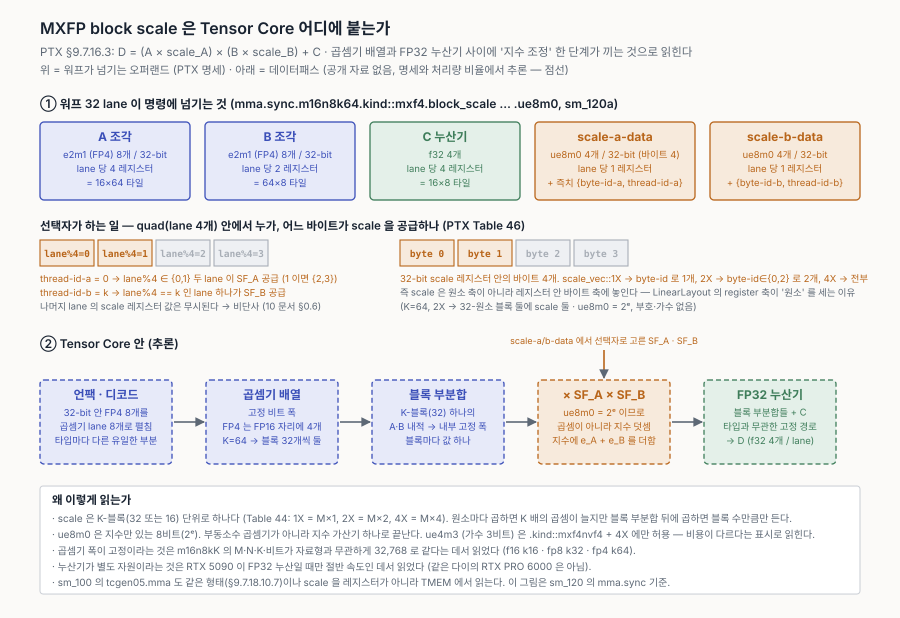
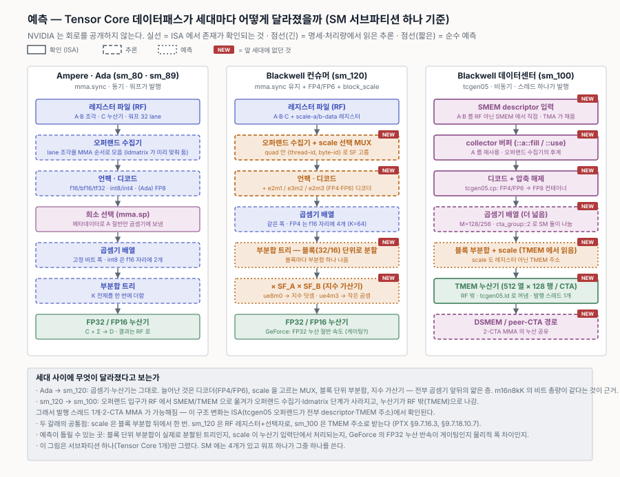
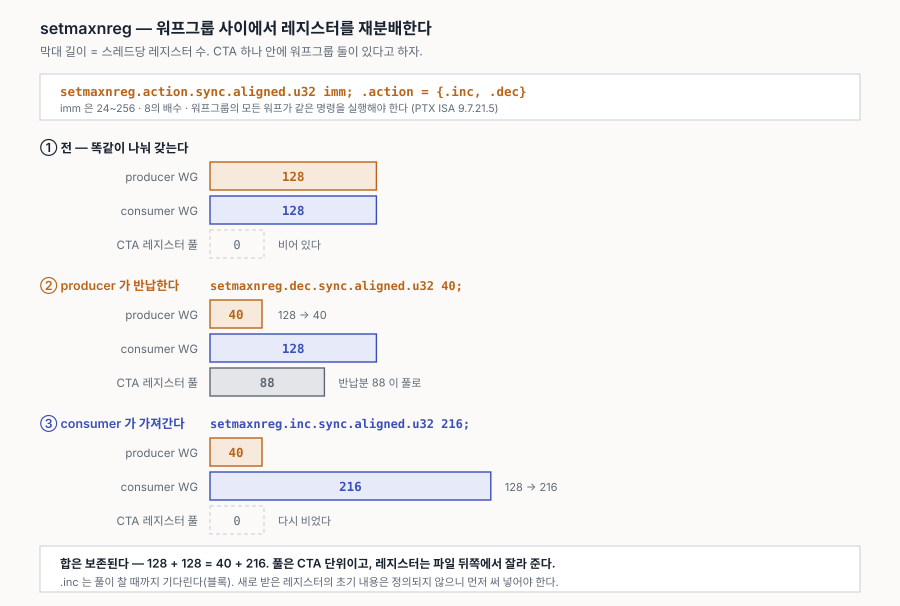

# 10. 메모리 최적화 우선순위와 확인 방법 (sm_120 기준)

커널 하나에서 메모리가 성능을 깎는 경로를 **영향이 큰 순서**로 놓고, 각각 무엇을 보고 무엇을 고치는지 정리한다. HW 한도표는 [06-sm-features.md](06-sm-features.md) §HW 한도에 있으므로 여기서는 반복하지 않고 참조한다.

같은 내용을 그림으로 본 자료: [메모리 병목 우선순위](https://claude.ai/code/artifact/e4d955a6-7e76-4f87-beba-bc04bcb96c12)

> **배수는 GEMM 계열에서 흔히 보는 대략치다.** 커널·형상·정밀도에 따라 크게 달라지며, 보유 장비에서 측정한 값이 아니다(`(미확인)`). 순위는 "먼저 볼 곳"의 순서이지 고정된 서열이 아니다. Phase 0에서 실측하면 이 표를 실측값으로 교체한다(§6).

---

## 0. 기초 — 표기 · 계층 · 경로

### 0.1 표기 읽는 법 — state space는 어느 쪽을 가리키는가

PTX 명령의 state space 한정자(`.global`, `.shared`, `.local`, `.const`)는 **항상 메모리 쪽**을 가리킨다. 반대쪽 끝은 언제나 레지스터라 적을 필요가 없다.

| 명령 | 뜻 | 방향 |
|---|---|---|
| `ld.global [p]` | global **로부터** 레지스터로 읽는다 | global → register |
| `st.global [p], v` | 레지스터에서 global **으로** 쓴다 | register → global |
| `ld.shared [p]` | SMEM **로부터** 읽는다 | shared → register |
| `st.shared [p], v` | SMEM **으로** 쓴다 | register → shared |

즉 `ld`면 그 공간이 **출발지**, `st`면 **목적지**다. 레지스터는 반대편 끝에 고정이라 이름에 나타나지 않는다.

```ptx
ld.global  d, [p];    // global → 레지스터 d
st.global  [p], v;    // 레지스터 v → global
ld.shared  d, [p];    // SMEM   → 레지스터 d
st.shared  [p], v;    // 레지스터 v → SMEM
```

오퍼랜드 순서도 같은 규칙이다. **목적지가 먼저** 온다 — `ld`는 목적지가 레지스터라 `d`가 앞에, `st`는 목적지가 메모리라 `[p]`가 앞에 온다. 한정자가 둘 붙는 복사 명령도 마찬가지로 목적지 공간을 먼저 적는다.

```ptx
cp.async.ca.shared.global      [dst], [src], 4;      // shared ← global
cp.async.bulk.global.shared::cta [dst], [src], size; // global ← shared  (TMA store, sm_90+)
```

**메모리↔메모리 단일 명령은 이 둘뿐이다.** 나머지 조합은 레지스터를 거쳐야 한다. 예를 들어 SMEM의 결과 타일을 global로 내보내려면(GEMM epilogue) sm_75 이하에서는 두 명령이 필요하다.

```ptx
ld.shared  d, [s];    // SMEM → 레지스터
st.global  [g], d;    // 레지스터 → global
```

sm_90 이상에서는 위의 `cp.async.bulk.global.shared::cta` 한 명령으로 끝난다. sm_120에서도 쓸 수 있다.

SASS(하드웨어 어셈블리)에서는 같은 것이 다른 이름으로 보인다. `ncu`·`cuobjdump` 출력을 읽을 때만 만난다.

| SASS | PTX | 뜻 |
|---|---|---|
| `LDG` | `ld.global` | load global |
| `STG` | `st.global` | store global |
| `LDS` | `ld.shared` | load shared |
| `STS` | `st.shared` | store shared |
| `LDGSTS` | `cp.async` | global→shared 비동기 복사 |

접미사는 폭이다. `LDG.E.128`은 한 번에 128-bit을 옮긴다는 뜻이고, `LDG.E`만 있으면 벡터화가 안 된 것이다(§2.4).

### 0.2 메모리 계층 — 무엇이 어디서 나뉘는가

층마다 **나눠 갖는 단위**가 다르고, 그래서 실패하는 방식도 다르다. 수치는 RTX 5090 기준.

| 층 | 붙어 있는 곳 | 공유 범위 | 크기 | 지연 | 나눠 갖는 단위 · 실패 방식 |
|---|---|---|---|---|---|
| 레지스터 파일 | SM의 processing block마다 | 스레드 전용 | 256 KB/SM (블록당 64 KB) | ~1 cycle | 컴파일러가 스레드마다 고정 할당(64K × 32-bit, 스레드당 255개). 넘치면 local = DRAM으로 스필 |
| **L1** (캐시) | SM 하나 | SM 1개 | 통합 128 KB/SM 중 carveout 나머지 | ~30–40 cycle | 128 B 라인 = **32 B sector** 4개. global 접근이 지나는 길이라 sector 낭비가 여기서 난다. **SM 간 일관성 없음** |
| **SMEM** (스크래치패드) | 〃 (같은 SRAM) | CTA = SM 1개 | 최대 100 KB/SM · 블록당 99 KB | ~30–40 cycle | 태그도 라인도 sector도 **없다**. 요청한 바이트만 온다. 구조는 **뱅크 32개 × 4 B**뿐이고 충돌은 직렬화 → 스위즐로 해결 |
| L2 | 칩 전체 | GPU 전체 | 96 MB (full GB202 128 MB) | 수백 cycle | **슬라이스/파티션**에 주소 해시로 분배, 편중되면 partition camping. 원자 연산 수행 지점 |
| DRAM (GDDR7) | 칩 바깥 | GPU 전체 | 32 GB · 1,792 GB/s | 더 큼 | 채널 → 뱅크 그룹 → 뱅크 → row. 버려진 바이트를 되돌릴 수 없다 |

- SM 하나는 **processing block 4개**(각각 CUDA core 32 · Tensor Core 1 · 레지스터 파일 64 KB · warp scheduler 12 warps)와 그 넷이 공유하는 **통합 128 KB L1/SMEM**으로 이루어진다. RTX 5090은 11 GPC · 170 SM(백서 Table 1·3).
- **L1과 SMEM은 같은 SRAM을 carveout으로 나눠 쓰지만 서로 다른 경로다.** 이것이 "SMEM에는 sector가 없다"와 "L1은 sector로 채운다"가 동시에 참인 이유다.
- **GPU에는 CPU의 L3에 해당하는 층이 없다.** L2가 마지막 온칩 캐시다. 누산기 전용 TMEM은 sm_100 전용이라 sm_120에는 없다.
- 지연은 L1/SMEM 30~40 cycle만 실측값이고([arXiv 2507.10789](https://arxiv.org/abs/2507.10789) GB203, 2차 출처) 나머지는 자릿수만 맞춘 대략치다 `(미확인)`. 한도는 PG 13.4 Table 31(CC 12.x), 구성·L2·대역폭은 RTX Blackwell 백서.

### 0.3 접근 경로 — 어떤 명령이 어디를 지나는가

같은 "메모리 접근"이라도 지나는 유닛이 전혀 다르다. ●는 거쳐 가고 ─는 건너뛴다.

| 명령 | RF | SMEM | L1 | L2 | DRAM | 방향 |
|---|:-:|:-:|:-:|:-:|:-:|---|
| `ld.shared` / `ldmatrix` | ● | ● | ─ | ─ | ─ | 메모리 → RF |
| `st.shared` / `stmatrix` | ● | ● | ─ | ─ | ─ | RF → 메모리 |
| `ld.global` (기본 `.ca`) | ● | ─ | ● | ● | ● | 메모리 → RF |
| `st.global` (기본 `.wb`) | ● | ─ | ● | ● | ● | RF → 메모리 |
| `ld/st.global.cg` | ● | ─ | **건너뜀** | ● | ● | 〃 |
| `ld/st.local` (스필) | ● | ─ | ● | ● | ● | 〃 |
| `cp.async` / TMA | **건너뜀** | ● | (`.ca`/`.cg`) | ● | ● | 메모리 → 메모리 |
| `ld.const` | ● | ─ | constant cache | ● | ● | 메모리 → RF |

핵심 세 가지.

- **`ld.shared`는 L1·L2·DRAM을 전혀 지나지 않는다.** 그래서 sector도 캐시 미스도 없고 뱅크만 있다.
- **`ld.local`은 `ld.global`과 같은 길이다.** `.local`은 별도 메모리가 아니라 스레드마다 잘라 준 DRAM의 창이고, 유일한 차이는 주소가 스레드 간 인터리빙되어 warp의 local 접근이 자동으로 coalesced가 된다는 점뿐이다. 스필이 절벽인 이유는 경로가 나빠서가 아니라 **DRAM까지 갔다 오기 때문**이다.
- **`cp.async`만 RF를 건너뛴다.** 양 끝이 모두 메모리인 복사라 레지스터가 관여하지 않는다(§2.1).

방향은 단방향이다. `ld`는 메모리→레지스터, `st`는 레지스터→메모리로 **같은 유닛을 반대로** 지난다. `cp.async`/TMA만 예외다.

#### 각 명령을 언제 쓰는가

| 명령 | 방향 | 언제 쓰나 | 목적 | 주의 |
|---|---|---|---|---|
| `cp.async` / TMA | global → SMEM | 타일을 SMEM에 적재. 파이프라인의 **복사 단계** | 레지스터를 안 거치고 복사를 발행해 두고 계산을 계속 | sm_80+. 크기 **4/8/16 B**만. 완료는 `mbarrier`/`wait_group` |
| `st.shared` / `stmatrix` | 레지스터 → SMEM | ① `cp.async`를 못 쓸 때 ② 계산 결과를 **warp 간 공유**(리덕션·전치·에필로그 재배치) | 다른 스레드가 볼 수 있는 곳에 값을 놓는다 | 스위즐을 건다면 **여기 첨자와 로드 쪽 첨자가 같아야** 한다 |
| `ld.shared` / `ldmatrix` | SMEM → 레지스터 | MMA 직전. **오퍼랜드 fragment** 꺼내기 | MMA가 요구하는 lane별 배치로 가져온다 | `.trans`로 전치 가능. lane마다 **연속 16 B** 요구 — 스위즐 단위가 16 B인 이유 |
| `ld.global` | global → 레지스터 | ① SMEM을 안 쓰는 커널 ② 스칼라·인덱스 로드 ③ `cp.async`가 안 맞는 형상 | 계산에 쓸 값을 직접 가져온다 | 여기서 **coalescing**이 판정된다 |
| `st.global` | 레지스터 → global | **에필로그** — 결과 타일 출력 | 커널의 출력 | 기본 `.wb`는 L1·L2 모두 캐시. TMA store로 SMEM에서 바로 내보낼 수도 있다 |
| `.cg` (한정자) | L1 우회 | 한 번 쓰고 버릴 데이터. `cp.async.cg`가 대표 | **캐시를 오염시키지 않는다** | `cp.async.cg`는 **16 B에서만**. 형제로 `.cs`, `.lu` |
| `ld.const` | constant cache → 레지스터 | 모든 스레드가 **같은 값**을 읽을 때 — 커널 인자, 스케일 팩터, 형상 파라미터 | 브로드캐스트 전용 경로 | 64 KB. warp 안에서 주소가 **갈리면** 직렬화된다 |

**GEMM 커널 한 바퀴에서의 순서** — `ld.const`(인자·스케일) → `cp.async`(k 타일 적재) → `ldmatrix`(오퍼랜드) → `mma.sync`(계산) → 다음 k로 반복 → `st.shared`(에필로그 재배치) → `st.global`(출력). `ld.global`과 `st.shared`는 `cp.async`를 쓸 수 없는 경우의 대체 경로이고, `.cg`는 그 위에 붙는 한정자다.

#### 오퍼랜드는 어디에 있어야 하는가

**오퍼랜드는 저장소의 성질이 아니라 명령에서의 역할**이다 — `mma.sync d, a, b, c`에서 네 자리가 오퍼랜드이고, 그것들이 마침 레지스터에 있을 뿐이다. 그런데 **명령마다 오퍼랜드를 어디서 받을 수 있는지가 ISA에 못 박혀 있고, 그게 세대마다 바뀌었다.**

| 명령 | A | B | 누산기 | 세대 |
|---|---|---|---|---|
| `mma.sync` | 레지스터 | 레지스터 | **레지스터** | sm_70~ · **sm_120이 여기** |
| `wgmma.mma_async` | 레지스터 또는 **SMEM descriptor** | **SMEM descriptor** | 레지스터 | **sm_90a 전용** |
| `tcgen05.mma` | SMEM 또는 TMEM | **SMEM descriptor** | **TMEM** | sm_100 (B200) |

세대가 갈수록 오퍼랜드가 레지스터 파일 밖으로 나간다 — Hopper는 A·B를 SMEM에서 직접 읽게 했고, sm_100은 누산기까지 TMEM으로 뺐다(§2.1의 "RF를 경유한다는 것이 왜 비싼가"와 같은 흐름).

**sm_120에는 `mma.sync`만 있다.** A·B·누산기가 전부 레지스터여야 하므로 `BM×BN / (warps×32)` 누산기가 스레드당 255개 한도를 정면으로 밀어붙인다(§2.3). B200에서는 그 항이 아예 없어, FP4 ridge를 넘는 큰 타일을 쓸 수 있느냐가 여기서 갈린다.

#### 캐시 연산자 (PTX ISA Table 30 / 31)

| load | 뜻 | | store | 뜻 |
|---|---|---|---|---|
| `.ca` | **기본값.** L1·L2 모두에 할당 | | `.wb` | **기본값.** 모든 coherent 레벨에 write-back |
| `.cg` | L2에만, **L1 우회** | | `.cg` | L2에만, **L1 우회** |
| `.cs` | streaming — evict-first로 넣어 오염을 줄인다 | | `.cs` | 〃 (스트리밍 출력) |
| `.lu` | last use — 스필 복원처럼 다시 안 쓸 라인 | | `.wt` | system memory로 write-through |
| `.cv` | 캐시하지 않고 매번 다시 읽는다 | | | |

> **L1은 SM 간 일관하지 않는다.** PTX 문서가 명시한다 — 한 스레드가 L1을 우회해 global에 쓰고 다른 SM의 스레드가 `ld.ca`로 읽으면 **오래된 L1 데이터를 맞을 수 있다**. 드라이버가 의존하는 grid 사이에서 L1을 무효화한다. 커널 안에서 SM 간 통신을 하려면 L2 수준(`.cg`, 원자 연산, `.cluster` scope)을 거쳐야 한다.

### 0.4 캐시는 무엇을 하는가 — CPU와 GPU를 따로 본다

CPU와 GPU를 나란히 놓고 "무엇이 다른가"를 보면 오히려 흐려진다. **각각에서 캐시를 뺐다 넣었다 해 보는 것**이 빠르다.

#### CPU — 캐시는 지연을 줄인다

CPU는 한 코어가 동시에 굴리는 스레드가 한둘뿐이라, 메모리를 기다리는 동안 **대신 시킬 일이 없다**. 대기가 곧 손해다.

| | 계산 | 대기 | 총 시간 |
|---|---|---|---|
| 캐시 없음 | 210 | 320 | **530** |
| 캐시 있음 | 210 | 80 | **290** |

계산량은 같다. 달라진 것은 기다린 시간뿐이고 그것이 그대로 총 시간의 차이가 된다. **CPU 캐시는 지연을 줄이는 장치다.**

#### GPU — 캐시는 대역폭을 아낀다

GPU는 SM 하나에 최대 1,536 스레드(48 warps)가 상주한다. 한 warp가 기다리면 스케줄러가 다른 warp를 발행하므로, **지연은 캐시가 아니라 warp 교대가 이미 가리고 있다**. 캐시를 빼도 실행 유닛은 멈추지 않는다.

그러면 무엇이 달라지는가 — **DRAM 버스로 오간 바이트**다.

| | DRAM 트래픽 | 실행 유닛 | 총 시간 |
|---|---|---|---|
| 캐시 없음 | 100% (버스 포화) | 쉬지 않음 | **520** |
| 캐시 있음 | 50% | 쉬지 않음 | **300** |

캐시를 빼면 모든 요청이 DRAM까지 나가면서 버스가 포화되고, 그때부터는 warp를 아무리 많이 상주시켜도 다 같이 기다린다. 트래픽이 절반이 되자 총 시간도 줄었다. **GPU 캐시는 대역폭을 아끼는 장치다.**

그래서 GPU에서 캐시의 값은 "지연을 줄였나"가 아니라 **"버스로 나가는 바이트를 줄였나"**로 재야 한다. `ncu`에서 L2 적중률(`lts__t_sector_hit_rate.pct`)과 DRAM 트래픽을 같이 보는 이유다.

#### 그래서 GPU 캐시는 오래 들고 있지 못한다

대역폭을 아끼는 것이 목적이라면 클 필요가 없고, 실제로도 **스레드당으로는 아주 작다**.

| | 캐시 | 나눠 쓰는 스레드 | 스레드당 |
|---|---|---|---|
| CPU 코어 (일반적인 x86, 대략치) | L1D 48 KB | 2 | 약 **24 KB** |
| GPU SM (sm_120) | L1/SMEM 128 KB | 1,536 | 약 **85 B** |

약 280배 차이다. 이 크기로는 데이터를 오래 들고 있을 수 없고, 그럴 목적으로 만들어지지도 않았다.

**역할 분담**

| | 담당 |
|---|---|
| 지연 가리기 | **warp 교대** (캐시가 아니다) |
| 공간 지역성 | 대부분 **coalescing** — 요청 시점에 32 B sector로 병합한다. 캐시에 남겨서 얻는 것이 아니다 |
| 예측 가능한 재사용 | **SMEM**. 언제 쫓겨날지 보장되므로 직접 올린다 (GEMM 타일) |
| 예측 못 하는 재사용 | **L2**. embedding gather, attention의 KV 재읽기처럼 모양을 모르는 경우 |
| 한 번 흘려보낼 데이터 | `.cs`로 오염을 막는다 |

L1과 L2의 성격도 갈린다. **L1**은 저장소라기보다 **요청 병합 지점**(L1TEX)이고 스필의 1차 받침대다. SM마다 따로이고 SM 간 일관성이 없어 오래 들고 있으라고 만든 것이 아니다(§0.3). **L2**는 칩 전체가 공유하는 유일한 지점이라 CTA 간 재사용·원자 연산·쓰기 병합이 모두 여기서 일어난다. 그리고 L2 적중률을 실제로 좌우하는 것은 캐시 힌트가 아니라 **CTA 처리 순서**다(§2.7).

#### GPU 캐시가 정확히 맡는 것

지역성이 아니라는 뜻이 아니라, **지역성의 몫 중 둘을 다른 유닛이 가져갔다**는 뜻이다.

| 지역성 | CPU에서 누가 | GPU에서 누가 |
|---|---|---|
| **공간** | 캐시의 **라인 fetch** — 이득은 대개 **L1**에서 회수되고, 순차면 **L2 프리페처**가 확장 | **coalescing** — 요청 시점에 32 B sector로 병합 |
| **시간** · 모양을 아는 것 | 캐시의 **보관** — 재사용 거리에 따라 **L1 → L2 → L3** 중 어디서든 | **SMEM** — 사람이 직접 올린다 |
| **시간** · 모양을 모르는 것 | 〃 | **캐시(L2)** ← GPU 캐시에 남는 지역성 몫은 이것뿐 |

CPU 칸에 특정 층을 못 박지 않은 이유는 §0.5에 있다 — L1/L2/L3는 지역성 종류로 나뉘지 않는다. 층을 가르는 축은 재사용 거리이고, 말할 수 있는 것은 회수 위치의 경향뿐이다.

그래서 GPU 캐시가 맡는 지역성 몫은 **예측 못 하는 시간 지역성** 하나다(embedding gather, attention KV 재읽기, MoE 라우팅). 그리고 지역성과 **무관한** 역할이 따로 있는데, 이쪽이 오히려 고유하다.

| L1의 역할 | 성격 |
|---|---|
| **요청 병합** — warp 32 lane의 주소를 32 B sector 요청으로 묶는다 | 캐시가 아니라 **주소 정리**. 주 업무다 |
| **스필 받침대** — local memory 트래픽을 DRAM까지 안 가게 받는다 | 절벽을 언덕으로 |
| 작은 재사용 흡수 — 같은 CTA 안 warp들이 같은 라인을 볼 때 | 실재하지만 작다 |
| read-only / texture 경로 (`__ldg`) | 이름이 **L1TEX**인 이유 |
| SMEM과 용량을 나눈다 (carveout) | 캐시를 줄여 SMEM을 늘릴 수 있다 |

**L1이 아닌 것** — 일관성 지점이 아니고(SM 간 미보장, §0.3), 재사용을 잡는 저장소도 아니며(스레드당 85 B), **없어도 정확성에 문제가 없다**. `.cg`로 우회 가능하고 `cp.async.cg`가 실제로 그렇게 한다.

**L2는 정반대다.** 모든 SM이 보는 유일한 공통 지점이라 **원자 연산이 여기서 수행**되고, 쓰기가 합쳐지며, **메모리 순서의 기준점**이다. 지역성이 0인 커널에서도 필요하다. 즉 CPU의 L3는 "느리지만 큰 캐시"이고, **GPU의 L2는 캐시이면서 동시에 칩의 교차로**다.

#### 한 줄로 — 수단은 같고, 환전되는 것이 다르다

양쪽 다 **재사용**을 노린다. 캐시라는 물건이 원래 그것이다. 다른 것은 그 재사용이 **무엇으로 환전되느냐**다.

| | 수단 | 환전되는 것 | 그래서 얻는 것 |
|---|---|---|---|
| **CPU** | 재사용 | **시간** | 미스가 줄어 코어가 안 멈춘다 |
| **GPU** | 재사용 | **바이트** | 트래픽이 줄어 버스가 덜 붐빈다 |

**적중 하나의 가치가 다르다.** CPU는 한 번 맞으면 그 스레드가 수백 사이클을 안 기다린다 — 지금 당장 시간이 벌린다. GPU는 적중 하나가 거의 무의미하다. 그 warp가 기다리는 동안 어차피 다른 warp가 돌았기 때문이다. **총량이 줄어야** 비로소 이득이고, 그래서 적중률(비율)이 아니라 절대 바이트를 본다.

그래서 "캐시 친화적으로 짠다"의 뜻도 갈린다 — CPU는 접근을 지역성 있게 다듬는 일이고(루프 순서, 블로킹, 구조체 배치), GPU는 총 트래픽을 줄이는 일이다(타일 키우기, SMEM 재사용, 정밀도 낮추기). 목적지는 같은데 경유지가 달라 손대는 곳이 달라진다.

단어 하나만 더 — GPU에서 "캐시"라고 할 때 실질은 **L2**다. L1은 스레드당 85 B라 재사용을 거의 못 잡고, 실제로는 요청 병합 지점 역할을 한다(§0.2).

### 0.5 지역성과 메커니즘은 다른 것이다

캐시 이야기에서 가장 자주 섞이는 두 가지를 먼저 떼어 놓는다.

| | 프로그램의 성질 — **지역성** | 하드웨어의 대응 — **메커니즘** |
|---|---|---|
| **공간** | 이웃 주소를 곧 쓴다 | **라인 단위로 가져온다** |
| **시간** | 같은 주소를 곧 또 쓴다 | **보관하고, 오래 안 쓴 것부터 버린다** |

오른쪽 메커니즘은 지역성이 있든 없든 **똑같이 돈다**. 시간 지역성이 전혀 없는 워크로드(거대한 배열 랜덤 접근)에서도 캐시는 여전히 최근 것을 보관하고 오래된 것을 버린다 — 동작은 같고 **이득만 없다**. 즉 **시간 지역성 = 프로그램이 같은 것을 다시 쓴다는 사실**이고, **LRU 보관·교체 = 그 사실에 걸어 보는 베팅**이다. 베팅이 틀리면 캐시가 오염되기만 하며, 그래서 `.cs`/`.lu` 같은 힌트가 존재한다(§0.3) — 베팅이 틀릴 것을 프로그래머가 알 때 알려주는 통로다.

캐시는 "자주 쓸 것"을 판단하지 않는다. 넣을 때는 무조건 넣고(allocate on miss), **버릴 때만** 고른다. 기준도 빈도가 아니라 **최근성**이다(LRU/pseudo-LRU/RRIP). 빈도를 재려면 라인마다 카운터가 필요하지만 최근성은 순서 비트 몇 개면 되고, 빈도 기반은 한번 인기를 얻은 라인이 식지 않는 문제가 있다. 그리고 교체 결정은 전역이 아니라 **set 안에서만** 이루어지므로(연관도), 캐시가 비어 있어도 특정 set만 붐비면 쫓겨난다 — conflict miss.

**층은 어떤 지역성을 담당하지 않는다.** 두 메커니즘 모두 모든 층에서 작동한다(라인 크기도 층마다 같다). 층이 정하는 것은 **얼마나 먼 재사용까지 잡느냐**(용량)와 각 층이 푸는 제약(속도 / 완충·예측 / 공유·일관성)뿐이고, 그 적중이 어느 지역성에서 왔는지는 **워크로드가 정한다**. 아래는 라인 64 B · float 4 B · L1 48 KB · L2 1 MB 가정에서 실제로 센 값이다.

| 워크로드 | L1 적중 출처 | L2 적중 출처 |
|---|---|---|
| 32 KB 배열 × 4회 통과 | 공간 95% / 시간 5% | — (L1에서 끝남) |
| 1 MB 배열 × 4회 통과 | 공간 100% | 시간 100% |
| 1 MB 배열 × 1회 통과 (스트리밍) | 공간 100% | 순차면 **프리페치 = 공간** 100% |

구조적으로 말할 수 있는 것은 **공간 지역성 몫의 상한**뿐이다.

```
공간 적중 비율 ≤ 1 − (1 / 라인당 원소 수) = 1 − 1/16 = 93.75%   (float, 64 B 라인, 순차)
```

순차 접근이면 전체 접근의 최대 93.75%가 공간으로 처리되고 끝이며, 남은 6.25%(라인의 첫 접근)를 두고 시간 지역성과 프리페치가 경쟁한다. sm_120에서는 32 B sector에 float 8개이므로 상한이 `1 − 1/8 = 87.5%`이고, **그 몫을 캐시가 아니라 coalescing이 요청 시점에 가져간다**(§0.2).

공간 재사용이 구조적으로 더 가깝다는 점도 기억할 만하다 — 공간 재사용 거리는 **라인 크기**에 묶이고(최대 15 접근), 시간 재사용 거리는 **작업 집합 크기**에 묶인다(수천~수백만 접근). 게다가 거리가 0에 가까운 시간 재사용은 레지스터·스토어 버퍼가 먼저 흡수하므로, 캐시가 보는 시간 재사용은 이미 먼 것만 남는다.

#### 일곱 항목을 지역성으로 분류하면

| 지역성 | 해당 항목 | 하는 일 |
|---|---|---|
| **공간** | §2.2 coalescing · §2.4 벡터화·정렬 | 한 번에 가져온 것 중 **버리는 바이트를 줄인다** |
| **시간** | §2.5 SMEM 타일링 · §2.7 CTA 순서 | **재사용 거리를 줄여** 같은 바이트를 다시 안 가져오게 한다 |
| **둘 다 아님** | §2.1 파이프라이닝 · §2.3 스필 · §2.6 뱅크 충돌 | §2.1은 **언제** 가져오나, §2.3은 **얼마나 들고 있나**, §2.6은 **동시에 몇 개를 짚나** |

세 번째 줄이 요점이다. **지역성만으로는 GPU 메모리 최적화를 다 설명할 수 없다.** 그리고 시간 지역성 쪽 두 항목은 CPU에서 하던 일과 같은 기법이다 — **루프 블로킹이 GPU에서는 SMEM 타일링과 CTA 순서 바꾸기로 나타난다**. 캐시를 키울 수 없으니 재사용 거리를 캐시 용량 아래로 밀어 넣는 것이고, 목적도 수단도 같다.

---

### 0.6 레지스터 안의 배치 — 왜 변환이 생기는가

§0.3은 오퍼랜드가 **어느 저장소에** 있어야 하는지를 봤다. 그런데 sm_120처럼 A·B·누산기가 전부 레지스터인 경우에도, **같은 레지스터 파일 안에서 배치가 서로 다르다.** 물리적으로 구분된 뱅크가 있는 게 아니라 "어느 lane의 몇 번째 자리에 어느 원소가 있어야 하는가"가 오퍼랜드마다 따로 정해져 있다.

#### ISA가 비트 단위로 고정한다

PTX ISA 9.7.16.5.8의 `mma.sync.m16n8k16`(f16) 규정을 비트로 펼치면 이렇다. `groupID = %laneid >> 2`, `threadID_in_group = %laneid % 4`, `i` = 원소 인덱스.

| | groupID (lane 4~2) | lane % 4 | 원소 인덱스 i |
|---|---|---|---|
| A (M16×K16) | **M** | K | M · K |
| B (K16×N8) | **N** | K | K |
| 누산기 (M16×N8) | **M** | **N** | M · N |

읽히는 것이 둘이다.

- **누산기와 A는 같다.** 둘 다 `lane = (행%8)×4 + 열/2` — lane 하나가 가로로 인접한 두 칸을 갖는다. 그래서 앞 MMA의 결과를 다음 MMA의 A로 넘기는 것은 레인을 건너지 않는다.
- **B는 그 전치다.** `lane = 열×4 + (행%8)/2` — lane 하나가 세로로 인접한 두 칸을 갖는다. 누산기를 B로 넘기려면 lane 0~3에 뭉쳐 있던 8개가 lane 0·4·8·…·28로 흩어져야 한다. **값이 실제로 레인을 건넌다.**

> 누산기 = A 일치는 `m16n8k16` f16에서만 성립한다. fp8·fp4에서 어떻게 깨지는지는 바로 아래 "누산기는 안 넓어지고 A·B만 넓어진다"에서 본다. 그리고 누산기의 N은 8, A의 K는 16이라 **누산기 타일 두 개가 A 하나**다.

```
무늬 A — lane 하나가 가로 2칸          (K16의 A, 그리고 모든 누산기)
        열0  1    2  3    4  5    6  7
  행0 | T0  T0 | T1  T1 | T2  T2 | T3  T3
  행1 | T4  T4 | T5  T5 | T6  T6 | T7  T7
  행2 | T8  T8 | T9  T9 |T10 T10 |T11 T11
  행3 |T12 T12 |T13 T13 |T14 T14 |T15 T15
  행4 |T16 T16 |T17 T17 |T18 T18 |T19 T19
  행5 |T20 T20 |T21 T21 |T22 T22 |T23 T23
  행6 |T24 T24 |T25 T25 |T26 T26 |T27 T27
  행7 |T28 T28 |T29 T29 |T30 T30 |T31 T31
        lane = (행 % 8) * 4 + 열 / 2        <- 행이 lane을 크게 움직인다

무늬 B — lane 하나가 세로 2칸          (K16의 B)
        열0   1   2   3   4   5   6   7
  행0 | T0   T4  T8 T12 T16 T20 T24 T28
  행1 | T0   T4  T8 T12 T16 T20 T24 T28
  행2 | T1   T5  T9 T13 T17 T21 T25 T29
  행3 | T1   T5  T9 T13 T17 T21 T25 T29
  행4 | T2   T6 T10 T14 T18 T22 T26 T30
  행5 | T2   T6 T10 T14 T18 T22 T26 T30
  행6 | T3   T7 T11 T15 T19 T23 T27 T31
  행7 | T3   T7 T11 T15 T19 T23 T27 T31
        lane = 열 * 4 + (행 % 8) / 2        <- 열이 lane을 크게 움직인다
```

**무늬 A와 무늬 B는 서로 전치다.** 이것이 §0.6 첫 표의 "B만 N을 groupID에 둔다"를 그림으로 본 것이다.

##### `mma.sync.m16n8k16` — f16 / bf16 (sm_70~, sm_120 포함)

```
mma.sync.aligned.m16n8k16.row.col.f32.f16.f16.f32
    {d0, d1, d2, d3},        // 누산기 출력   .f32  x4
    {a0, a1, a2, a3},        // A            .b32  x4  = f16 8개
    {b0, b1},                // B            .b32  x2  = f16 4개
    {c0, c1, c2, c3};        // 누산기 입력   .f32  x4

A  M16 x K16   무늬 A 를 2x2 로 붙인다        B  K16 x N8    무늬 B
        K0-7     K8-15                            N0-7
  M0-7 | a0,a1 | a4,a5                     K0-7  | b0,b1
 M8-15 | a2,a3 | a6,a7                    K8-15  | b2,b3

C/D  M16 x N8   무늬 A
        N0-7
  M0-7 | c0,c1
 M8-15 | c2,c3
```

##### `mma.sync.m16n8k32` — fp8 (e4m3 / e5m2), sm_89~

```
mma.sync.aligned.m16n8k32.row.col.f32.e4m3.e4m3.f32
    {d0..d3}, {a0,a1,a2,a3}, {b0,b1}, {c0..c3};
    // 레지스터 개수는 그대로. 한 레지스터에 fp8 4개가 들어간다

A  M16 x K32   무늬 A' (lane 하나가 가로 4칸)
        K0-15        K16-31
  M0-7 | a0..a3    | a8..a11
 M8-15 | a4..a7    | a12..a15
        lane = (행 % 8) * 4 + (열 % 16) / 4

C/D  M16 x N8   무늬 A  — K16 때와 완전히 같다
```

##### `mma.sync.m16n8k64` — fp4 (e2m1), sm_120a `block_scale`

```
mma.sync.aligned.m16n8k64.row.col.kind::mxf4.block_scale.f32.e2m1.e2m1.f32.ue8m0
    {d0..d3}, {a0..a3}, {b0,b1}, {c0..c3},
    scaleAData, {byte-id-a, thread-id-a},
    scaleBData, {byte-id-b, thread-id-b};

A  M16 x K64   무늬 A'' (lane 하나가 가로 8칸)
        K0-31        K32-63
  M0-7 | a0..a7    | a16..a23
 M8-15 | a8..a15   | a24..a31
        lane = (행 % 8) * 4 + (열 % 32) / 8

C/D  M16 x N8   무늬 A  — 여전히 같다
```

#### 누산기는 안 넓어지고 A·B만 넓어진다

세 명령을 겹쳐 보면 `acc = Afrag` 일치가 어디서 깨지는지가 한 줄로 나온다.

| 명령 | 원소 타입 | A의 lane당 열 수 | 누산기의 lane당 열 수 | 일치 |
|---|---|---|---|---|
| `m16n8k16` | f16 / bf16 | `tid*2` → **2** | `tid*2` → 2 | **O** |
| `m16n8k32` | fp8 | `tid*4` → **4** | `tid*2` → 2 | X |
| `m16n8k64` | fp4 | `tid*8` → **8** | `tid*2` → 2 | X |

누산기 식은 셋 다 `row = groupID(+8)`, `col = tid*2 + (i&1)`로 **글자 하나 안 바뀐다**. 넓어지는 것은 A·B뿐이다. 레지스터 개수가 4개로 고정이고 한 레지스터에 담기는 원소 수만 느는 구조이기 때문이다.

그래서 f16에서는 lane 비트가 `열[1]`에 걸려 A와 누산기가 맞아떨어지지만, fp8은 `열[3:2]`, fp4는 `열[5:3]`으로 옮겨 가 **누산기의 `열[2:1]`과 어긋난다.** GEMM을 이어 붙이거나 FlashAttention처럼 누산기를 다음 MMA의 A로 넘길 때, 저정밀 포맷일수록 변환이 필요해진다는 뜻이다.

#### 배치도가 아예 없는 경우 — `tcgen05.mma` (sm_100)

```
tcgen05.mma.cta_group::1.kind::f16  [d-tmem], a-desc, b-desc, idesc, ...
tcgen05.mma.cta_group::1.kind::f16  [d-tmem], [a-tmem], b-desc, idesc, ...
```

네 오퍼랜드 중 레지스터에 있는 것이 하나도 없다 — A는 SMEM descriptor 또는 TMEM 주소, B는 SMEM descriptor뿐, 누산기와 스케일은 TMEM 주소다. **lane별 배치도라는 개념 자체가 없다.** `ldmatrix`로 SMEM에서 레지스터로 끌어올리는 단계가 통째로 사라지고, 대신 `.collector::a::fill` / `::use`로 하드웨어 버퍼에 재사용을 맡긴다.

> **기저와 stride.** 위 표의 비트 배정은 LinearLayout의 **기저**로 적힌다. 2의 거듭제곱 stride는 그 특수한 경우일 뿐이고, 기저값에 비트가 둘 이상 켜지면 어떤 stride로도 표현되지 않는다 — 그것이 스위즐이다. 자세한 것은 [11-linearlayout-history.md](11-linearlayout-history.md) §1 "stride 와의 관계".

#### 블록 스케일은 배치로 표현되지 않는다

`mma.sync ... .block_scale`(sm_120a, PTX 8.7~)은 스케일을 `{byte-id, thread-id}`라는 **즉치 선택자**로 받는다(PTX ISA 9.7.16.3 Table 46).

- `thread-id-a`는 quad 안에서 어느 **thread-pair**가 SF_A를 공급할지 고른다 — 0이면 `%laneid % 4 ∈ {0,1}`, 1이면 `{2,3}`. 나머지 lane은 같은 값을 쓴다(**비단사**).
- `thread-id-b`는 어느 **한 thread**가 SF_B를 공급할지 고른다 — `%laneid % 4 == thread-id-b`.
- `byte-id`는 32비트 레지스터 **안쪽의 바이트**를 고른다. `(block, warp, lane, register)`로는 짚을 수 없는 자리라, Triton LinearLayout의 register 축은 물리 레지스터 번호가 아니라 **원소**를 센다.

이 스케일이 Tensor Core 안에서 **어디에** 곱해지는지는 NVIDIA가 공개하지 않았다. 다만 PTX 명세 두 가지 — 스케일이 K-블록(32 또는 16) 하나에 값 하나라는 것(Table 44), 스케일 타입이 지수만 있는 `ue8m0`이라는 것(Table 45) — 에서 자리를 거꾸로 읽을 수 있다. **블록 부분합을 구한 뒤, FP32 누산기에 더하기 전에, 지수 덧셈 한 번**으로 들어간다고 보는 것이 가장 싸고 명세와 맞는 그림이다. 원소마다 곱하면 K배의 곱셈이 늘고, 누산 뒤에 곱하면 블록마다 다른 스케일을 적용할 수 없다.



그림의 아래 절반(데이터패스)은 **추론**이고 점선으로 그렸다. 위 절반(오퍼랜드와 선택자)은 PTX ISA 9.7.16.3 그대로다. 곱셈기 폭이 자료형과 무관하게 고정이라는 것은 `m16n8kK`의 M·N·K·비트가 f16 k16, fp8 k32, fp4 k64에서 전부 32,768로 같다는 데서, 누산기가 별도 자원이라는 것은 RTX 5090이 FP32 누산일 때만 절반 속도라는 데서(같은 GB202의 RTX PRO 6000은 아님) 읽었다. sm_100의 `tcgen05.mma`도 같은 형태의 block scaling을 갖지만(PTX 9.7.18.10.7) 스케일을 레지스터가 아니라 TMEM에서 읽는다.

여기서 한 걸음 더 나가, 세대마다 Tensor Core 데이터패스가 **어떻게 달라졌을지**를 예측도로 그려 둔다. 세 열은 Ampere·Ada(sm_80·89), Blackwell 컨슈머(sm_120), Blackwell 데이터센터(sm_100)이고, 위에서 아래로 오퍼랜드 입구 → 곱셈기 → 누산기 순서다. 상자의 테두리가 실선이면 ISA에서 존재가 확인되는 것, 긴 점선이면 명세·처리량에서 읽은 추론, 짧은 점선이면 순수 예측이며, `NEW`는 앞 세대에 없던 것이다. **이 그림은 검증된 회로도가 아니다.** 읽는 방식은 하나다 — sm_120에서 늘어난 것은 곱셈기 앞뒤의 얇은 층(FP4/FP6 디코더, 스케일 선택 MUX, 블록 단위 부분합, 지수 가산기)이고, sm_100에서 달라진 것은 오퍼랜드 입구가 RF에서 SMEM·TMEM으로 옮겨 가고 누산기가 RF 밖으로 나간 **구조 변화**라는 것. 앞의 것은 `m16n8kK`의 비트 총량이 자료형과 무관하게 같다는 데서, 뒤의 것은 `tcgen05` 오퍼랜드가 전부 descriptor·TMEM 주소라는 데서 읽었다.



#### 변환이 생기는 다섯 지점

전부 **한 값에 소비자가 둘 이상**인 상황이고, FlashAttention 커널 하나 안에 전부 들어 있다.

| | 어디서 | 무엇이 어긋나는가 |
|---|---|---|
| 1 | 오퍼랜드 역할이 바뀐다 (`P = softmax(QKᵀ)`가 다음 MMA의 A) | 누산기 배치와 A 배치는 별개로 고정 |
| 2 | 에필로그 (누산기 → `st.global`) | 누산기는 lane당 2개씩 열로 흩어져 있다 → coalescing과 충돌(§2.2) |
| 3 | reduction·broadcast (`tl.max`, `tl.sum`) | 없앨 축이 `lane%4`면 quad 내 shuffle, `groupID`면 워프를 가로지른다 |
| 4 | 형상 연산 (transpose·reshape) | 데이터는 그대로인데 배치만 바뀐다 |
| 5 | 한 값에 소비자가 둘 | 둘의 요구가 다르면 한쪽은 변환 |

어긋난 방식에 따라 나가는 코드가 갈린다 — 레지스터 이름만 바꿔 끼우면 되는 경우(명령 0개), `shfl.sync`로 끝나는 경우, `st.shared` + 배리어 + `ld.shared` 왕복이 필요한 경우.

#### `blocked` layout과 coalescing은 같은 숫자다

Triton에서 MMA와 무관한 평범한 텐서(`tl.load` 결과, `tl.arange`, elementwise 결과)가 갖는 배치가 `blocked`이고, 숫자 목록 네 개로 정의된다.

```
#ttg.blocked<{sizePerThread=[1,2], threadsPerWarp=[4,8], warpsPerCTA=[2,1], order=[1,0]}>
```

안쪽에서 바깥쪽으로 읽는다 — 스레드 하나가 몇 개를 연속으로 맡고(`sizePerThread`) → 그 스레드들이 워프를 채우고(`threadsPerWarp`) → 워프들이 CTA를 채운다(`warpsPerCTA`). `order`가 각 단계에서 어느 축이 먼저 차는지를 정한다.

**§2.4의 벡터화 폭이 `sizePerThread`이고, §2.2의 coalescing이 `order`다.** 같은 커널에서 `order=[0,1]`로 바꾸면 lane이 열 방향으로 흩어져 sector 수가 뛴다. Triton의 coalescing 패스가 바꾸는 것이 정확히 이 숫자들이다.

#### LinearLayout이 바꾼 것은 셋 중 가운데 층이다

배치 사이의 변환은 Triton에서 세 층으로 나뉜다. 이 셋을 섞으면 오해가 생긴다.

| | 무엇 | LinearLayout 전 | 후 |
|---|---|---|---|
| **표기** | IR의 `ttg.convert_layout` op | op 하나 | **그대로 하나** |
| **구현** | 그 op을 실제 명령으로 내리는 lowering | **배치 쌍마다** 따로 | **하나** — `B⁻¹ ∘ A` |
| **최적화** | `RemoveLayoutConversions` 패스 — op 자체를 지운다 | 둘 다 있다 | 판정을 계산할 수 있게 됐다 |

`convert_layout` op은 없어지지 않는다. 컴파일러가 "여기서 배치가 바뀐다"를 어딘가엔 적어야 한다. 없어진 것은 **조합마다 손으로 쓰던 lowering**이다 — 배치가 N개면 쌍이 N(N−1)/2개이고, 새 포맷 하나가 들어오면 기존 전부와의 변환을 새로 써야 했다. MX 계열의 scale 오퍼랜드가 그 '새 포맷 하나'의 대표적인 예다.

> **도입 시점 주의.** LinearLayout은 MX나 Blackwell 때문에 생긴 것이 아니다. [triton-lang/triton #3794](https://github.com/triton-lang/triton/pull/3794)(2024-04-30 작성, 05-09 병합)이 원본이고, PR 본문이 든 이유는 ① 고치기 어려운 layout 변환 버그들, ② `reshape + transpose + reshape` 조합 중 당시 layout으로 효율적으로 표현할 수 없는 것들, ③ **"Blackwell이 이 문제를 더 악화시킬 것이 우려된다"** 였다. Blackwell은 원인이 아니라 예고된 악재로 언급됐고, MX scale은 그 뒤에 온 사례다. 논문은 [arXiv:2505.23819](https://arxiv.org/abs/2505.23819). 개발 과정 전체는 [11-linearlayout-history.md](11-linearlayout-history.md)에 커밋 단위로 정리했다.

최적화 패스는 변환을 **고정점에 닿을 때까지 뒤로 민다**. 고정점은 둘뿐이다 — MMA 오퍼랜드(ISA)와 메모리 접근(coalescing·스위즐). 그 사이의 elementwise 연산과 `tl.arange` 기반 주소 계산은 어느 배치로 해도 결과가 같으므로, 변환이 **주소 계산에 흡수되어 사라질 수 있다**. 데이터는 안 움직이고 어느 lane이 어느 주소를 짚느냐만 바뀐다.

> **되밀기에는 대가가 있다.** MMA 오퍼랜드 배치로 global을 읽으면 그 배치가 coalescing에 유리하다는 보장이 없다 — 레지스터 셔플 하나를 없애는 대신 §2.2의 sector 수가 늘 수 있다. coalescing 패스와 이 패스는 같은 숫자를 반대 방향으로 당긴다. 정리가 아니라 휴리스틱이다.

#### `.T`·`view`와 무엇이 다른가

발상은 같다 — 옮기는 대신 다르게 읽는다. 그러나 바꾸는 대상이 다르다.

| | `.T` · `view` | layout 변환 |
|---|---|---|
| 바꾸는 것 | 주소 함수 (stride) | **어느 lane이 어느 원소를 갖는가** |
| 데이터 이동 | **항상** 없음 | 있을 수도, 없을 수도 |
| 실패할 때 | 표현 불가 → `reshape`가 복사 | 밀 곳이 없음 → `shfl` / SMEM 왕복 |
| 비용을 내는 쪽 | 소비자 (나쁜 stride, `.contiguous()`) | 변환 자리에서 바로 |

stride를 다시 쓰는 일이 데이터 이동을 요구하는 경우는 원리적으로 없다. 반면 `X[0,4]`가 lane 2의 레지스터에 있고 lane 16이 그것을 가져야 하는 상황에는 **다시 쓸 stride가 없다.**

> **성능 이득이 어디서 나는가 (계산값 · 미측정)** — `B⁻¹ ∘ A`는 컴파일 타임에 계산되므로 같은 변환이면 나가는 명령도 같다. 빨라지는 경로는 둘이다. ① 예전에는 사람이 신경 쓴 조합만 `ldmatrix`·벡터화·`shfl`을 제대로 쓰고 나머지는 SMEM 왕복 fallback으로 떨어졌는데, 이제는 모든 조합이 같은 판정을 받는다. ② 컴파일러가 변환 비용을 계산할 수 있으니 애초에 변환이 안 생기는 배치를 고를 수 있다. 따라서 이득은 **이미 손이 많이 간 fp16 GEMM이 아니라 덜 다뤄진 조합**(MX/FP4, 새 shape)에서 난다고 예상된다 — Phase 0에서 MXFP4 커널로 확인할 항목이다.

컴파일 경로에서 이 배치들이 어디에 놓이는지는 [08-helion-triton-gluon.md](08-helion-triton-gluon.md)를 볼 것.


## 1. 우선순위 요약

| # | 항목 | 층 | 안 잡으면 | 확인 |
|---|---|---|---|---|
| 1 | 비동기 복사·파이프라이닝 | 시간축 | **2~5x** | long scoreboard stall 비율 |
| 2 | global coalescing | global | **2~10x** | bytes per sector |
| 3 | 레지스터 스필 | register | **1.1~3x** | `-Xptxas -v`의 spill 줄 |
| 4 | 벡터화·정렬 | global | 1.2~2x | SASS에 `LDG.E.128`이 있는가 |
| 5 | SMEM 용량 ↔ occupancy | SMEM | 1.2~2x | occupancy 제한 요인 |
| 6 | 뱅크 충돌 | SMEM | 1.1~1.5x | shared bank conflict 수 |
| 7 | L2·캐시 정책 | global | 1.0~1.3x | L2 hit rate |

뱅크 충돌이 6위인 것은 최악이 32x라도 그것이 SMEM 로드 **명령 하나**의 이야기이기 때문이다. 커널 전체 시간에서 SMEM 로드의 비중은 보통 일부라, 1~3번을 잡은 뒤에야 보인다.

**작업 순서는 위에서 아래로 하되 6번은 마지막에 손댄다.** 1~5번을 고치는 과정에서 타일 모양과 접근 패턴이 계속 바뀌고, 스위즐은 패턴 맞춤 해법이라 패턴이 확정되기 전에 고르면 역효과가 난다(§2.6).

---

## 2. 항목별

### 2.1 비동기 복사·파이프라이닝 (시간축)

복사가 끝나야 계산이 시작되면 SM은 대부분의 시간을 기다린다. `cp.async`와 TMA는 복사를 발행해 놓고 레지스터도 명령 슬롯도 붙잡지 않으므로, SMEM을 여러 단으로 나눠 **k번째 타일을 계산하는 동안 k+1번째를 받아 둘 수 있다**.

전체 경로는 하나다 — **GMEM → SMEM → RF → Tensor Core**. 세대에 따라 달라지는 것은 **첫 구간을 무엇으로 구현하느냐**뿐이다. sm_80 이전에는 global에서 shared로 바로 옮기는 명령이 없어 레지스터를 찍고 가야 했다.

```
sm_75 이하 :  GMEM --ld.global--> RF(경유) --st.shared--> SMEM --ldmatrix--> RF(오퍼랜드) --> TC
sm_80 이상 :  GMEM --cp.async------------------------->  SMEM --ldmatrix--> RF(오퍼랜드) --> TC
```

여기서 RF가 두 번 나오지만 역할이 다르다. 앞은 어쩔 수 없이 거쳐 가는 **경유지**, 뒤는 Tensor Core에 넣을 **오퍼랜드**다. 뒤의 RF는 어느 세대에서도 없앨 수 없고, `cp.async`가 없앤 것은 앞의 경유지뿐이다.

`cp.async` 이전에도 겹치기 자체는 가능했다. `ld.global`을 미리 발행하면 된다. 차이는 **그 값이 `st.shared`로 내려갈 때까지 레지스터가 붙잡혀 있다**는 점이다. 단수를 늘릴수록 붙잡힌 레지스터가 누산기와 자리를 다투고 §2.3으로 터진다. `cp.async`는 깊이의 대가를 레지스터에서 SMEM으로 옮긴 것이고, 그래서 §2.5와 한 묶음이 된다.

| | |
|---|---|
| **증상** | SM 이용률도 낮고 메모리 대역폭도 안 찬다. 둘 다 놀고 있으면 대개 여기 |
| **확인** | `smsp__warp_issue_stalled_long_scoreboard_per_warp_active.pct` |
| **처방** | 2~4단 다단 버퍼 + `mbarrier`. Triton `num_stages`, CUTLASS `Stages` |
| **함정** | 단수를 늘리면 SMEM 사용량이 배로 늘어 §2.5와 충돌한다. 둘은 같이 정해야 한다 |

#### RF를 경유한다는 것이 왜 비싼가

RF도 메모리이므로 "중간 저장으로 쓰느냐 마느냐"의 차이가 맞다. 다만 RF는 성격이 달라 경유 비용이 홉 하나 이상이다.

| | 레지스터 파일 | SMEM |
|---|---|---|
| 소유 범위 | **스레드 하나만** | CTA 전체가 공유 |
| 할당 시점 | **컴파일 타임에 고정** | 실행 시 CTA 단위 |
| 주소 지정 | 불가(이름으로만) | 가능 |
| 용량 회계 | 스레드당 개수 × 상주 스레드 수 | CTA당 바이트 |

1. **레지스터는 빌렸다 돌려주는 풀이 아니다.** 컴파일러가 값의 live range 전체에 레지스터를 잡아 둔다. `ld.global`부터 `st.shared`까지가 live range이고, 단수를 늘릴수록 이 구간이 길어져 예약량이 커진다. 복사에 잠깐 쓰는 게 아니라 **정원이 줄어든다**.
2. **그 정원을 누산기와 나눈다.** GEMM에서 레지스터를 가장 많이 먹는 것은 k 루프 내내 살아 있는 누산기 타일이다. 복사용으로 잡힌 레지스터는 정확히 여기와 다툰다.
3. **중간 저장으로서 쓸모가 없다.** 레지스터는 스레드 전용이라 같은 CTA의 다른 스레드가 볼 수 없다. 타일은 어차피 공유해야 하므로 SMEM까지 내려가야 하고, RF 경유는 버퍼가 아니라 순수 경유다.

`cp.async`가 한 일은 버퍼링 의무를 **버퍼링용으로 설계되지 않은 저장소에서 그러라고 있는 저장소로 옮긴 것**이다. 덤으로 청크당 명령이 둘(`ld.global` + `st.shared`)에서 하나로 줄고 그 사이 의존성도 사라진다.


**최소 타깃** ([PTX ISA](https://docs.nvidia.com/cuda/parallel-thread-execution/index.html) Target ISA Notes):

| 기능 | 최소 | 비고 |
|---|---|---|
| `cp.async`, `cp.async.commit_group`, `cp.async.wait_group` | **sm_80** | "Requires sm_80 or higher" |
| `mbarrier`, `mbarrier.test_wait` | sm_80 | |
| `mbarrier.try_wait`, `.expect_tx` | sm_90 | transaction count 기반 대기 |
| TMA: `cp.async.bulk`, `cp.async.bulk.tensor` | **sm_90** | "Requires sm_90 or higher" |
| `.cp_mask` | sm_100 | |
| `.multicast::cluster` | sm_90 | **advised 목록: sm_90a / sm_100f·a / sm_103f·a / sm_107a·f / sm_110f·a — sm_120 없음** |

**sm_120은 `cp.async`·`mbarrier`·TMA를 모두 쓸 수 있다.** multicast만 기대하면 안 된다(06 §sm_120, CUTLASS는 GeForce cluster를 1x1x1로 고정). sm_75 이하에는 `cp.async`가 없어 레지스터 경유 수동 프리페치뿐이다.

코드 레벨에서 `cuda::memcpy_async`/`cuda::pipeline`(libcu++)은 sm_80 이상에서 `cp.async`로 내려가고 그 아래에서는 **동기 복사로 조용히 폴백**한다. 컴파일은 되는데 빨라지지 않는 경우가 여기서 나온다.

### 2.2 global coalescing (global)

> Triton에서는 이 선택이 `blocked` layout의 `order`로 나타난다 — §0.6.


뱅크 충돌의 global 버전. 판정 기준은 warp 32 lane의 주소가 **몇 개의 32 B sector에 걸치는가**다.

warp 한 번이 요청하는 바이트는 고정이 아니라 **32 × (lane당 접근 폭)** 이다.

| lane당 폭 | warp 한 번 | 최소 sector 수(정렬·연속일 때) | SASS |
|---|---|---|---|
| 1 B | 32 B | 1 | `LDG.E.U8` |
| 2 B (half) | 64 B | 2 | `LDG.E.U16` |
| **4 B (float)** | **128 B** | **4** | `LDG.E` |
| 8 B (float2) | 256 B | 8 | `LDG.E.64` |
| 16 B (float4) | 512 B | 16 | `LDG.E.128` |

아래 설명은 가장 흔한 lane당 4 B를 기준으로 한다. 128 B가 자주 인용되는 것은 **L1/L2 캐시 라인이 128 B이고 32 B sector 네 개로 구성되기** 때문이다. 4 B × 32 lane이 정렬되어 연속이면 캐시 라인 하나에 정확히 맞는다.

연속이면 sector 4개, 흩어지면 32개를 긁는다. 가져온 바이트는 8배인데 쓰는 바이트는 같으니 대역폭의 7/8을 버린다.

> **폭을 넓혀도 sector 수는 줄지 않는다.** float4로 512 B를 읽으면 어차피 sector 16개다. 넓은 로드의 이득은 sector 절약이 아니라 명령 수 감소와 메모리 병렬성이고, 그래서 §2.4(벡터화)는 이 항목과 별개다. 연속 접근이라 coalescing은 100%인데 4 B씩 읽어 명령이 4배로 나가는 경우가 실제로 흔하다.

| | |
|---|---|
| **증상** | 대역폭 수치는 높은데 실효 처리량이 낮다 |
| **확인** | `smsp__sass_average_data_bytes_per_sector_mem_global_op_ld.ratio` — 32에 가까우면 좋고 4~8이면 나쁘다 |
| **처방** | lane 번호가 **가장 안쪽 차원**을 훑도록 인덱스를 짠다. 전치는 global에서 하지 말고 SMEM을 경유한다 (전치 비용을 뱅크 문제로 바꾸는 것이고 그쪽이 훨씬 싸다) |
| **함정** | row-major 텐서를 열 방향으로 도는 순간 발생한다 |

### 2.3 레지스터 스필 (register)

가장 조용한 함정. 값이 레지스터에 다 안 들어가면 컴파일러가 일부를 **local memory**로 내보내는데, local memory는 이름과 달리 **global memory**다. 경고가 없다.

| | |
|---|---|
| **증상** | 타일 크기를 조금 키웠는데 성능이 절벽처럼 떨어진다 |
| **확인** | `nvcc -Xptxas -v`의 `spill stores/loads`. 0이 아니면 의심. `ncu`에서는 local load/store 트래픽 |
| **처방** | 언롤 축소, `__launch_bounds__`로 목표 occupancy 명시, 타일·단수 축소 |
| **함정** | 스레드 수를 늘리면 스레드당 레지스터 상한이 같이 내려간다 |

한도(PG 13.4 Table 31): SM당 32-bit 레지스터 **64 K**(= 256 KB), thread block당 64 K, **스레드당 최대 255개**, 스레드당 local memory 최대 512 KB.

지연 격차 (2차 출처, [arXiv 2507.10789](https://arxiv.org/abs/2507.10789) GB203 실측): L1/SMEM 히트가 **30~40 cycle**. L2와 DRAM은 그보다 각각 한 자릿수·두 자릿수 배 크다(정확한 수치는 `(미확인)`, Phase 0 항목). 레지스터 한 사이클짜리 접근이 DRAM으로 내려가는 것이 스필의 비용이다.

#### 워프와 레지스터의 연결은 고정이다

스필을 이해하려면 배분 방식을 알아야 한다. **레지스터는 블록이 SM에 올라갈 때 잘려 나가고, 워프가 끝날 때까지 그대로다.**

그래서 **워프 전환에 레지스터 저장·복원이 없다.** 각 워프가 자기 자리를 계속 붙들고 있으니 전환이 0 사이클이고, 그것이 GPU가 지연을 숨기는 방식의 근간이다(§0.4). CPU 컨텍스트 스위치가 레지스터를 메모리에 밀어 넣는 것과 정확히 반대다.

대신 대가가 occupancy로 나타난다.

```
동시 상주 워프  ~=  65,536 / (스레드당 레지스터 * 32)

   64 개/스레드  ->  32 워프
  128 개/스레드  ->  16 워프
  255 개/스레드  ->   8 워프
```

레지스터를 많이 쓰면 띄울 워프가 줄고, 지연을 가릴 여력이 준다. §2.5의 SMEM ↔ occupancy 와 같은 구조의 맞바꿈이다. *(실제 할당에는 8개 단위 같은 입도가 있어 위 계산보다 거칠다.)*

#### 예외 — `setmaxnreg` (sm_90a · sm_100a · **sm_120a** · family `f` 타깃)

고정이라는 원칙에 구멍이 하나 있다. 워프그룹끼리 **명시적으로** 주고받을 수 있다.



```
setmaxnreg.action.sync.aligned.u32  imm;      .action = {.inc, .dec}
```

**CTA 단위로 레지스터 풀이 유지된다.** `.dec` 은 풀로 반납하고 `.inc` 은 풀에서 가져온다. 데이터를 나르는 producer 워프그룹이 반납하고 MMA 를 도는 consumer 워프그룹이 가져가는 식이며, **warp specialization 이 이것으로 돌아간다**([08-helion-triton-gluon.md](08-helion-triton-gluon.md)).

주의할 점이 PTX 규정에 그대로 있다(9.7.21.5).

| | |
|---|---|
| `imm` 범위 | **24 ~ 256**, **8의 배수** |
| 실행 단위 | **워프그룹의 모든 워프**가 같은 명령을 실행해야 한다. 이후 명시적 동기화 필요 |
| `.inc` | 풀에 레지스터가 찰 때까지 **블록(대기)** 한다 |
| 새 레지스터 | **초기 내용이 정의되지 않는다** — 쓰기 전에 초기화해야 한다 |
| 자르는 위치 | 레지스터 파일의 **뒤쪽(tail-end)** 에서 |
| 전제 | 커널이 **최대 레지스터 수를 지정해** 컴파일돼 있어야 효과가 있다 |

마지막 줄이 실무적으로 걸린다 — `__launch_bounds__` 나 `-maxrregcount` 없이 쓰면 **아무 효과 없이 지나갈 수 있다.**

### 2.4 벡터화·정렬 (global)

> Triton에서는 이 폭이 `blocked` layout의 `sizePerThread`다 — §0.6.


128-bit 로드 한 번이 32-bit 네 번보다 명령 수도 1/4이고 메모리 병렬성도 좋다. 조건은 주소가 16 B 정렬.

| | |
|---|---|
| **확인** | SASS에 `LDG.E.128`이 아니라 `LDG.E`만 보이면 벡터화 실패 |
| **처방** | 텐서 시작 주소와 **행 피치**가 둘 다 정렬돼야 한다. 하나만 맞으면 첫 행만 정렬되고 나머지가 어긋난다. fp16이면 행 길이를 8의 배수로 |
| **함정** | 뱅크 충돌을 **패딩**으로 해결하면 정확히 이 정렬이 깨진다 |

### 2.5 SMEM 용량 ↔ occupancy (SMEM)

SMEM은 SM당 고정 예산이다. CTA 하나가 많이 쓰면 상주 CTA 수가 줄고, 하나가 메모리를 기다릴 때 대신 돌릴 상대가 없어진다. 반대로 타일을 키우면 산술 강도가 올라간다. 이 균형이 GEMM 튜닝의 본체다.

| | |
|---|---|
| **확인** | `ncu` Occupancy 섹션이 한계 요인(SMEM/레지스터/스레드 수)을 알려 준다 |
| **처방** | 99 KB는 기본이 아니라 `cudaFuncAttributeMaxDynamicSharedMemorySize`로 요청해야 열린다 |
| **함정** | occupancy를 무조건 높이는 게 답이 아니다. 큰 타일 + 적은 CTA가 이기는 경우가 많다 |

sm_120 한도(PG 13.4 Table 31, CC 12.x): SMEM **100 KB/SM · 99 KB/block**, 통합 L1/SMEM 128 KB. sm_100은 228/227 KB로 두 배 이상이라, **B200용 타일 구성을 sm_120에 그대로 옮길 수 없다**. 자세한 표는 06 §HW 한도.

### 2.6 뱅크 충돌 (SMEM)

SMEM은 **32개 뱅크 × 4 B = 128 B 주기**로 나뉜다(PG Table 31 "Number of shared memory banks: 32"). 한 warp의 lane들이 같은 뱅크의 **다른** 주소를 짚으면 그만큼 직렬화된다(같은 주소는 broadcast라 충돌이 아니다).

| | |
|---|---|
| **확인** | `l1tex__data_bank_conflicts_pipe_lsu_mem_shared_op_ld.sum` |
| **처방** | XOR 스위즐 — 저장 자리를 행마다 어긋낸다. 패딩보다 SMEM을 아끼고 16 B 정렬을 지킨다 |
| **함정** | 스위즐은 **패턴 맞춤**이다. 접근 모양이 바뀌면 같은 스위즐이 역효과를 낸다 |

측정으로 확인한 패턴 의존성(32 lane, 32 뱅크, `slot = c XOR r`):

| 접근 패턴 | 그대로 | XOR 스위즐 |
|---|---|---|
| 열 방향 (`c` 고정) | 1 뱅크 / **32-way** | 32 뱅크 / 1-way |
| 행 방향 (`r` 고정) | 32 뱅크 / 1-way | 32 뱅크 / 1-way |
| 대각선 (`c = r`) | 32 뱅크 / 1-way | 1 뱅크 / **32-way** |
| 대각선 인접 (`c = r+1`) | 32 뱅크 / 1-way | 5 뱅크 / **16-way** |
| 2칸 간격 (`c = 2r`) | 16 뱅크 / 2-way | 32 뱅크 / 1-way |

대각선에서 `c XOR r = r XOR r = 0`이 되어 전부 0번 뱅크로 몰린다. 또한 **한 warp가 같은 행만 읽을 때는 XOR 스위즐이 원리적으로 무효**다(`r`이 상수면 XOR은 뱅크 번호의 치환일 뿐이라 몰림 분포가 보존된다). 인터리브된 복소수의 실수부만 읽기, `x[:, ::2]` 같은 stride 슬라이스가 여기 해당하고, 처방은 스위즐이 아니라 패딩·planar 레이아웃·벡터화다.

실제 스위즐은 원소가 아니라 **16 B 덩어리 단위**다. `ldmatrix`가 lane마다 연속 16 B를 요구하기 때문이다. TMA의 스위즐 모드가 32 B / 64 B / 128 B 세 가지뿐인 것도 같은 제약이다.

> 이 항목의 상세·실습: [텐서 레이아웃 실습 노트](https://claude.ai/code/artifact/8a569d63-1b74-4373-8e60-f837f5a009ea), [examples/tensor_layout_playground.py](examples/tensor_layout_playground.py)

### 2.7 L2·캐시 정책 (global)

여러 CTA가 같은 데이터를 다시 읽는 구조라면 L2 잔류 여부가 갈린다. 한 번 흘려보낼 데이터가 재사용 데이터를 밀어내는 상황이 흔하다.

| | |
|---|---|
| **확인** | `lts__t_sector_hit_rate.pct` |
| **처방** | 재사용 영역에 persisting access window(`cudaAccessPolicyWindow`), 스트리밍 데이터에 evict-first 힌트 |
| **함정** | 효과가 형상 의존적이라 측정 없이 손대면 대개 헛수고 |

GB203은 GH100과 달리 **monolithic L2**(파티션 없음)라 파티션 중재 오버헤드가 없는 대신 부하가 낮을 때의 지역성 이점이 다르다(2차 출처, arXiv 2507.10789 §C). 5090/PRO 6000(GB202)에도 같은 설계인지는 `(미확인)`.

---

## 3. 순위 밖 — 틀리면 답이 깨진다

성능 항목이 아니다. 빠뜨리면 느려지는 게 아니라 **가끔** 틀린다. 재현이 안 되는 부류라 디버깅 비용이 가장 비싸다.

| 항목 | 언제 필요한가 | 빠뜨리면 |
|---|---|---|
| `fence.proxy.async.shared::cta` | TMA가 쓴 SMEM을 일반 `ld.shared`로 읽을 때 | 대부분 맞다가 간헐적 오답 |
| 스위즐 식 일치 | 저장부와 로드부 | 항상 오답 |
| `mbarrier` arrive/wait | `cp.async`·TMA 완료 대기 | 미완료 데이터를 읽음 |
| 메모리 모델(acquire/release) | 워프 간 직접 통신 | 재현 어려운 레이스 |

스위즐은 성능 튜닝이면서 동시에 **정확성 계약**이다. 그래서 CUTLASS는 스위즐을 옵션이 아니라 레이아웃 **타입**에 넣고, Triton은 LinearLayout으로 표현한다. 양쪽을 사람이 손으로 맞추게 두면 반드시 틀린다.

---

## 4. `ncu` 메트릭 모음

```
# 1. 파이프라이닝
smsp__warp_issue_stalled_long_scoreboard_per_warp_active.pct
# 2. coalescing
smsp__sass_average_data_bytes_per_sector_mem_global_op_ld.ratio
# 3. 스필  (컴파일 시점: nvcc -Xptxas -v)
l1tex__t_sectors_pipe_lsu_mem_local_op_ld.sum
# 6. 뱅크 충돌
l1tex__data_bank_conflicts_pipe_lsu_mem_shared_op_ld.sum
l1tex__data_bank_conflicts_pipe_lsu_mem_shared_op_st.sum
# 7. L2
lts__t_sector_hit_rate.pct
```

섹션 단위로 볼 때는 `ncu --section MemoryWorkloadAnalysis --section Occupancy`. 추측하기 전에 이것부터 본다. 메트릭 이름은 [Nsight Compute Kernel Profiling Guide](https://docs.nvidia.com/nsight-compute/ProfilingGuide/index.html) 기준이며 버전에 따라 바뀔 수 있다.

---

## 5. 세대별 가용성 한눈에

| | sm_75 이하 | sm_80 (Ampere) | sm_90 (Hopper) | **sm_120 (보유 장비)** |
|---|---|---|---|---|
| 수동 프리페치 (레지스터 경유) | O | O | O | O |
| `cp.async` | X | **O** | O | **O** |
| `mbarrier` | X | O | O | O |
| `mbarrier.try_wait` / `.expect_tx` | X | X | **O** | O |
| TMA (`cp.async.bulk.tensor`) | X | X | **O** | **O** |
| TMA `.multicast::cluster` | X | X | O (sm_90a 권장) | 문법상 가능, **권장 타깃 아님** |
| `wgmma` | X | X | sm_90a 전용 | X |
| `tcgen05` / TMEM | X | X | X | X (sm_10x 전용) |

---

## 6. 09 연구 계획과의 연결

Phase 0([09-research-plan.md](09-research-plan.md) §3)에서 이 문서의 `(미확인)` 항목을 실측 대상으로 삼는다.

- §1 표의 배수를 **보유 장비 실측값**으로 교체 — 같은 GEMM을 항목별로 일부러 망가뜨려(비파이프라인, stride 접근, 강제 스필) 대조 측정
- §2.3 지연 격차: GB202 기준 L1/SMEM·L2·DRAM 지연 pointer-chasing 측정 (arXiv 2507.10789의 GB203 결과와 대조)
- §2.6 스위즐 패턴 의존성: 위 표를 CPU 시뮬레이션이 아닌 실제 커널 + `ncu` 카운터로 재확인
- §2.7 GB202의 L2 구조가 GB203과 같은 monolithic인지 확인

측정·보고 규칙은 09 §5를 따른다(전력 상한·클럭 고정·드라이버/CUDA 버전·커밋 기록).
