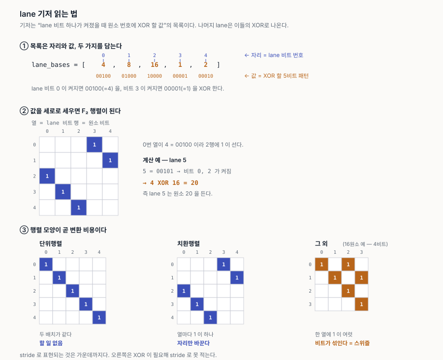
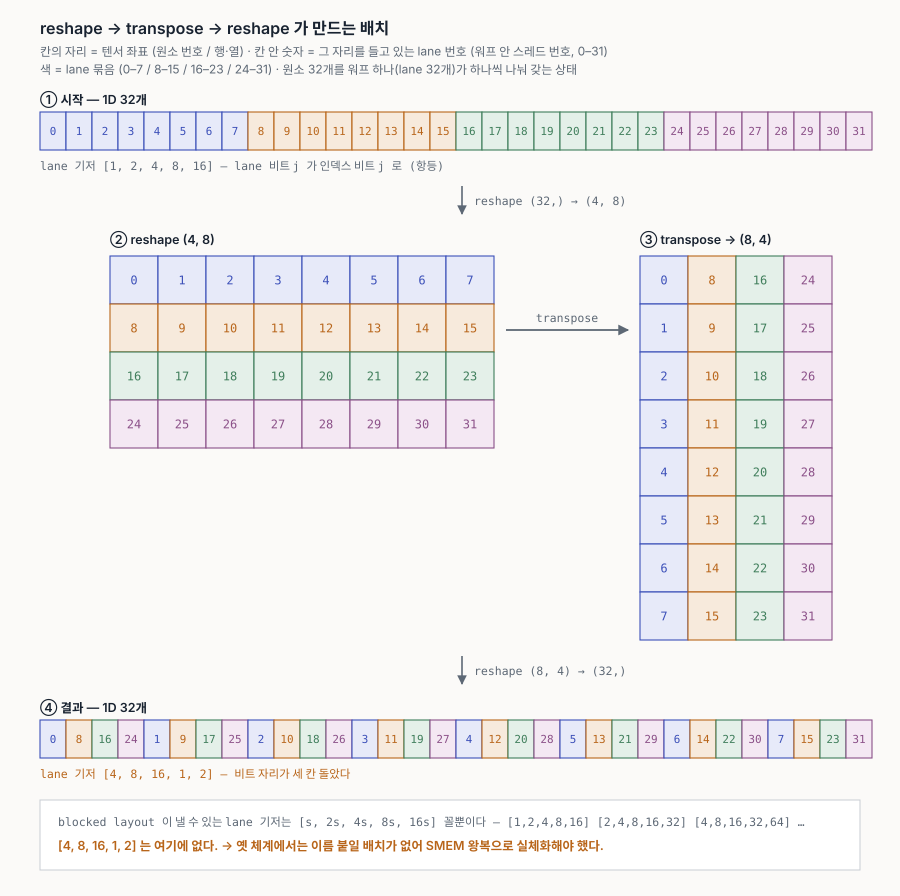
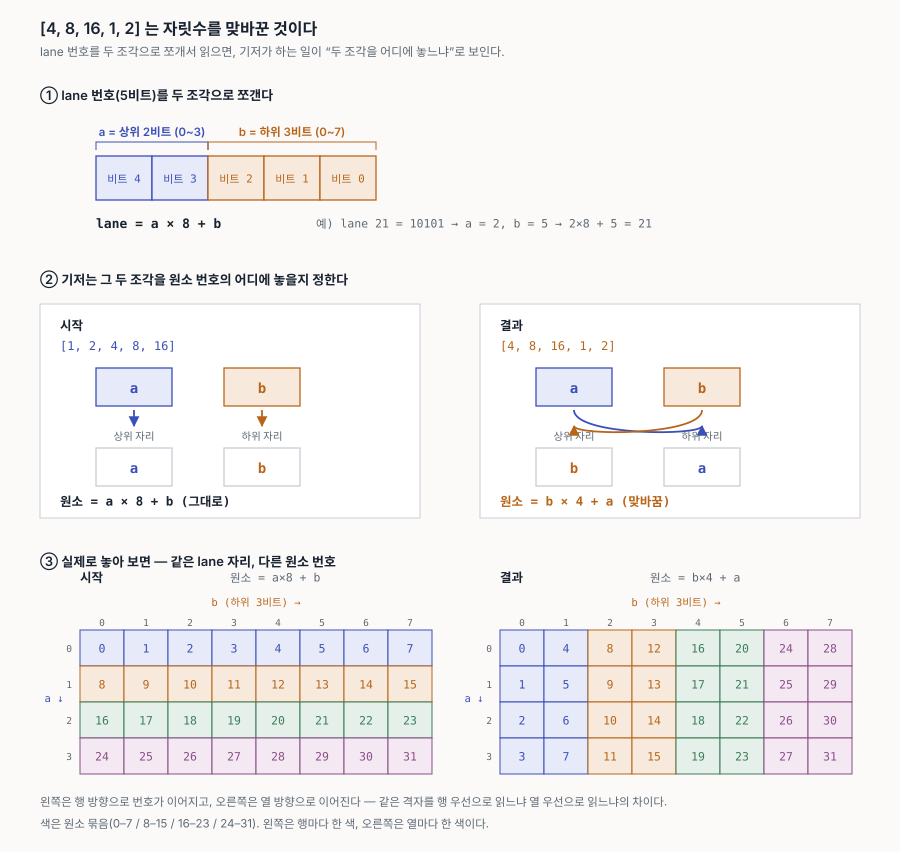
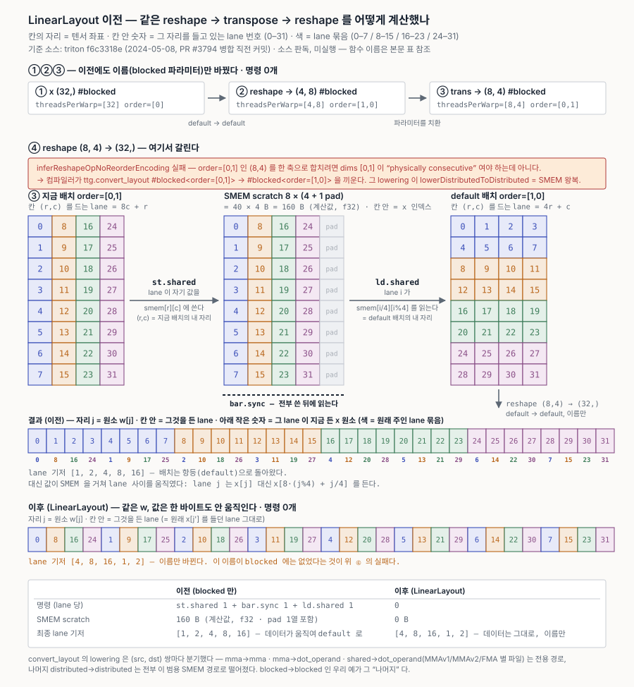
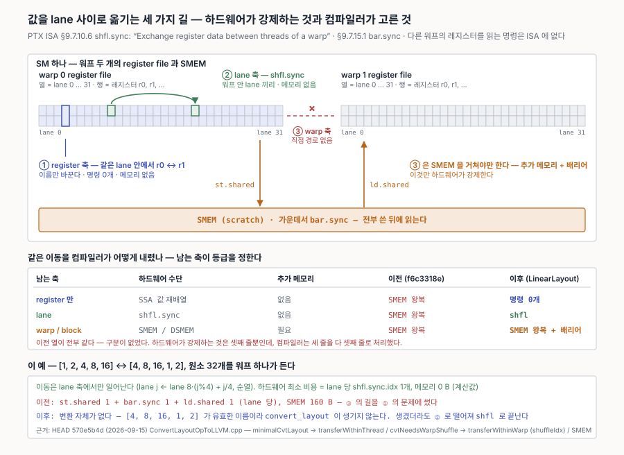
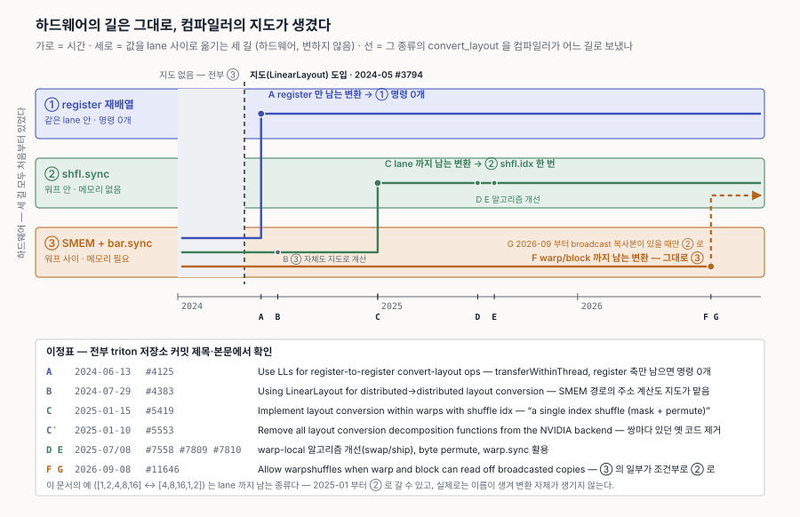
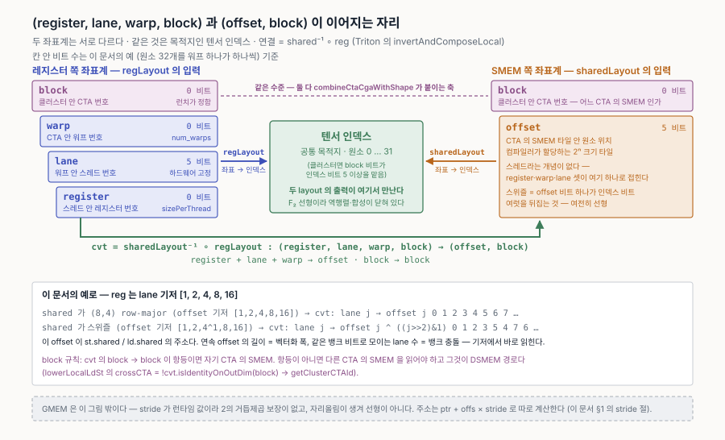

# 11. LinearLayout은 어떻게 만들어졌나 — 커밋으로 따라가기

`docs/08`이 Triton 컴파일 경로를, `docs/10` §0.6이 LinearLayout이 **무엇인지**를 다룬다. 이 문서는 **왜 그렇게 됐는지**를 저장소 이력에서 직접 확인한 기록이다.

논문([arXiv:2505.23819](https://arxiv.org/abs/2505.23819), ASPLOS)은 완성된 체계를 설명한다. 그런데 각 조각이 **어떤 문제 때문에** 필요했는지는 PR 본문과 커밋에 그때의 언어로 남아 있고, 그쪽이 이해에 더 도움이 된다.

**방법.** `git clone --filter=blob:none --no-checkout https://github.com/triton-lang/triton.git` (2026-09-14 시점, HEAD `2026-09-12`, 6,963 커밋) + GitHub 이슈 API.

집합을 둘로 잡았다. **제목 기준** — `linear layout`/`LinearLayout`/`[LAYOUTS]`가 든 커밋 **245건**. **파일 기준** — `LinearLayout.{h,cpp}`, `LinearLayoutConversions.{h,cpp}`, `LayoutUtils.*`, `LinearLayoutTest.cpp`를 건드린 고유 커밋 **223건**(2024년 60 · 2025년 114 · 2026년 49).

> **두 집합이 크게 어긋난다.** 코어를 건드린 223건 중 제목에 키워드가 있는 것은 **78건(35%)**뿐이다. `LinearLayoutConversions.cpp` 170건만 놓고 보면 **116건(68%)**이 제목에 안 드러난다. 제목 검색만으로는 실제 발자국의 3분의 1만 보인다 — 이 문서의 초판이 그 함정에 빠져 있었다.

> **이 문서가 바로잡는 두 가지.** ① LinearLayout은 Blackwell 때 도입된 것이 아니다 — Blackwell 하드웨어보다 1년 가까이 앞선다. ② MX scale 오퍼랜드가 방아쇠도 아니다 — 그보다 나중에 온 사례다.

---

## 1. 도입 — PR #3794 (2024-05-08)

[triton-lang/triton#3794 "Linear layouts"](https://github.com/triton-lang/triton/pull/3794) · 작성 2024-04-30 · 병합 2024-05-08 · +2,673/−77, 34개 파일 · 작성자 Justin Lebar, 아이디어 제안 Adam Goucher.

Blackwell 발표(2024-03 GTC) **한 달 뒤**에 작성됐고, Triton의 sm_100 지원은 2025년에 들어온다. 즉 **하드웨어가 나오기 한참 전**이다.

PR 본문이 든 이유는 셋이다.

> 1. layout 변환과 관련해 **고치기 매우 어려운 알려진 버그들**이 있다
> 2. `reshape + transpose + reshape` 조합 중 **현재 layout으로는 효율적으로 표현할 수 없는** 것들이 있다
> 3. layout 처리 코드가 이미 매우 복잡한데, **"Blackwell이 이 문제를 더 악화시킬 것이 우려된다"**

**③에 주목할 것.** Blackwell은 원인이 아니라 **예고된 악재**로 언급됐다. 스펙만 보고 "이대로면 감당 안 되겠다"고 판단한 것이다.

### ③은 무엇을 보고 한 말인가

2024-04-30 시점에 Blackwell에 대해 공개된 것은 GTC 발표(2024-03-18)뿐이다. PTX ISA는 CUDA 12.8(2025-01)에서야 나온다. 그런데 **발표만으로 충분했다.**

기술 브리프의 "Second-Generation Transformer Engine" 절이 이렇게 적는다.

> Blackwell Tensor Core는 새 정밀도를 추가하는데, **커뮤니티가 정의한 microscaling 포맷**이 포함된다. (…) **micro-tensor scaling**이라 부르는 미세 입도 스케일링 기법으로 (…) FP4 AI를 가능하게 한다.

컴파일러 쪽에서 읽으면 한 줄이다 — **오퍼랜드가 하나 더 생긴다.** `microscaling`은 블록마다 스케일 하나가 따로 붙는 포맷이고, 그 스펙은 이미 공개돼 있었다: [arXiv:2310.10537](https://arxiv.org/abs/2310.10537) *Microscaling Data Formats for Deep Learning*, **2023-10**, Microsoft·AMD·Intel·Meta·**NVIDIA**·Qualcomm 공저. GTC보다 6개월, PR #3794보다 **7개월 앞선다.**

| 2024-04 시점에 공개돼 있던 것 | layout에 무슨 뜻인가 |
|---|---|
| microscaling 포맷 채택 | **scale 텐서라는 새 오퍼랜드** — 배치가 N → N+1, 쌍은 N² |
| 2세대 Tensor Core | fragment 배치가 또 한 벌 바뀐다 |
| FP4 / FP6 | 레지스터당 원소 수가 늘어 **lane당 담당 열이 2 → 4 → 8** |

세 번째는 나중에 정확히 그대로 실현됐다([10-memory-model.md](10-memory-model.md) §0.6). 새 명령의 구체적 배치는 몰라도 **정밀도가 내려가면 A·B는 넓어지고 누산기는 안 넓어진다**는 것은 구조적으로 예측 가능한 일이었다.

### 반대로 그때 몰랐던 것

`tcgen05`, **TMEM**, 2-CTA MMA는 PTX ISA에 있고 **CUDA 12.8(2025-01)**에서야 공개됐다. 즉 §5의 `tcgen05.ld/st` 일반화(2025년 8~10월)는 **설계 당시 존재조차 몰랐던 메모리 층**을 다룬 것이다.

그래서 그 커밋들이 `TensorMemoryToLLVM.cpp`에서 **435줄을 지운** 사실이 더 무겁다 — 예상하지 못한 층이 하나 추가됐는데 **대수를 고치지 않고 얹혔다**는 뜻이기 때문이다. 도입 PR의 미해결 질문 ①(*"정말 모든 layout을 표현할 만큼 유연한가"*)에 대한 사후 답이기도 하다.

본문은 CUTLASS도 직접 언급한다 — *"CUTLASS v2에 같은 문제가 있었고, v3에서 CuTe layout으로 특수 케이스들을 하나로 묶었다."* Triton에 CuTe를 그대로 쓰는 것도 검토했으나 맞지 않아, Goucher가 제안한 linear layouts를 택했다고 적혀 있다.

### ①이 가리킨 버그의 실체

PR이 링크한 곳은 당시 `python/test/unit/language/test_core.py`의 `test_convert2d`다. 해당 시점 파일을 꺼내 보면:

```python
if (M == 1 or N == 1) and interm_layout:
    # TODO(jlebar): These OOB accesses don't even hit an assert in the
    # compiler, and some of them return the wrong result instead of
    # crashing!
    pytest.skip("Out of bound access when maxPhase > 1")
```

**퇴화 차원(M=1 또는 N=1) + 스위즐된 중간 shared layout** 조합에서 SMEM 범위 밖 접근이 나고, 컴파일러가 assert도 안 걸고 **조용히 틀린 결과**를 냈다. `maxPhase`는 스위즐 파라미터다.

§0.6에서 본 것과 같은 구조다 — 스위즐은 성능 튜닝이면서 **정확성 계약**이고, 하드웨어는 검사해 주지 않는다. 옛 체계는 퇴화 차원과 스위즐의 합성을 표현할 수 없어 오프셋을 잘못 계산했고, 아무도 못 잡았다.

### 먼저 — lane 기저란 무엇인가

아래 예를 읽으려면 이 표기 하나가 필요하다. ([10-memory-model.md](10-memory-model.md) §0.6이 같은 것을 비트 배정표로 다룬다.)

layout은 **하드웨어 좌표 → 텐서 인덱스** 함수다. `lane`은 **워프 안의 스레드 번호**(`%laneid`, 0~31)이고 행·열이 아니다 — 입력 쪽에 있다.

그리고 이 함수는 F₂ 위에서 **선형**이다. 즉 어떤 lane이 갖는 원소 번호는 **켜진 lane 비트들의 몫을 XOR한 것**이다. 그러니 **비트 하나만 켜진 lane 다섯 개**(1, 2, 4, 8, 16)가 무엇을 갖는지만 적으면 32개 전부가 정해진다. 그 목록이 **기저**다.



목록이 두 가지를 동시에 담고 있어서 숫자만 보면 헷갈린다.

```
lane_bases = [4, 8, 16, 1, 2]
              ↑
        자리 j = lane 비트 번호        (입력 쪽)
        값     = XOR 할 비트 패턴      (출력 쪽)
```

`lane_bases[0] = 4 = 00100` 은 "lane 비트 0이 켜지면 원소 번호에 `00100`을 XOR하라"는 뜻이다. 그래서 `lane 5 = 00101` → 비트 0과 2 → `4 XOR 16 = 20` → **lane 5는 원소 20을 든다.**

각 값을 **세로로 세워 열로 놓으면 F₂ 행렬**이 된다(열 = lane 비트, 행 = 원소 비트). 그림 ③이 요점이다 — **행렬 모양이 곧 변환 비용이다.**

| 행렬 | 뜻 | 비용 |
|---|---|---|
| **단위행렬** | 두 배치가 같다 | 할 일 없음 |
| **치환행렬** (열마다 1이 하나) | 자리만 바뀐다 | 어느 비트가 움직였는지에 따라 갈린다 |
| **그 외** (한 열에 1이 여럿) | 한 lane 비트가 원소 비트 여럿을 건드린다 | 스위즐 — **stride로는 못 적는다** |

값이 전부 2의 거듭제곱이면 앞의 둘이고, 아니면 셋째다. 예컨대 `[1, 2, 5, 10]`에서 `5 = 00101`, `10 = 01010`은 각각 비트가 둘씩 켜져 있다.

#### stride 와의 관계 — 2의 거듭제곱 stride는 기저의 특수한 경우다

방향을 뒤집어 읽으면 안 된다. **기저가 stride인 것이 아니라, stride가 기저의 한 부분집합이다.**

기저의 정의에는 stride가 나오지 않는다.

> `bases[j]` = lane 비트 `j` 가 켜졌을 때 원소 번호에 **XOR 할 값**.

그 값이 마침 **단일 비트**(2의 거듭제곱)이면 "stride 얼마짜리 축"으로 읽히고, 아니면 안 읽힐 뿐이다. stride로 읽히는 것은 정의가 아니라 부수적 성질이다.

```
   모든 기저
   ├── 값이 전부 단일 비트   →  2의 거듭제곱 stride 와 일대일
   └── 값에 비트가 여럿      →  stride 밖 — 스위즐
```

**읽히는 경우**를 먼저 확인해 두면 관계가 분명해진다. 위 예의 `reshape (4, 8)` 은 stride 가 `(8, 1)` 이다.

| 축 | 비트 수 | stride | 기저값 |
|---|---|---|---|
| 열 | 3 | 1 | `1, 2, 4` = 1 × (1,2,4) |
| 행 | 2 | 8 | `8, 16` = 8 × (1,2) |

전치해 `(8, 4)` 가 되면 stride 가 `(4, 1)` 이 되고, 기저는 `4, 8, 16` / `1, 2` 로 바뀐다. 앞서 본 **조각**이 곧 **축**이고, 조각 안의 값들이 그 축의 `stride × 1, 2, 4, …` 다.

**왜 2의 배수가 아니라 거듭제곱이어야 하나.** 좌표 `c` 의 기여 `c × s` 가 비트별 XOR과 같으려면 **자리올림이 없어야** 한다.

```
stride 4 (거듭제곱)              stride 6 (2의 배수지만 거듭제곱 아님)
 c=1 →  4 = 00100                c=1 →  6 = 00110
 c=2 →  8 = 01000                c=2 → 12 = 01100
 c=3 → 12                        c=3 → 18
 4 XOR 8 = 12   ✓ 일치            6 XOR 12 = 10   ✗ 실제는 18
```

`stride 6` 에서는 `6` 과 `12` 가 비트 2에서 겹쳐 자리올림이 나고, 그 순간 선형성이 깨진다. 거듭제곱만이 `s, 2s, 4s, …` 를 전부 단일 비트로 유지한다.

정리하면 세 갈래다.

| | |
|---|---|
| stride 가 2의 거듭제곱 | 기저로 표현됨 (기저값이 전부 단일 비트) |
| stride 가 그 외 (3, 6, 런타임 `K` …) | **선형이 아니다.** 기저로 못 쓴다 — GMEM이 여기 |
| 기저값에 비트가 여럿 | **stride 로 못 쓴다.** 스위즐 |

가운데 줄이 [10-memory-model.md](10-memory-model.md) §0.6에서 "GMEM에는 layout이 없다"고 한 이유다. `ptr + offs × stride_am` 의 `stride_am` 은 런타임 값이라 2의 거듭제곱이라는 보장이 없다.

아래 줄이 LinearLayout이 shape/stride 대수보다 넓은 지점이다. SMEM 뱅크 충돌을 피하는 XOR 스위즐이 정확히 여기 살고, stride 대수만 있으면 스위즐을 **별도 개념으로 따로 붙여야** 한다 — 논문이 CuTe와의 차이로 *"스위즐이 linear layout에는 내재되어 있는데 CuTe에서는 따로 다룬다"* 고 한 것이 이 얘기다.

### ②는 어떤 조합인가 — 구체적인 예 하나

워프 하나로 확인할 수 있다. **1D 32원소 텐서를 lane 32개가 하나씩 나눠 갖는** 상태에서 시작한다.

```python
x = ...            # shape (32,), lane i 가 원소 i 를 든다
y = tl.reshape(x, (4, 8))
z = tl.trans(y)          # (8, 4)
w = tl.reshape(z, (32,))
```

**데이터는 한 바이트도 움직일 필요가 없다.** 셋 다 "누가 무엇을 갖는가"의 이름만 바꾸는 연산이기 때문이다. 그런데 결과 배치를 기저로 따라가 보면 문제가 드러난다.



| | lane 기저 |
|---|---|
| 시작 | `[1, 2, 4, 8, 16]` — lane 비트 `j` 가 인덱스 비트 `j` 로 (항등) |
| 결과 | **`[4, 8, 16, 1, 2]`** — 비트 자리가 세 칸 돌았다 |

`[4, 8, 16, 1, 2]` 는 숫자만 보면 뜬금없지만, **lane 번호를 두 조각으로 쪼개서 읽으면 자릿수를 맞바꾼 것**이다.



lane 번호 5비트를 상위 2비트 `a`(0~3)와 하위 3비트 `b`(0~7)로 나누면 `lane = a×8 + b` 다. 그러면 두 배치가 이렇게 읽힌다.

| | 원소 번호를 만드는 식 |
|---|---|
| 시작 `[1, 2, 4, 8, 16]` | `a × 8 + b` — **그대로** |
| 결과 `[4, 8, 16, 1, 2]` | `b × 4 + a` — **두 조각을 맞바꿈** |

앞의 세 값 `4, 8, 16`이 하위 조각 `b`에 곱해지는 자리(×4)를 맡고, 뒤의 `1, 2`가 상위 조각 `a`를 맨 아래 자리로 밀어 넣는다. 확인해 보면 `lane 9 = a1, b1 → 1×4 + 1 = 원소 5` 로 맞는다.

**이게 전치의 정의 그대로다** — 빠른 축과 느린 축이 자리를 바꾼다. 그래서 `lane i` 가 원소 `((i & 7) << 2) | (i >> 3)` 를 들게 되고, lane 순서로 늘어놓으면 `0, 4, 8, 12, 16, 20, 24, 28, 1, 5, 9, …` 이다.

**그런데 `blocked` layout이 낼 수 있는 1D lane 기저는 `[s, 2s, 4s, 8s, 16s]` 꼴뿐이다** — `sizePerThread = s` 만큼 연속으로 맡고 그다음부터 lane이 나눠 갖는 구조라, 비트가 **증가 순서**로만 배정된다. 후보는 넷뿐이다.

```
[1, 2, 4, 8, 16]   [2, 4, 8, 16, 32]   [4, 8, 16, 32, 64]   …
```

`[4, 8, 16, 1, 2]` 는 여기 없다. **이름 붙일 배치가 없으니 컴파일러가 할 수 있는 일은 SMEM으로 실체화하는 것뿐이다** — 아무것도 움직일 필요가 없었는데 `st.shared` + 배리어 + `ld.shared` 가 생긴다. PR이 말한 *"효율적으로 표현할 수 없다"* 가 이것이다.

#### 그때는 실제로 어떻게 계산됐나

"SMEM으로 실체화" 가 코드에서 어디서 일어나는지를 PR #3794 병합 직전 커밋 [`f6c3318e`](https://github.com/triton-lang/triton/commit/f6c3318e4d70d697b5af4672babb4ac4ca61bd63) (2024-05-08) 에서 따라갔다. 세 연산 중 **앞의 둘은 그때도 공짜**였고, 갈리는 곳은 마지막 `reshape` 하나다.



| 단계 | 그때의 처리 | 근거 (커밋 `f6c3318e`) |
|---|---|---|
| ① `x (32,)` | `#blocked<threadsPerWarp=[32], order=[0]>` — default 배치 | `getDefaultBlockedEncoding` (`lib/Dialect/TritonGPU/IR/Dialect.cpp`) |
| ② `reshape → (4,8)` | src 가 default 면 dst 도 default 로 **이름만** 바꾼다. lowering 은 값을 풀어 다시 묶는 것뿐 — **명령 0개** | `inferReshapeOpNoReorderEncoding` 의 "default → default encoding is always a nop" / `ReshapeOpConversion` (`ViewOpToLLVM.cpp`) |
| ③ `trans → (8,4)` | `sizePerThread`·`threadsPerWarp`·`warpsPerCTA` 를 치환하고 `order` 를 `[1,0] → [0,1]` 로 — 역시 **이름만, 명령 0개** | `inferTransOpEncoding` blocked 가지 / `TransOpConversion` 주석 *"just a renaming of the registers"* |
| ④ `reshape → (32,)` | **실패.** `order=[0,1]` 인 `(8,4)` 의 두 축을 하나로 합치려면 두 축이 *"physically consecutive"* 여야 하는데 아니다 → 추론이 `failure()` 를 낸다 | `inferReshapeOpNoReorderEncoding` 의 `isConsecutive(reverse(gather(srcInvOrder, srcDims)))` 검사 |
| ④′ 끼워 넣기 | Triton → TritonGPU 변환이 `reshape` 의 입력을 default 배치로 맞추려고 **`ttg.convert_layout #blocked<order=[0,1]> → #blocked<order=[1,0]>`** 을 삽입한다. `RemoveLayoutConversions` 도 이 op 을 못 없앤다 — 앞뒤 `reshape` 어느 쪽으로 밀어도 같은 검사에 걸린다 | `TritonGPUConversion.cpp` 의 `addTargetMaterialization` → `ConvertLayoutOp` / `Transforms/Utility.cpp` 의 `inferSrcEncoding`·`inferDstEncoding` 이 같은 함수를 부른다 |
| ④″ lowering | blocked → blocked 는 전용 경로가 없어 **범용 SMEM 왕복**으로 떨어진다. lane 마다 자기 자리에 `st.shared` → `bar.sync` → default 자리에서 `ld.shared`. scratch 는 `8×(4+1 pad)` = **160 B (계산값, f32)** | `lowerDistributedToDistributed` + `processReplica` (`lib/Conversion/TritonGPUToLLVM/ConvertLayoutOpToLLVM.cpp`), pad 는 `getScratchConfigForCvtLayout` (`lib/Analysis/Allocation.cpp`) |

결과가 흥미롭다. **옛 경로는 배치를 default `[1, 2, 4, 8, 16]` 로 되돌리기 위해 값을 움직였고**, LinearLayout 경로는 값을 그대로 두고 배치 이름을 `[4, 8, 16, 1, 2]` 로 바꾼다. 둘이 계산한 텐서 `w` 는 같다 — 검증 스크립트가 두 lane 대응표를 대조해 확인한다. 차이는 lane 당 **`st.shared` 1 + `bar.sync` 1 + `ld.shared` 1 + SMEM 160 B** 대 **명령 0개**다.

**이 이동에 SMEM 이 정말 필요했나.** 하드웨어 기준으로는 아니다. 값을 lane 사이로 옮기는 길은 셋이고, 그중 추가 메모리가 필요한 것은 워프 경계를 넘는 하나뿐이다.



| 남는 축 | 하드웨어 수단 | 추가 메모리 | 이전 (`f6c3318e`) | 이후 (LinearLayout) |
|---|---|---|---|---|
| `register` 만 | 같은 lane 안에서 SSA 값 재배열 | 없음 | SMEM 왕복 | 명령 0개 (`transferWithinThread`) |
| `lane` | `shfl.sync` — PTX ISA §9.7.10.6 *"Exchange register data between threads of a warp"* | 없음 | SMEM 왕복 | `shfl` (`cvtNeedsWarpShuffle` → `transferWithinWarp`) |
| `warp` / `block` | SMEM / DSMEM + `bar.sync` (§9.7.15.1) | **필요** | SMEM 왕복 | SMEM 왕복 + 배리어 |

이전 열이 전부 같다는 것이 요점이다. 다른 워프의 레지스터를 읽는 명령이 ISA 에 없으니 셋째 줄은 하드웨어가 강제하는 것이지만, 옛 컴파일러는 첫째·둘째 줄도 셋째 줄로 처리했다. 확인한 커밋에서 `convert_layout` lowering 이 `shfl` 을 쓰는 곳은 MMAv3 → 8-bit dot operand 변환 하나뿐이고, blocked → blocked 를 포함한 나머지 distributed → distributed 는 전부 SMEM 경로였다. 우리 예의 이동은 워프 하나 안의 lane 순열 (`lane j ← lane 8·(j%4) + j/4`) 이라 하드웨어 최소 비용은 lane 당 `shfl.sync.idx` 1개, 메모리 0 B 다 `(계산값)`. 즉 옛 경로는 **표현의 한계가 불필요한 이동을 만들고, lowering 의 단순함이 그 이동을 가장 비싼 길로 보낸** 두 겹의 손해다. 지금 Triton 은 `minimalCvtLayout` 으로 항등인 축을 걷어낸 뒤 남는 축으로 이 셋을 구분한다 (HEAD `570e5b4d`, 2026-09-15, `ConvertLayoutOpToLLVM.cpp`) — 그리고 이 예는 변환 자체가 생기지 않으니 표의 어느 줄에도 들어가지 않는다.

**세 길은 하드웨어에 원래부터 있었다. 생긴 것은 컴파일러의 지도다.** `shfl` 은 Kepler 부터 있는 명령이고, 같은 lane 안의 재배열은 명령조차 아니다. 옛 컴파일러가 이 길들을 못 쓴 이유는 이름 있는 배치 쌍을 받아서 두 배치가 어느 축에서 다른지 일반적으로 판정할 수단이 없었기 때문이다. LinearLayout 이 그 판정을 주었고, 판정이 생기자 싼 길부터 차례로 열렸다.



| | 시점 | PR | 열린 길 |
|---|---|---|---|
| | 2024-05-08 | [#3794](https://github.com/triton-lang/triton/pull/3794) | LinearLayout 도입 — 판정의 재료. 이때는 `convert_layout` lowering 이 아직 옛 코드 |
| A | 2024-06-13 | [#4125](https://github.com/triton-lang/triton/pull/4125) "Use LLs for register-to-register convert-layout ops" | `register` 축만 남는 변환 → ① 명령 0개 (`transferWithinThread`) |
| B | 2024-07-29 | [#4383](https://github.com/triton-lang/triton/pull/4383) | distributed → distributed 의 SMEM 경로 자체도 LinearLayout 으로 주소 계산 |
| C | 2025-01-15 | [#5419](https://github.com/triton-lang/triton/pull/5419) "Implement layout conversion within warps with shuffle idx" | `lane` 까지 남는 변환 → ② `shfl.idx`. PR 본문: *"for all distributed layouts, we can implement this transformation using a single index shuffle (mask + permute)"* |
| C′ | 2025-01-10 | [#5553](https://github.com/triton-lang/triton/pull/5553) | NVIDIA 백엔드에서 쌍마다 있던 decomposition 함수 전부 제거 |
| D·E | 2025-07 ~ 08 | [#7558](https://github.com/triton-lang/triton/pull/7558), [#7809](https://github.com/triton-lang/triton/pull/7809), [#7810](https://github.com/triton-lang/triton/pull/7810) | 워프 안 알고리즘 개선 (swap / ship), byte permute, `warp.sync` 활용 |
| F·G | 2026-09-08 | [#11646](https://github.com/triton-lang/triton/pull/11646) "Allow warpshuffles when warp and block can read off broadcasted copies" | `warp`/`block` 축이 남아도 broadcast 된 복사본을 읽을 수 있으면 ② 로 — ③ 의 일부가 조건부로 내려옴 |

즉 앞 표의 "이전" 열이 전부 SMEM 인 것은 2024-05 시점의 사실이고, `lane` 줄이 일반 경로로 열린 것은 그로부터 8개월 뒤다. 가장 최근 항목은 원래 SMEM 이 필요하던 `warp` 축 변환 일부까지 `shfl` 로 내리는 것이라, 셋째 줄도 조건부로 둘째 줄로 내려오는 중이다. 이 이력은 §3 의 `invertAndCompose` 수정 이력과 같은 방식으로 커밋 제목·본문에서 확인했고, 각 PR 의 lowering 이 실제로 내는 명령 수는 측정하지 않았다.

**그런데 `(register, lane, warp, block)` 과 `(offset, block)` 은 다른 주소 체계 아닌가.** 다르다. LinearLayout 이 두 체계를 하나로 합친 것이 아니라, **둘이 가리키는 목적지가 같다**는 점을 쓴다. 레지스터 쪽 layout 도 SMEM 쪽 layout 도 “하드웨어 좌표 → 텐서 인덱스” 함수이고, 입력 축 이름만 다르다. 텐서 인덱스가 공통 좌표계라서 `sharedLayout⁻¹ ∘ regLayout` 이 항상 정의되고, 그 결과가 “이 lane 의 이 register 는 offset 몇 번에 써야 하나”다. `MemoryOpToLLVM.cpp` 의 `invertAndComposeLocal(sharedLayout, regLayout)` 이 이 식이고, 출력이 곧 `st.shared` / `ld.shared` 의 주소다.



| | 레지스터 쪽 입력 축 | SMEM 쪽 입력 축 | 대응 |
|---|---|---|---|
| 클러스터 안 CTA | `block` | `block` | **같은 수준.** 두 layout 모두 `combineCtaCgaWithShape(ctaLayout, cgaLayout, shape)` 가 같은 CGA layout 으로 이 축을 붙인다 (`LinearLayoutConversions.cpp`) |
| CTA 안 | `warp` → `lane` → `register` | `offset` | 셋이 하나로 접힌다. SMEM 에는 “어느 스레드” 라는 개념이 없고 타일 안 위치만 있다 |

합성 `cvt` 는 `block → block` 부분과 `register + lane + warp → offset` 부분으로 갈라진다. `block → block` 이 항등이면 각 CTA 가 자기 SMEM 만 쓰고, 항등이 아니면 다른 CTA 의 SMEM 을 읽어야 하므로 DSMEM 경로로 간다 — `lowerLocalLdSt` 의 `crossCTA = !cvt.isIdentityOnOutDim(block)` 이 그 판정이고 그때만 `getClusterCTAId` 를 부른다 (`Utility.cpp`). 이것이 가능한 조건은 양쪽이 모두 F₂ 위에서 선형이라는 것이다. 스위즐은 offset 비트 하나가 인덱스 비트 여럿을 뒤집는 것이라 여전히 선형이고, 반대로 GMEM 은 stride 가 런타임 값이라 선형이 아니어서 이 그림 밖에 있다 (위 stride 절).

우리 예로 확인하면, `regLayout` 이 lane 기저 `[1, 2, 4, 8, 16]` 이고 SMEM 이 `(8,4)` row-major 면 `cvt` 는 `lane j → offset j`, offset 비트 2 가 인덱스 비트 0 도 뒤집는 스위즐이면 `lane j → offset j ^ ((j>>2)&1)` = `0 1 2 3 5 4 7 6 …` 이다. 연속 offset 의 길이가 벡터화 폭, 같은 뱅크 비트로 모이는 lane 수가 뱅크 충돌이라 기저에서 바로 읽힌다.

> 직접 확인: [`examples/rf_smem_compose.py`](examples/rf_smem_compose.py) — 두 layout 을 기저 목록으로 적고 `shared⁻¹ ∘ reg` 를 전수 조사로 합성한다. 클러스터 예에서 `block → block` 이 항등으로 나오는 것도 본다.

두 가지 주의. 이 표는 **소스 판독**이고 당시 빌드를 실행한 것이 아니다 (`미실행`). 그리고 `convert_layout` lowering 이 **(src, dst) 쌍마다 분기**했다는 것도 이 커밋에서 그대로 보인다 — `mma → mma`, `mma → dot_operand`, `shared → dot_operand` (MMAv1 / MMAv2 / FMA 별 파일) 는 전용 경로, 나머지 distributed → distributed 는 전부 위의 범용 SMEM 경로다. `blocked → blocked` 인 이 예가 그 "나머지" 다. 이 구조가 §7 의 "N² 에서 1로" 의 N² 쪽이다.

> 직접 확인: [`examples/reshape_transpose_reshape_before_ll.py`](examples/reshape_transpose_reshape_before_ll.py) (GPU 불필요) — 위 커밋의 blocked 빌더·`trans` 추론·`reshape` 추론·SMEM 왕복을 파이썬으로 옮겨 그림의 숫자를 전부 만들고, LinearLayout 경로와 결과가 같은지 대조한다.

LinearLayout에서는 `[4, 8, 16, 1, 2]` 가 그냥 유효한 기저 목록이다. `reshape` 는 비트 재묶음, `trans` 는 치환 행렬이고 **둘 다 연산이 닫혀 있어** 결과가 항상 유효한 LinearLayout이다. 이름을 붙이고 **명령 0개**로 끝난다.

> 직접 확인: [`examples/reshape_transpose_reshape.py`](examples/reshape_transpose_reshape.py) (GPU 불필요). `tl.trans` 한 번만이라면 `blocked` 의 `order` 를 뒤집어 표현되므로 문제가 없다 — **reshape가 양쪽에 붙어 축 경계를 가로질러야** 비로소 표현 밖으로 나간다. PR 본문이 "some reshape + transpose + reshape combinations"라고 쓴 이유다.

### 그때 미해결로 남긴 질문 둘

> 1. linear layout이 우리가 신경 쓰는 모든 layout을 표현할 만큼 **정말 유연한가**?
> 2. linear layout의 **텍스트 IR은 어떤 모양이 될까**? 지금 IR만큼 읽기 쉽게 만들 수 있나?

그리고 계획을 이렇게 적었다 — 우선 `BlockedLayout`의 인덱스 생성만 LL로 돌리고, 다른 layout도 같게 만들어 **codegen이 LL만 쓰게** 한 뒤, 미들엔드로 올리고, *"최종 목표는 모든 layout을 이것 하나로 대체하는 것"*.

7번 절에서 이 목표가 어떻게 됐는지 확인한다.

---

## 2. 흡수 — 기존 layout을 하나씩 (2024-05 ~ 07)

| 날짜 | PR | 무엇을 편입했나 |
|---|---|---|
| 2024-05-15 | #3909 | MMAv2/v3 → LinearLayout |
| 2024-05-15 | #3925 | `SliceEncodingAttr` → LinearLayout |
| 2024-05-30 | #4036 | AMD MFMA → LinearLayout |
| 2024-06-04 | #4038 | **Shared** → LinearLayout (스위즐이 여기 들어온다) |
| 2024-06-06 | #4070 | `AsyncCopyGlobalToLocalOp` lowering에 LL 사용 |
| 2024-06-13 | #4125 | **레지스터→레지스터** convert-layout에 LL 사용 |
| 2024-07-29 | #4383 | distributed → distributed 변환 전반 |

순서가 말해 준다. **표현을 먼저 다 흡수하고**(5~6월), 그다음에 **변환 코드 생성**을 LL로 옮겼다(6~7월). §0.6의 "표기 → 구현" 두 층이 실제로 이 순서로 진행됐다.

---

## 3. 아직도 고치고 있다 — `invertAndCompose`

§0.6에서 `B⁻¹ ∘ A`라고 쓴 그 연산이다. **저장소에서 가장 오래, 가장 자주 고쳐진 함수다.** 제목에 이름이 든 커밋만 아홉 건이고, 2년 4개월에 걸쳐 있다.

| 날짜 | PR | |
|---|---|---|
| 2024-06-10 | #4115 | 모호성 해소 방식 변경 |
| 2024-10-25 | #4991 | 레지스터→레지스터 변환 판정 개선 |
| 2024-12-05 | **#5309** | **최소자승 해로 전환** |
| 2024-12-19 | #5468 | 항등 차원이 있을 때의 버그 |
| 2025-04-14 | #6272 | 디버그 빌드 크래시 |
| 2025-07-16 | #7515 | `memdesc_subview` 오프셋 누적 문제 |
| 2026-04-24 | #10116 | 결함 수정 |
| 2026-06-18 | #10647 | 브로드캐스트 상황에서 CTA를 넘지 않도록 |
| **2026-09-08** | **#11645** | `GeneralLinearLayout`에서의 수정 — **클론 HEAD 나흘 전** |

이 함수 하나가 §0.6에서 정리한 세 갈래(비용 0 / `shfl` / SMEM 왕복) 판정을 전부 짊어진다. 대수는 단순한데 **모호성을 어떻게 해소하느냐**가 곧 성능이고, 그래서 계속 손이 간다.

**#4115 (2024-06-10) — 모호성.** 커밋 본문이 예시를 든다:

```
A(thread=1, block=0) = 1
A(thread=2, block=0) = 2
A(thread=0, block=1) = 0
```

같은 출력으로 가는 입력이 여럿이면 **어느 것을 고를지**가 정해지지 않는다. 같은 제목의 PR이 이틀 뒤 #4124로 한 번 더 올라온다 — **도입 한 달 만에 같은 함수를 두 번 고쳤다.**

**#5309 (2024-12-05) — 최소자승으로 정리.** 본문이 가장 명확하다.

> `getInjectiveMat`가 필요 없어진다. 그건 **입력과 출력의 레지스터 개수가 다르면 동작하지 않았고**, 그 위에 `getFreeVariable` 같은 곡예가 얹혀 있었다.
> 이제는 `invertAndCompose`를 **`AX = B`의 해 `X`** 로 계산한다. 해가 존재하는지(= A가 전사인지) assert로 확인하고, **데이터 이동을 최소화하는 휴리스틱을 명시한다** — 같은 차원은 고려하지 않고, 그 외에는 **최소 노름 해를 골라 브로드캐스트를 유도**한다.

`-250 / +168`. **해법을 제대로 잡으니 코드가 줄었다.**

§0.6에서 "역원 대신 의사역원, 모호한 자리를 결과에 유리하게 고른다"고 쓴 것의 실체가 이 커밋이다. 그리고 "유리하게"의 기준이 **최소 노름 = 최소 데이터 이동**이라고 코드에 박혀 있다.

---

## 4. 미해결 질문 ②의 답 — IR 표현 (#5170, 2024-11-21)

`[LAYOUTS] Implement IR support for LinearLayouts`. +785/−197.

IR 표현을 **canonical form + `repOrder`** 로 정했다. 도입 PR의 두 번째 숙제가 6개월 뒤에 풀린 것이다.

부수 효과가 하나 딸려 왔다 — `scale_dot`에서 **임의 모양의 warp 배치**를 지원하게 됐다. 그전에는 `[num_warps, 1]`만 됐다. 표현력이 생기니 제약이 저절로 풀린 예다.

저자가 본문에 남긴 우려도 기록해 둘 만하다 — `getSizePerThread` 같은 메서드가 **호출할 때마다 재계산**되고, 캐싱 여지가 있다는 것. LL이 "이름"이 아니라 "계산"이 된 대가다.

---

## 5. Blackwell — 얹기만 하면 됐나

도입 PR이 우려한 바로 그 지점이다. **설계가 의도대로 작동했다면 이 커밋들이 특수 코드를 늘리는 게 아니라 줄여야 한다.**

| 날짜 | PR | |
|---|---|---|
| 2025-02-05 | #5799 | mixed precision scaled dot (MX 계열) |
| 2025-08-14 | #7831 → **revert #7865** | `tcgen05.ld/st` 일반 lowering |
| 2025-08-15 | #7874 | 위 reland |
| 2025-10-15 | #8421 → **revert #8469** | `tcgen05.ld/st`용 distributed layout 생성 |
| 2025-10-29 | #8495 | 위 reland |

#7874 본문:

> 이 새 lowering은 **모든 명령을 지원하고, 임의의 layout에서/으로** 로드·스토어한다. 또한 **사용 가능한 모든 명령을 지원하는 일을 자명하게(trivial)** 만든다.

그리고 숫자가 이를 뒷받침한다. #8495는 `TensorMemoryToLLVM.cpp`에서 **435줄을 지운다**(전체 +1,365/−1,089, 34개 파일). **특수 케이스 코드를 삭제하고 일반 경로로 대체한 것**이다 — 이게 "LinearLayout이 값을 했나"에 대한 가장 직접적인 증거다.

동시에 정직하게 볼 것도 있다. **두 번 다 revert됐다.** #7865의 사유는 구체적이다:

> 내부 Gluon 커널 일부가 깨졌다. `assert(!isStore || cvt.getInDimSize(kReg) == vals.size());` 가 실패한다.

일반화가 옳은 방향이어도 하루 만에 되돌릴 만큼 만만치 않았다는 뜻이다. 전체 53건 중 **revert–reland 쌍이 네 번**이다(#6577/#6652, #7304/#7309/#7314, #7831/#7865/#7874, #8421/#8469/#8495).

---

## 6. 이유 ②는 2년 뒤에야

도입 PR의 두 번째 동기 — `reshape + transpose + reshape` 조합 — 를 정면으로 다룬 것은 **#11006 "[TritonGPU] Allow arbitrary reshapes of subslices" (2026-07-23)** 로 보인다. +846/−224, 35개 파일. 착수로부터 **2년 2개월**이다.

*(중간에 부분적으로 개선된 커밋이 더 있을 수 있다 — 제목 기준으로 고른 것이라 `(미확인)`.)*

---

## 6-2. 2026년은 정리 단계가 아니다

클론 HEAD가 2026-09-12인데, 2026년에만 관련 커밋이 58건이다(8.5개월, 월 ~7건). 그리고 성격이 "마무리"가 아니다.

### 타입이 하나 더 늘었다 — `GenericLinearEncodingAttr` (#9765, 2026-04-23)

+839/−201. 본문이 무엇을 푸는지 명확하다.

> `LinearEncodingAttr`의 **완화된 변형**으로, **스위즐된 warp 기저**와 **비단사(그러나 여전히 전사)** layout을 지원한다. 그런 제약에 의존하지 않는 연산에서는 이런 layout을 안전하게 쓰되, **의존하는 연산으로는 전파되지 않도록** 보장한다.

§0.6에서 다룬 브로드캐스트·비단사 문제가 **타입 수준의 구분**으로 올라온 것이다. 그리고 뒤이어 #10122가 `local_load`/`store`를 이 인코딩으로 내릴 수 있게 한다. **표현을 줄이는 게 아니라 늘리는 방향**이다.

`[BC BREAKING] Remove zero register bases from blocked layouts` (#11541, **2026-09-02**)도 같은 결이다 — blocked layout을 LL로 바꿀 때 0인 레지스터 기저를 떨어뜨려, **더 많은 blocked layout이 LL 수준에서 동치가 되게** 한다. 본문이 목적을 직접 적는다: *"원리적으로 일부 convert layout을 제거할 수 있다."*

### 쓰임새가 변환 밖으로 나갔다

이게 2026년의 진짜 변화다. LinearLayout이 이제 **변환을 위한 도구가 아니라 layout에 대한 질의 인터페이스**로 쓰인다.

| PR | 무엇에 |
|---|---|
| #11024 (2026-07-23) | **메모리 할당 크기**를 LL에서 계산 |
| #10475 (2026-06-09) | NVMMA SMEM 속성을 LL에서 추론 |
| #9192 · #9219 | `ReduceOp` lowering 단순화 |
| #9221 (2026-02-06) | **CTA를 가로지르는 `tt.reduce`** |
| #10948 (2026-07-23) | ConSan 정밀 alias 분석 |

#11024의 본문이 특히 좋다 — `getAllocationShapePerCTA`가 브로드캐스트가 있는 `SharedLinearLayout`에서 틀렸다는 데서 출발해, **"애초에 '할당 shape'이라는 개념 자체가 브로드캐스트 앞에서 정의되지 않는다"**고 결론 내린다. 대신 `kOffset` 기저의 개수를 센다. **옛 개념이 틀렸다는 걸 LL이 드러낸 사례다.**

### AMD가 주요 사용자다

코어 223건 중 제목이 `[AMD*]`인 것이 **52건, 23%**다(2024년 8 · 2025년 28 · 2026년 16).

시작이 이르다. **#4036 "[AMD] Support MFMA to LinearLayout conversion" (2024-06-12)** — 도입 **한 달 뒤**다. 이어 WMMA(#4134), WMMAv2(#4292), `dotOperandMfma`(#4817)가 붙고, 2026년에는 gfx1250의 scaled WMMA(#10082·#10222)와 TDM gather/scatter로 이어진다.

논문의 MI250 성능 이득이 **1.00~1.03×**임을 함께 놓고 보면 의미가 분명하다 — **AMD가 이걸 쓰는 이유는 속도가 아니다.** 표현과 정확성이다. 이 문서의 다른 절들이 NVIDIA에 치우쳐 있다는 점을 감안할 것.

### 보유 장비와 직결되는 것

**#11262 "[NVIDIA] Support batched SM120 scaled-dot scale layouts" (2026-08-12).** sm_120의 scaled-dot scale layout 변환이 rank-2 오퍼랜드를 가정하고 M/N·K를 차원 0·1로 하드코딩하고 있어서, **배치 matmul(rank-3 scale 텐서)에서 배치 차원이 lane·warp·register 구성에서 탈락**하던 문제다. +53/−17.

2026년 8월까지도 sm_120 + block scale 경로에 이런 구멍이 있었다는 뜻이라, [09-research-plan.md](09-research-plan.md)의 MXFP4 실험에서 **Triton 버전을 반드시 기록**해야 한다. 관련해 `[KERNELS] Fuse forward/inverse FP4 layout conversion`(#11495·#11496, 2026-08-28)도 같은 시기다.

---

## 6-3. Gluon — 비용 구분이 사용자 API가 됐다

Gluon은 LL을 감추지 않고 **그대로 노출한다**. 현재 `python/triton/experimental/gluon/language/_layouts.py`가 내보내는 클래스에 `DistributedLinearLayout`과 `SharedLinearLayout`이 그대로 있다. 노출은 2025년에 집중됐다 — `convert_layout`과 shared memory(#6971, 2025-05-29)로 시작해 `DistributedLinearLayout`(#7115), C++↔Python layout 번역(#7120), AMD MFMA·WMMA(#7653·#8090), `PaddedSharedLayout`(#7766)까지.

여기서 두 가지가 눈에 띈다.

**① `assert_trivial`** (#7466, 2025-07-11). `ttgl.convert_layout(value, layout, assert_trivial=True)`의 의미를 커밋 본문이 이렇게 적는다:

> 이 플래그는 프론트엔드가 **layout 변환이 결국 trivial한지** — 즉 **lane 안에서 레지스터가 재배열되는 정도인지** — 를 확인하게 한다. 여러 연산의 layout 제약이 우연히 맞아떨어지는 커널을 쓸 때, **실수로 인한 성능 회귀를 걱정하지 않아도** 되어 유용하다.

**§0.6의 세 갈래 중 ①(비용 0)이 그대로 사용자 API가 된 것이다.** "이 변환은 공짜여야 한다"고 선언하면 컴파일러가 `B⁻¹ ∘ A`로 검사해 준다. 사람이 PTX 그림을 눈으로 대조할 필요가 없어졌다는 이 문서의 주제가 API 한 줄로 나타난 셈이다.

**② `AutoLayout`** (#7447, 2025-07-10). 정반대 방향이다 — "layout을 네가 정해라"라는 값이고, 전용 패스 `--gluon-resolve-auto-encodings`가 해소한다. **모든 것을 손으로 지정하는 DSL에도 추론 탈출구가 필요했다**는 기록이다.

`assert_trivial`의 경계가 테스트에 그대로 있다(`python/test/gluon/test_frontend.py`).

```python
# 통과 — trivial
parent = ttgl.BlockedLayout([1, 128], [32, 1], [4, 1], [0, 1])
value  = ttgl.arange(0, 128, layout=ttgl.SliceLayout(1, parent))
ttgl.convert_layout(value, ttgl.BlockedLayout([1], [32], [4], [0]), assert_trivial=True)

# CompilationError — trivial이 아니다
src = ttgl.BlockedLayout([2], [32], [4], [0])   # sizePerThread 2
dst = ttgl.BlockedLayout([1], [32], [4], [0])   # sizePerThread 1
ttgl.convert_layout(value, dst, assert_trivial=True)
```

아래쪽은 `sizePerThread`가 2→1로 바뀌어 **어느 lane이 무엇을 갖는지가 달라지므로** 컴파일 오류가 난다. §0.6의 갈래 ①과 ②③의 경계가 **사용자가 쓴 코드에서 컴파일 타임에 판정**되는 것이다.

### TMEM은 예외다 — 이름이 남았고 기저는 출력 전용이다

Gluon이 노출하는 TMEM 배치는 **기저 목록이 아니다.**

```python
class TensorMemoryLayout:
    block: Tuple[int, int]      # CTA 안에서 행/열당 연속 원소 수
    col_stride: int             # 논리적으로 인접한 열 사이 32-bit 열 간격
    cga_layout: List[List[int]] # 여기만 기저 모양
    two_ctas: bool
    fp4_padded: bool
```

기저로 펼친 형태(`_TensorMemoryLinearLayout`)도 있긴 한데, 이름이 밑줄로 시작하고 docstring이 *"Print-only linear layout for TMEM"*이며 `_to_ir()`이 **예외를 던진다** — *"TensorMemoryLinearLayout is print-only; IR materialization is unsupported"*.

그렇다고 TMEM이 대수 밖에 있는 것은 아니다. 백엔드는 `toLinearLayout(memTy)`로 TMEM 타입을 그대로 대수에 태운다(`TensorMemoryToLLVM.cpp`, `TensorMemoryUtils.cpp`). **§7과 정확히 같은 패턴이다** — IR과 사용자 API에는 이름 있는 구조화 서술자가 남고, 계산은 그 아래 LL로 한다.

> 이 문서의 초판과 [10-memory-model.md](10-memory-model.md)는 *"Triton은 TMEM 배치도 LinearLayout으로 적는다"*고 썼다. **부정확하다.** 계산은 LL로 하지만 **IR에 적히는 것은 `TensorMemoryEncodingAttr`**이고, 기저 표현은 출력 전용이다. 수정했다.

---

## 7. 원래 목표는 아직 미달성이다

도입 PR은 *"최종 목표는 모든 layout을 이것 하나로 대체하는 것"*이라고 적었다. 2026-09 시점의 `TritonGPUAttrDefs.td`를 보면:

```
def BlockedEncodingAttr      : DistributedEncoding<...>
def NvidiaMmaEncodingAttr    : DistributedEncoding<...>
def SliceEncodingAttr        : DistributedEncoding<...>
def DotOperandEncodingAttr   : DistributedEncoding<...>
def AMDMfmaEncodingAttr      : DistributedEncoding<...>
def SwizzledSharedEncodingAttr / NVMMASharedEncodingAttr / ...
def LinearEncodingAttr
def GenericLinearEncodingAttr
```

**옛 layout이 전부 살아 있다.** 지워지지 않았고, `LinearEncodingAttr`·`GenericLinearEncodingAttr`와 **공존**한다.

이건 실패가 아니라 **숙제 ②의 답이 그렇게 나왔기 때문**으로 보인다. 이름 있는 형태가 IR을 읽기 쉽게 하고, 어차피 전부 `toLinearLayout()`으로 같은 표현에 도달한다. 즉:

- **표기 층** — 이름 있는 layout, 사람이 읽는다. **안 지웠다.**
- **구현 층** — lowering. **N²에서 1로 줄었다.** 여기가 진짜 성과다.

§0.6의 "세 층" 구분이 이 이력에서 그대로 확인된다. LinearLayout은 `ttg.convert_layout`이나 `blocked` 같은 이름을 없앤 것이 아니라, **그 아래를 하나로 만든 것**이다.

---

## 8. 규모

| | |
|---|---|
| 관련 커밋(제목 기준) | **245** — 2024년 67 · 2025년 **120** · 2026년 58 |
| `LinearLayout.h`를 건드린 커밋 | 53 |
| `LinearLayoutConversions.cpp` 커밋 | **170** |
| `LinearLayout.h` 줄 수 | 498 → **914** |
| revert–reland 쌍 | 4 |

2025년이 정점인 것은 Blackwell 대응 시기와 겹친다. 다만 **2026년이 잦아든 것은 아니다** — 클론이 9월까지라 8.5개월분이고, 월 ~7건으로 2025년(월 ~10건)과 큰 차이가 없다. 그리고 6-2절에서 본 대로 성격이 마무리가 아니다.

**핵심 헤더는 2배도 안 컸는데 변환 파일은 커밋이 170건**이다 — 대수 자체는 작게 유지되고, 늘어난 것은 **그 대수로 layout들을 기술하고 질의하는 코드**라는 뜻이다. 설계 의도대로다.

---

---

## 8-2. 성능은 얼마나 좋아졌나 — 그리고 그게 요점이 아닌 이유

**커밋 본문에는 성능 수치가 거의 없다.** 245건을 훑어 speedup/regression 수치를 담은 본문은 사실상 없었다. 정당화가 벤치마크가 아니라 **정확성과 유지보수**였다는 뜻이다. 수치는 논문 평가 절([arXiv:2505.23819](https://arxiv.org/abs/2505.23819))에 있다.

### 성능

| | |
|---|---|
| 실제 워크로드 265건 평균 | **1.07×** |
| 범위 | GH200 0.96~**1.40×** · RTX 4090 0.97~1.37× · MI250 1.00~1.03× |
| **layout 변환** (SMEM 대신 warp shuffle) | 최대 **3.93×** |
| gather | 최대 **14.20×** |
| **MXFP4 × F16 matmul** (GH200) | **1.87×** |
| load/store 벡터화 폭 | 최대 **7배** (16-bit → 128-bit) |
| 브로드캐스트/리덕션 | SMEM store 명령 **76% 감소** |

평균 1.07×는 대단해 보이지 않는다. **그게 정확한 그림이다.** 논문도 이득이 **덜 다뤄진 경로**(warp shuffle 변환, mixed precision, 복잡한 layout 변형)에 몰려 있고 표준 GEMM·attention은 1.0~1.4×라고 밝힌다. §10의 "평균이 오르고 편차가 준다"가 수치로 확인된다.

§0.6에서 정리한 세 갈래도 여기서 정량화된다 — **`shfl`이 SMEM 왕복보다 3.93×까지 싸다.**

### 그런데 진짜 숫자는 이쪽이다

| | 옛 체계 | LinearLayout |
|---|---|---|
| mixed precision matmul 테스트 통과율 (784건) | **46.6%** | **100%** |
| 브로드캐스트 연산 | **0/10** | **10/10** |
| sliced layout 여러 항목 | 0/10 | 10/10 |

**절반 이상이 아예 틀렸거나 컴파일되지 않았다.** 이건 "느렸다"가 아니라 **"동작하지 않았다"**는 뜻이다. 도입 PR이 링크한 그 버그(§1)가 예외가 아니라 증상이었던 셈이다.

그러니 "LinearLayout이 얼마나 빨라지게 했나"는 잘못된 질문에 가깝다. **먼저 맞게 만들었고, 그 부산물로 덜 다뤄진 경로가 빨라졌다.**

*(MI250이 1.00~1.03×인 점도 기록해 둘 만하다 — AMD 쪽 성능 이득은 미미했고, 그럼에도 §6-2에서 본 대로 AMD가 주요 사용자가 됐다. 쓰는 이유가 속도가 아니라는 또 하나의 방증이다.)*

---

## 8-3. 누가 만들고 있나

`LinearLayout.h`를 건드린 53건의 저자 분포:

| | |
|---|---|
| Mario Lezcano Casado | **24** |
| Keren Zhou | 9 |
| Justin Lebar | 7 |
| Jeff Niu | 3 (+2) |

**도입한 사람과 유지하는 사람이 다르다.** Lebar가 시작했지만 절반 가까이를 Lezcano가 썼다 — §3의 `invertAndCompose` 최소자승 전환(#5309), §6-2의 `GenericLinearEncodingAttr`(#9765)이 모두 그쪽이다.

테스트는 `unittest/Tools/LinearLayoutTest.cpp`가 커밋 30건에 **1,339줄**이다. 헤더(914줄)보다 크다 — 대수가 맞는지를 계속 확인해 가며 만들었다는 뜻이다.

### 되돌림 네 번의 사유

| PR | 사유 |
|---|---|
| #6652 | *"layout inference에 버그가 있다. 곧 고쳐 보내겠다. main을 깨끗하게 유지하려 되돌린다"* |
| #7309 | *"일단 회귀가 있어서"* |
| #7865 | 내부 Gluon 커널이 깨짐 — `assert(!isStore \|\| cvt.getInDimSize(kReg) == vals.size())` 실패 |
| #8469 | 사유 없음 (되돌림만) |

일반화가 옳은 방향이어도 **실제 커널을 깨뜨리며 진행됐다**는 기록이다.

---

## 8-4. 이슈 — 사용자가 겪은 증상

커밋은 만든 쪽 시각이다. GitHub 이슈에서 `linear layout`을 검색하면 **19건**이 나오는데, 제목의 성격이 한눈에 드러난다.

| 날짜 | | |
|---|---|---|
| 2024-06-11 | #4116 | `threadsPerWarp = [2,2,8]`에서 **결과가 틀림** |
| 2024-09-13 | #4727 | linear layouts에서 assertion error |
| 2024-11-27 | #5265 | `num_warps = 8`에서 assertion 실패, **4에서는 통과** |
| 2025-01-14 | #5609 | H100 `num_warps = 8`에서 같은 증상 |
| 2025-01-29 | #5745 | **`reduce→reshape→reshape→broadcast`** lowering 중 assertion |
| 2025-08-11 | #7815 | 128×128 전치가 최적이 아님 *(open)* |
| 2026-01-08 | #9169 | **`RemoveLayoutConversions`의 나쁜 layout 선택으로 IR 폭발** |
| 2026-09-05 | #11600 | `tl.gather`가 `isWarpLocal` assert를 건드림 |

대부분이 **assertion 실패 · 크래시 · 조용한 오답**이다. 논문의 "통과율 46.6% → 100%"가 사용자 쪽에서 어떻게 보였는지가 이 목록이다. #5265/#5609의 *"`num_warps=8`에서는 실패, 4에서는 통과"*는 §8-2에서 말한 **편차**의 전형이다.

### #4116 — 도입 한 달 뒤의 조용한 오답

> `[2,2,32]` 스레드 블록에 `threadsPerWarp = [2,2,8]`에서 결과가 틀리게 나왔다. `TRITON_INTERPRET=1`이면 맞는다. ttgir을 손으로 `[2,1,16]`으로 바꾸면(벡터화가 덜 되는 대신) 맞는다. LLVM이나 ptxas 최적화를 꺼도 안 고쳐진다.

**인터프리터에서는 맞고 GPU에서만 틀린다** — 배치 계산이 틀렸다는 신호다. §1의 `test_convert2d`와 같은 부류이고, 도입으로 한 번에 사라진 게 아니라 **한동안 계속 나왔다**는 기록이다.

### #9169 — 인용했던 휴리스틱이 사고를 냈다

Torch Inductor 워크로드의 커널이 **컴파일이 끝나지 않는** 문제다. 원인으로 지목된 layout이 이것이다.

```
#linear = #ttg.linear<{
  register = [[0,0,1],[0,0,2],[0,0,4], … ,[0,1,0],[0,2,0],[1,0,0]],   // 기저 13개
  lane  = [[0,0,0],[0,0,0],[0,0,0],[0,0,0],[0,0,0]],                  // 전부 0
  warp  = [[0,0,0],[0,0,0]],                                          // 전부 0
  block = []}>
```
```
tensor<2x4x1024xf32, #linear>
```

`2×4×1024 = 8,192 = 2¹³`인데 **기저 13개가 전부 `register`에 들어가고 `lane`·`warp`는 전부 0**이다. 즉 **스레드 하나가 텐서 전체를 든다.** LLVM 구조체가 거대해지고 `insertvalue`가 폭증해 컴파일이 멈춘다.

§3에서 인용한 #5309의 휴리스틱을 다시 보자 — *"최소 노름 해를 골라 **브로드캐스트를 유도**한다."* 데이터 이동을 최소화하려는 그 기준이, 극단에서는 **모든 것을 브로드캐스트하는 해**를 고른다. **밀어내기가 정리가 아니라 휴리스틱이라는 말의 실물이다.** *(원인 지목은 이슈 작성자의 진단이고 수정 커밋까지 대조하지는 않았다 — `(미확인)`.)*

### 그 외 눈에 띄는 것

- **#4717** *"atomic_add slows down attention backwards due to layout conversions"* — 변환 비용이 사용자에게 성능 문제로 인지된 사례
- **#9678** *(open)* — `dot_scaled`의 FP4 입력에 **문서가 부족하다**. sm_120 + FP4로 실험할 때 참고할 것
- **#4785** *(open)* — WGMMA LHS를 레지스터로 넘기는 요건

---

## 8-5. 이 문서가 여전히 안 보는 것

- **이슈 검색어가 `"linear layout"` 하나**다. 증상만 적고 layout을 언급하지 않은 이슈는 안 잡힌다 — 실제 사용자 체감은 19건보다 넓을 것이다.
- **논문 저자 11명 중** 커밋 분포로 확인한 것은 상위 넷뿐이다.
- 코어 223건의 **본문을 전부 읽지는 않았다**. 인용한 것은 15건 남짓이다.

## 9. 직접 따라가려면

```bash
git clone --filter=blob:none --no-checkout https://github.com/triton-lang/triton.git
cd triton

# 줄기: 핵심 헤더의 전 생애
git log --reverse --format='%ad %s' --date=short --follow -- include/triton/Tools/LinearLayout.h

# 도입 커밋 본문
git log --format='%B' -1 $(git log --format=%H --grep='Linear layouts (#3794)' | head -1)

# 특정 PR 찾기
git log -1 --format='%ad %s%n%b' --date=short $(git log --format=%H --grep='(#5309)' | head -1)

# 그 시점의 파일 내용 (blobless clone은 필요할 때 받아 온다)
git show <commit>:python/test/unit/language/test_core.py
```

> `git log -S <문자열>`(pickaxe)은 blobless 클론에서 promisor fetch 실패로 중단될 수 있다. 파일 단위 `--follow`와 `--grep`으로 대체하면 된다.

## 읽는 순서 추천

1. **#3794 본문** — 동기 세 가지. 여기만 읽어도 절반은 이해된다
2. **그 시점의 `test_convert2d`** — 추상적인 "버그"가 무엇이었는지
3. **#5309** — 대수가 어떻게 제 모습을 찾았는지
4. **#8495의 `-435`줄** — 설계가 값을 했다는 증거
