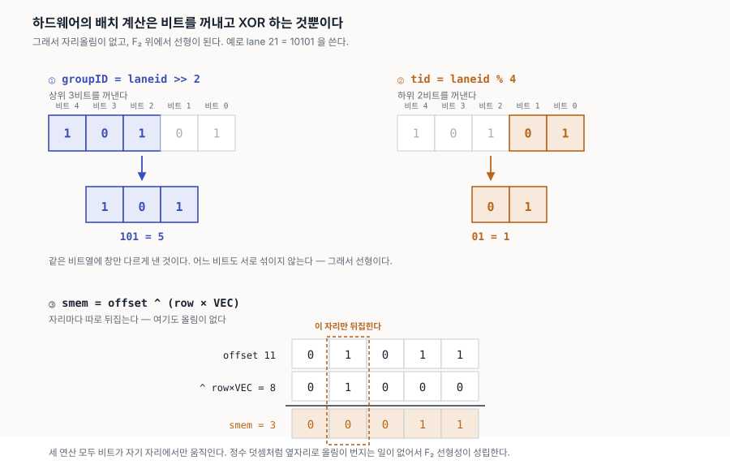
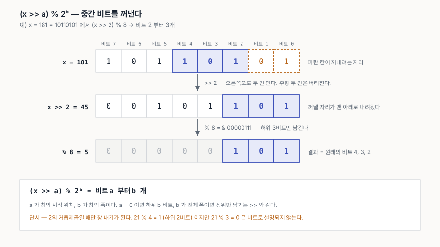
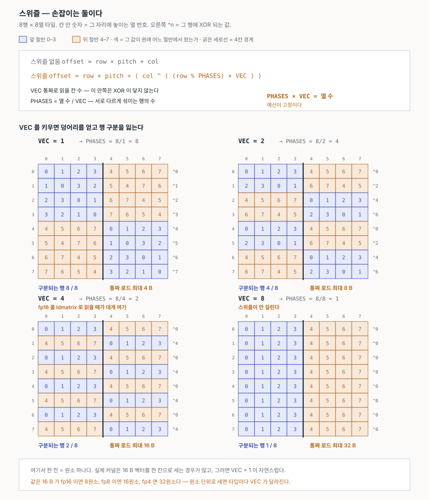
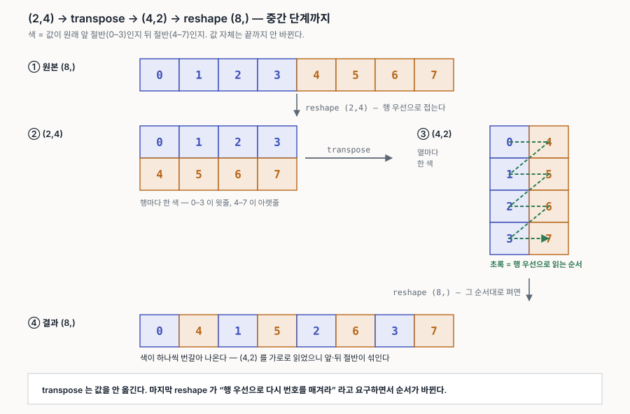
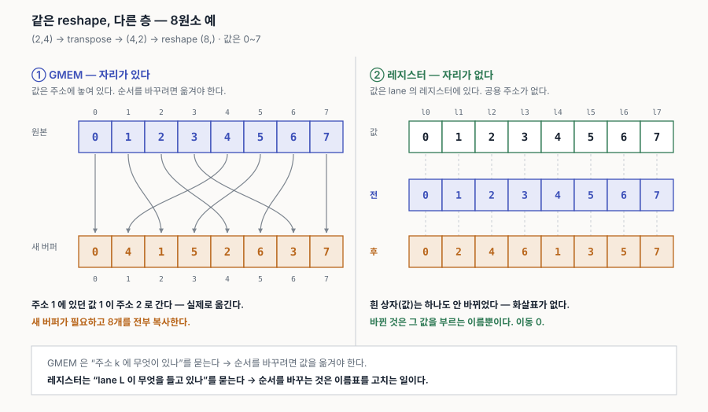
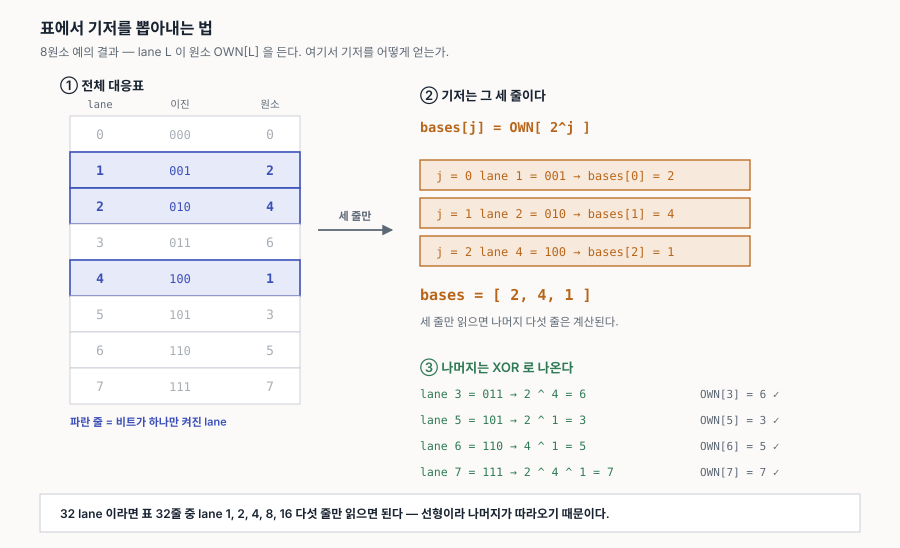
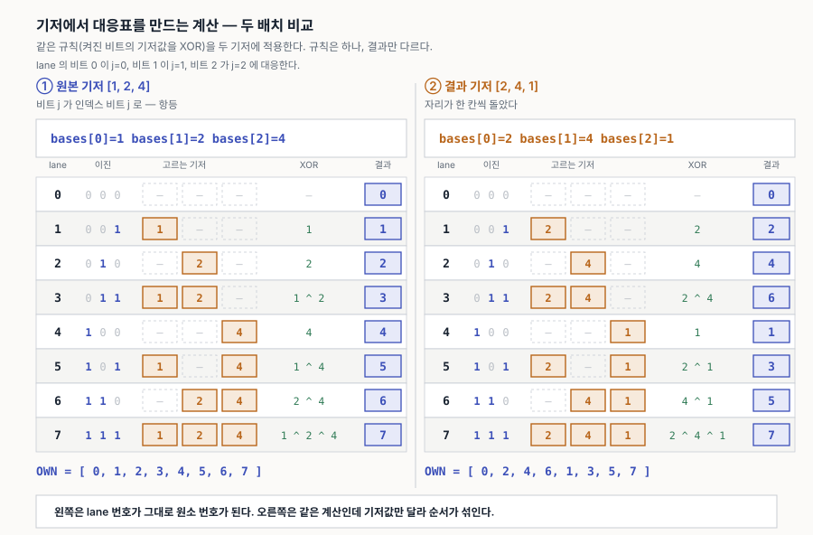
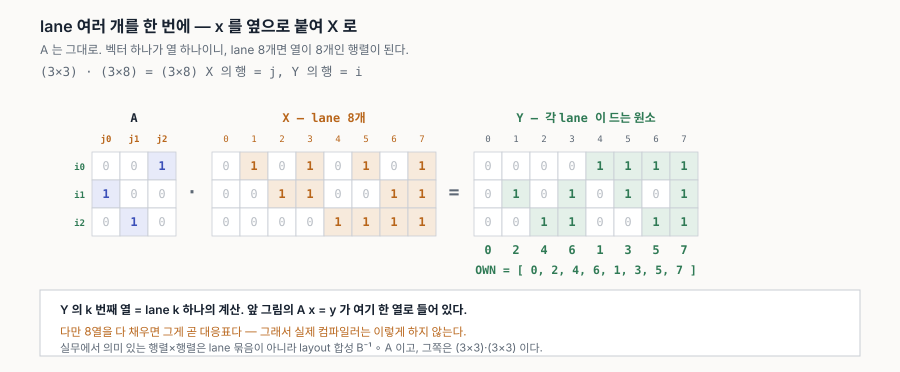
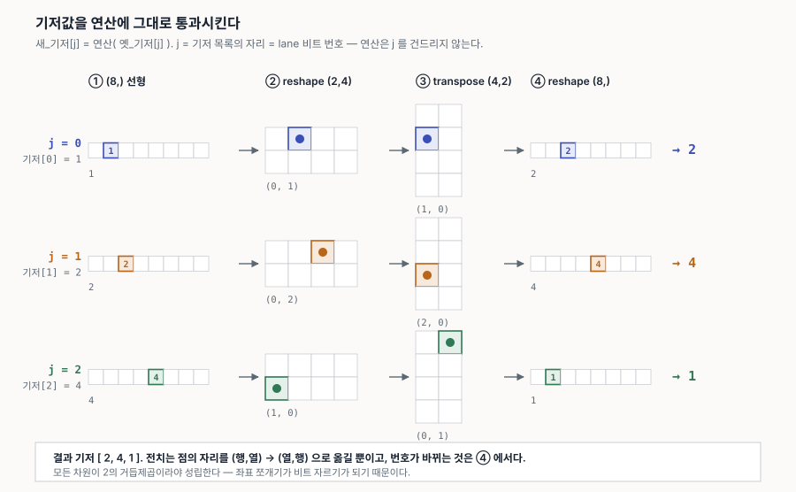
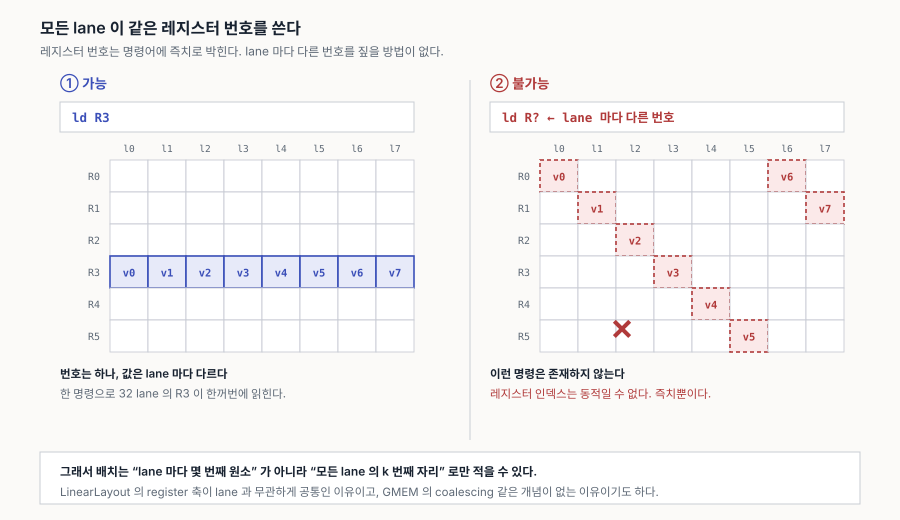

# 12. F₂ 입문 — 비트를 벡터로 보는 법

LinearLayout 문서([10](10-memory-model.md) §0.6, [11](11-linearlayout-history.md))를 읽다 보면 **F₂** 가 계속 나온다. 논문 제목부터가 *"Using F₂"* 다. 이 문서는 그게 무엇인지를 **처음 보는 사람 기준**으로 정리한다. 선형대수를 한 학기 들었다면 충분하고, 안 들었어도 따라올 수 있게 썼다.

한 줄 요약부터 적어 둔다.

> **F₂ = 원소가 `{0, 1}` 둘뿐인 수 체계.** 그 위에서 비트열은 벡터가 되고, GPU의 배치(layout)는 행렬이 된다.

**표기 약속.** 이 문서는 아래 세 가지를 글꼴로 구분한다.

| | 표기 | 예 |
|---|---|---|
| **스칼라** — 수 하나 | *소문자 이탤릭* | *a*, *x*, *k*, *n* |
| **벡터** — 비트열 하나 (= lane 번호 하나) | **소문자 볼드** | **x**, **e**₀, **b**ⱼ |
| **행렬** — 선형사상 하나 (= layout 하나) | **대문자 볼드** | **A**, **B**, **I** |
| **사상(함수)** — 그 행렬이 하는 일 | *소문자 이탤릭* + 괄호 | *f*(**x**), *g*(**x**) |

코드 안의 식별자는 `lane_bases` 처럼 고정폭으로 둔다.

> **거듭제곱과 XOR 을 헷갈리지 말 것.** 이 문서에서 거듭제곱은 **위첨자로만** 쓴다 — `2ᵏ`, `2⁵`. 기호 `^` 는 **언제나 XOR** 이다. 그리고 *f*(**x**) 는 **함수 적용**이지 *f* 와 **x** 의 곱이 아니다.

---

## 1. 왜 이걸 배우는가

GPU 커널에서 "어느 스레드가 어느 데이터를 갖는가"를 **배치(layout)** 라고 한다. 이게 골칫거리인 이유는 배치가 여러 종류이고 그 사이를 계속 오가야 하기 때문이다(11 문서 §1).

그런데 하드웨어의 배치 계산식을 들여다보면 전부 이런 모양이다.

```
groupID = laneid >> 2
tid     = laneid % 4
smem    = offset ^ (row * VEC)
```

| | 하는 일 |
|---|---|
| `>>` | 비트 꺼내기 |
| `%` | 비트 꺼내기 |
| `^` | XOR |

**곱셈도 나눗셈도 없고, 비트를 자르고 XOR 하는 것뿐이다.**



`>>` 와 `%` 는 **같은 비트열에 창만 다르게 내는 것**이고, `^` 는 **자리마다 따로 뒤집는 것**이다. 세 연산 모두 비트가 자기 자리에서만 움직인다 — 정수 덧셈처럼 옆자리로 **올림이 번지는 일이 없다.**

그리고 이런 연산은 F₂ 위에서 **선형(linear)** 이다. 선형이면 행렬로 적을 수 있고, 행렬이면 곱하고 뒤집고 풀 수 있다.

즉 F₂를 도입하는 이유는 새로운 수학을 만들려는 게 아니라, **이미 200년 된 선형대수를 그대로 가져다 쓰기 위해서**다.

세 번째 식 `offset ^ (row × VEC)` 는 **스위즐**이라는 것인데, 도구를 다 갖춘 뒤 §10에서 따로 본다.

---

## 2. 체(field)가 무엇인가

먼저 익숙한 것부터. **실수 ℝ** 에서 우리는 네 가지를 한다.

| | |
|---|---|
| 더하기 | 3 + 5 = 8 |
| 빼기 | 3 − 5 = −2 |
| 곱하기 | 3 × 5 = 15 |
| 나누기 | 3 ÷ 5 = 0.6 &nbsp;&nbsp;(0 으로 나누는 것만 빼고) |

이 네 가지가 모두 되고, 결합·교환·분배 법칙이 성립하는 수 체계를 **체(field)** 라고 부른다. ℝ, ℚ(유리수), ℂ(복소수)가 대표적이다.

정수 ℤ 는 체가 **아니다**. `3 ÷ 5` 가 정수가 아니기 때문이다. 나눗셈이 닫혀 있지 않다.

체가 되려면 정확히 이만큼이 필요하다.

| | |
|---|---|
| 덧셈 | 결합·교환, **항등원** 0, 모든 원소에 **역원** |
| 곱셈 | 결합·교환, **항등원** 1, **0 아닌** 모든 원소에 **역원** |
| 둘 사이 | 분배법칙 *a*(*b*+*c*) = *ab* + *ac* |

### 항등원과 역원

두 단어만 알면 위 표가 읽힌다.

**항등원(identity)** — **연산을 해도 아무것도 안 바뀌게 하는 원소.**

```
x + 0 = x        덧셈의 항등원은 0
x * 1 = x        곱셈의 항등원은 1
```

**역원(inverse)** — **그 원소와 연산하면 항등원이 되는 짝.** "되돌리는 것"이라고 보면 된다.

```
x + (-x)  = 0        덧셈의 역원은 -x
x * (1/x) = 1        곱셈의 역원은 1/x
```

둘 다 **항등원으로 되돌아온다**는 점이 같다.

실수에서 *x* = 3 이면 덧셈 역원은 −3, 곱셈 역원은 1/3 이다.

**왜 이 둘을 요구하는가 — 뺄셈과 나눗셈이 거기서 나오기 때문이다.**

```
a - b  =  a + (-b)      덧셈 역원이 있어야 정의된다
a / b  =  a * (1/b)     곱셈 역원이 있어야 정의된다
```

그래서 "사칙연산이 다 된다 = 체다" 라는 말과 위 표가 같은 뜻이다. 정수 ℤ 가 체가 아닌 이유도 여기서 보인다 — 3 의 덧셈 역원 −3 은 정수지만, **곱셈 역원 1/3 이 정수가 아니다.** 나눗셈이 닫히지 않는다.

---

## 3. F₂ — 가장 작은 체

원소를 `{0, 1}` 둘만 두고, 연산을 이렇게 정의한다.

```
  +  | 0  1              *  | 0  1
 ----+------            ----+------
  0  | 0  1              0  | 0  0
  1  | 1  0              1  | 0  1
```

곱셈표는 평범하다. 눈에 띄는 것은 덧셈의 **1 + 1 = 0** 이다.

### 왜 1 + 1 = 0 인가

**먼저, 다른 답이 있을 수 없다.** 원소가 `{0, 1}` 둘뿐이니 결과도 그 안에 있어야 한다("닫혀 있다"고 한다). 그런데 `1 + 1 = 2` 는 집합 밖이다. 그러니 `0` 이나 `1` 중 하나로 보내야 하고, 어느 쪽인지만 정하면 된다.

**그다음, 홀짝으로 읽어 보면 답이 나온다.**

`0` 을 짝수, `1` 을 홀수라고 읽어 보자.

| 홀짝으로 | F₂ 로 | |
|---|---|---|
| 짝 + 짝 = 짝 | `0 + 0 = 0` | |
| 짝 + 홀 = 홀 | `0 + 1 = 1` | |
| 홀 + 짝 = 홀 | `1 + 0 = 1` | |
| **홀 + 홀 = 짝** | **`1 + 1 = 0`** | ← 여기 |

홀수 둘을 더하면 짝수다. 3 + 5 = 8, 7 + 9 = 16. **그러니 `1 + 1` 은 `0` 일 수밖에 없다.** 위 덧셈표는 홀짝 계산표와 같은 것이다.

곱셈도 맞는다 — 홀수 × 홀수만 홀수이고 나머지는 짝수다. `1 × 1 = 1`, 나머지는 `0`.

**마지막으로 이름을 붙이면** 이것이 "**2로 나눈 나머지**"다. 짝수는 나머지 0, 홀수는 나머지 1이니까. 수식으로는 `(a + b) mod 2` 이고, 이 방식을 표기로 `ℤ/2ℤ` 라고 쓴다.

> **`ℤ/2ℤ` 읽는 법.** 슬래시 뒤가 "0 으로 취급할 것들"이다. `2ℤ` 는 2의 배수 전체 `{…, −4, −2, 0, 2, 4, …}` 이고, `ℤ/2ℤ` 는 **정수를 2의 배수만큼의 차이를 무시하고** 본 것이다. 그러면 정수가 짝수 한 덩어리, 홀수 한 덩어리로 뭉치고 그 둘이 `0` 과 `1` 이 된다.
> 같은 것을 `ℤ/2` 로 줄여 쓰기도 하고, **체**라는 점을 강조할 때 `F₂` 나 `GF(2)` 로 쓴다. `ℤ₂` 는 피하는 게 좋다 — 정수론에서 그 기호는 **2-adic 정수**라는 다른 대상을 뜻한다.

### 정말 체인가

| 조건 | 확인 |
|---|---|
| 덧셈 항등원 | 0 — *x* + 0 = *x* ✓ |
| 덧셈 역원 | 0 + 0 = 0, **1 + 1 = 0** → **모든 원소가 자기 자신의 역원** (−*x* = *x*) ✓ |
| 곱셈 항등원 | 1 — *x* × 1 = *x* ✓ |
| 곱셈 역원 (0 제외) | 1 × 1 = 1 → 1⁻¹ = 1 ✓ |
| 분배법칙 | 네 경우 다 확인됨 ✓ |

다섯 줄이 모두 성립한다. **원소가 둘뿐이라 이보다 작은 체는 없다.**

덧셈 역원 줄이 F₂의 특징이다. 실수에서는 3 을 되돌리려면 −3 이라는 **다른 수**가 필요한데, F₂에서는 **자기 자신을 한 번 더 더하면** 0 으로 돌아온다. 그래서 뒤(§8)에서 보듯 **뺄셈과 덧셈이 같은 연산**이 된다.

> **곁가지.** `ℤ/nℤ` 가 체가 되려면 `n` 이 **소수**여야 한다. `ℤ/4ℤ` 는 체가 아니다 — `2 × 2 = 4 = 0` 인데 `2 ≠ 0` 이라, 0 이 아닌 두 수를 곱해 0 이 나온다(영인자). 그러면 `2` 의 곱셈 역원이 존재할 수 없다. 그래서 F₂, F₃, F₅, F₇… 는 있어도 F₄ 는 `ℤ/4ℤ` 가 아니라 다른 방식으로 만든다.

### 덧셈 = XOR

덧셈표를 프로그래머 눈으로 보면 이것은 **XOR** 이다.

```
0 ^ 0 = 0      0 + 0 = 0
0 ^ 1 = 1      0 + 1 = 1
1 ^ 0 = 1      1 + 0 = 1
1 ^ 1 = 0      1 + 1 = 0     ← 같다
```

그리고 곱셈은 **AND** 다. F₂ 산술은 전부 비트 연산 하나로 끝난다.

---

## 4. 흔한 오해 — "mod 2 = XOR" 이 아니다

여기서 한 번 걸린다. **수 전체에 `mod 2` 를 하는 것과 XOR 은 다르다.**

```
5 + 9 = 14       (14) mod 2 = 0      ← 최하위 비트 하나만 남는다
5 ^ 9 = 12                            ← 이게 F₂ 벡터 덧셈
```

정확한 표현은 이렇다.

> XOR = **각 비트 자리마다 독립적으로** `(a + b) mod 2` 를 하는 것. 자리 사이에 **올림이 없다.**

```
  00101   (5)
^ 01001   (9)
  ─────
  01100   (12)      자리마다 따로, 올림 버림
```

`5 + 9 = 14` 와 다른 이유가 정확히 그 **자리올림** 이다. 이 차이가 뒤에서 계속 돌아온다.

### 그러면 `%` 는 무엇을 하는가 — 창 내기

`% 2ᵏ` 는 나눗셈이라기보다 **하위 k비트만 남기는 마스크**다. `2ᵏ − 1` 이 하위 k비트가 전부 1인 수이기 때문이다.

```
x % 2ᵏ  ==  x & (2ᵏ − 1)
```

| | 남기는 비트 | 마스크 |
|---|---|---|
| `% 1` | **0개** — 항상 0 | `& 0` |
| `% 2` | 하위 **1**비트 | `& 0b1` |
| `% 4` | 하위 **2**비트 | `& 0b11` |
| `% 8` | 하위 **3**비트 | `& 0b111` |
| `% 16` | 하위 **4**비트 | `& 0b1111` |

`% 1` 이 0인 데 주의할 것 — 모든 수가 1로 나누어떨어진다. **`% 2ᵏ` 가 k비트**이지 `% k` 가 k비트가 아니다.

`>>` 와 짝을 이루면 **중간 비트**를 꺼낼 수 있다.

| | |
|---|---|
| `x % 2ᵇ` | 하위 b비트를 **남긴다** |
| `x >> a` | 하위 a비트를 **버린다** |
| `(x >> a) % 2ᵇ` | 비트 `a` 부터 **b개**를 꺼낸다 |



다차원 인덱스를 쪼갤 때 쓰는 꼴이 세 번째다. 앞서 본 `groupID = laneid >> 2` 와 `tid = laneid % 4` 도 `a = 2, b = 3` 과 `a = 0, b = 2` 인 특수한 경우다.

> **여기도 2의 거듭제곱일 때만 성립한다.** `21 % 4 = 1` 은 하위 2비트지만 `21 % 3 = 0` 은 비트로 설명되지 않는다. 나누는 수가 거듭제곱이라야 `%` 가 창 내기가 되고, 그래야 §9의 선형성이 유지된다.

---

## 5. 비트열 = F₂ 위의 벡터

실수 위의 벡터 **v** = (3.1, −2.0, 0.5) 는 **성분이 스칼라**다. 성분을 F₂ 원소로 바꾸면 **비트열**이 된다.

```
(1, 0, 1, 0, 1)  ←→  10101  ←→  21
```

*n*비트 수 하나가 **n차원 F₂ 벡터** 하나다. 벡터 덧셈은 성분별 덧셈이니 곧 **비트별 XOR** 이고, 이는 4절에서 본 그대로다.

스칼라 곱은 심심하다. 쓸 수 있는 스칼라가 0 과 1 뿐이라 0·**v** = **0**, 1·**v** = **v** — 사실상 **"쓸까 말까"** 다.

> 그래서 F₂ 에서 **선형결합 = 벡터 몇 개를 골라 XOR 하기** 가 된다. 계수를 고민할 여지가 없다.
>
> 실수에서는 *c*₁**v**₁ + *c*₂**v**₂ + … 처럼 스칼라 *c*ᵢ 를 정해야 하는데, F₂에서는 *c*ᵢ 가 0 아니면 1 이라 **"넣는다 / 안 넣는다"** 뿐이다.

### 왜 32개가 딱 맞는가

*n*차원 F₂ 공간의 벡터 수는 정확히 2ⁿ 이다(각 성분이 0 또는 1). 5차원이면 32개.

**워프가 32 스레드**, 레지스터 개수·타일 크기·스위즐 주기가 전부 2의 거듭제곱인 GPU에서 이 대응이 억지 없이 맞아떨어진다. 실수 위의 선형대수였다면 이런 일이 안 생긴다.

---

## 6. 기저와 차원

**기저(basis)** 는 "이것들의 조합으로 전부 만들 수 있고, 하나라도 빼면 안 되는" 최소 집합이다.

5비트 공간의 **표준기저**는 비트 하나만 켜진 다섯 벡터다.

```
e₀ = 00001 = 1
e₁ = 00010 = 2
e₂ = 00100 = 4
e₃ = 01000 = 8
e₄ = 10000 = 16
```

- **생성한다** — 어떤 5비트 벡터든 이들의 XOR 로 나온다. **x** = 21 = 10101 = **e**₄ ^ **e**₂ ^ **e**₀
- **독립이다** — 어느 하나도 나머지의 XOR 로 못 만든다
- 그래서 **표현이 유일하다** — 어떤 **e**ⱼ 를 골랐는지가 곧 그 수의 이진 표기다

기저 벡터가 다섯이므로 **차원은 5** 다. 그리고 부분집합을 고르는 방법이 2⁵ = 32 가지라 벡터도 32개다.

---

## 7. 선형사상과 행렬

사상 *f* 가 **선형**이라는 것은 이 두 가지다. (**x**, **y** 는 벡터, *c* 는 스칼라)

```
f(x + y) = f(x) + f(y)
f(c*x)   = c * f(x)
```

F₂ 에서는 이렇게 읽는다.

| 일반 | F₂ 에서 |
|---|---|
| `f(x + y) = f(x) + f(y)` | `f(x ^ y) = f(x) ^ f(y)` |
| `f(c·x) = c·f(x)` | *c* 가 0/1 뿐이라 **자동으로 성립** |

첫 줄이 전부다. 그리고 여기서 **가장 중요한 결과**가 나온다.

> **선형사상은 기저에서의 값만 정하면 나머지가 전부 따라온다.**

```
f(21) = f(e₄ ^ e₂ ^ e₀) = f(e₄) ^ f(e₂) ^ f(e₀)
```

32개짜리 대응표가 **다섯 개 벡터**로 압축된다. LinearLayout이 하는 일이 정확히 이것이다.

### 행렬로 적기

그 다섯 벡터를 **b**ⱼ = *f*(**e**ⱼ) 라 하고 **세로로 세워 열로 놓으면 행렬 A** 가 된다. 예를 들어 **b**₀ = 4, **b**₁ = 8, **b**₂ = 16, **b**₃ = 1, **b**₄ = 2 라면 (11 문서 §1의 그 배치다):

```
         j = 0  1  2  3  4
       +-------------------
 i = 0 |     0  0  0  1  0
 i = 1 |     0  0  0  0  1
 i = 2 |     1  0  0  0  0
 i = 3 |     0  1  0  0  0
 i = 4 |     0  0  1  0  0
```

열 번호 *j* 는 **입력 비트**, 행 번호 *i* 는 **출력 비트**다. *j* 번째 열은 **b**ⱼ 를 이진수로 세운 것이다 — 0번 열이 `4 = 00100` 이라 *i* = 2 자리에 1 이 선다.

행렬·벡터 곱도 그대로다 — **A****x** 에서 곱은 AND, 합은 XOR 로 하면 된다.

그리고 실수 위 선형대수의 도구가 전부 따라온다.

| 선형대수 | 여기서의 의미 |
|---|---|
| 행렬 곱 **BA** | 배치를 연달아 적용 (합성) |
| 역행렬 **A**⁻¹ | 배치 되돌리기 — §3의 **곱셈 역원**을 행렬로 옮긴 것 |
| 단위행렬 **I** | 아무것도 안 바꾸는 배치 — **곱셈 항등원** |
| 가우스 소거법 | **A**⁻¹ 계산 — Triton의 `invertAndCompose` |
| 랭크 | 실제로 도달하는 자리의 수 |
| 단사(injective) | 서로 다른 lane 이 서로 다른 원소를 든다 |
| 전사(surjective) | 모든 원소에 주인이 있다 |
| 핵(kernel) | **브로드캐스트** — 여러 lane 이 같은 원소를 든다 |

§3에서 본 항등원·역원이 행렬 층에서 그대로 되풀이된다. **AA**⁻¹ = **I** 는 *x* × *x*⁻¹ = 1 과 같은 말이고, 그래서 **A**⁻¹ 이 있으면 "배치를 되돌린다"가 정의된다. 없으면(= 비단사, 브로드캐스트) 되돌릴 수 없다.

---

## 8. F₂ 라서 편한 것들

**① 뺄셈이 덧셈이다.** **x** + **x** = **0** 이므로 −**x** = **x**. 부호를 신경 쓸 일이 없다. 가우스 소거법에서 "이 행의 c배를 빼기"가 그냥 "XOR 하기"가 된다.

**② 계수가 0과 1뿐이다.** 선형결합이 부분집합 선택으로 단순해지고, 수치 오차라는 개념이 없다 — 계산이 **정확**하다.

**③ 행렬 원소가 비트다.** *n* × *n* 행렬 **A** 를 정수 *n* 개로 담을 수 있다(열 하나가 정수 하나). 행 XOR 한 번이 정수 XOR 한 번이라 소거법이 매우 빠르다.

**④ 나눗셈 걱정이 없다.** 0 아닌 스칼라가 1 뿐이라 피벗 나눗셈이 없다. 피벗은 "1이 있는 행을 찾아 XOR" 이 전부다.

---

## 9. 그런데 선형이 되려면 — 자리올림이 없어야 한다

F₂ 선형성이 성립하는 **조건**이 있다. 이것이 GPU layout에서 어디까지 되고 어디부터 안 되는지를 가른다.

`stride s` 인 축에서 좌표 `c` 는 `c × s` 를 기여한다. 이게 F₂ 덧셈(XOR)과 같으려면 자리올림이 없어야 한다.

**s = 4** — 2의 거듭제곱

```
c=1 ->  1*4 =  4 = 00100
c=2 ->  2*4 =  8 = 01000
c=3 ->  3*4 = 12
        4 ^ 8 = 12        <- 실제와 같다
```

**s = 6** — 2의 배수지만 거듭제곱은 아니다

```
c=1 ->  1*6 =  6 = 00110
c=2 ->  2*6 = 12 = 01100
c=3 ->  3*6 = 18
        6 ^ 12 = 10       <- 실제는 18, 어긋난다
```

`s = 6` 에서는 `6` 과 `12` 가 비트 2에서 **겹쳐** 올림이 나고, 그 순간 선형성이 깨진다. **2의 거듭제곱만이** `s, 2s, 4s, …` 를 전부 단일 비트로 유지한다.

이것이 GPU 문서에서 계속 나오는 두 문장의 근거다.

- **SMEM·레지스터 배치는 F₂로 적힌다** — 크기가 전부 2의 거듭제곱이라 자리올림이 없다
- **GMEM 주소는 F₂로 못 적는다** — `ptr + offs × stride` 의 `stride` 가 런타임 값이라 거듭제곱 보장이 없다

---

## 10. 스위즐 — 이 대수가 실제로 쓰이는 곳

§1 의 세 번째 식 `offset ^ (row × VEC)` 가 **스위즐**이다. 여기까지 온 도구 — 기저, 행렬, 자리올림 — 로 그것을 읽어 본다.

먼저 무엇을 푸는 장치인지부터. SMEM은 뱅크 32개로 나뉘어 있고 같은 뱅크를 여러 lane이 동시에 건드리면 직렬화되는데, 2차원 타일을 그대로 저장하면 **열 방향 접근이 한 뱅크에 몰린다.** 행마다 자리를 다르게 뒤섞어 그것을 흩뜨리는 것이 스위즐이다.

```
plain    offset = row * pitch + col
swizzle  offset = row * pitch + ( col ^ ( (row % PHASES) * VEC ) )
```

| | |
|---|---|
| `VEC` | 통짜로 읽을 칸 수 — **이 안쪽은 XOR 이 닿지 않는다** |
| `PHASES` | `= 열 수 / VEC` — 서로 다르게 섞이는 행의 수 |

손잡이를 `k` 하나로 적으면 `col ^ (row × 8)` 처럼 숫자 8이 어디서 왔는지 알 수 없다. **두 이름으로 나눠 적으면 예산이 식 안에 드러난다** — `PHASES × VEC = 열 수`.



### 한 줄 정의

> **스위즐 = 한 축의 좌표가 다른 축의 비트를 뒤집는 것.**


`stride` 배치에서는 각 좌표가 **자기 몫만** 더한다 — 행 비트는 offset의 윗자리로, 열 비트는 아랫자리로 간다. 배선이 평행하고 **축이 섞이지 않는다.**

스위즐은 여기에 선을 하나 더 그린다. `row × VEC` 때문에 **행 비트가 열 자리로도 넘어온다.** 그러면 그 출력 비트는 `c2` 와 `r0` **둘에서 오고, 값은 둘의 XOR**이 된다.

그 한 선이 전부다. 그리고 그 한 선 때문에 다음이 따라온다.

| | |
|---|---|
| 한 출력 비트가 두 입력에서 온다 | 기저값에 **비트가 둘 켜진다** — `[1, 2, 5, 10]` 의 `5`, `10` 이 그것 |
| `행 × s_r + 열 × s_c` 로 못 적는다 | 이 꼴에는 축을 섞는 항이 없다 → **stride 밖** |
| 그래도 F₂ 선형이다 | XOR 이라 자리올림이 없다 → 기저로는 적힌다 |

11 문서 §1 "stride 와의 관계"에서 *"기저값에 비트가 여럿이면 stride 로 못 적는다"* 고 한 것의 그림이 이것이다. **스위즐은 stride 대수의 바깥이면서 F₂ 대수의 안쪽**이고, 그 사이에 정확히 들어맞는 것이 LinearLayout이다.

### 왜 `+` 가 아니라 `^` 인가

XOR은 행 안에서 자리를 **1:1로 재배열**할 뿐이라 칸이 겹치지도 범위를 벗어나지도 않는다. `col + row` 는 `7 + 3 = 10` 처럼 범위를 넘어 `% 8` 이 필요해지고, 그 순간 자리올림이 생겨 §9의 선형성이 깨진다. **스위즐이 XOR인 것은 취향이 아니라 필연이다.**

### `VEC` 은 좋고 나쁨이 아니라 맞바꿈이다

그림의 판정 줄 두 개가 서로 반대로 움직인다.

| `VEC` | `PHASES` = 구분되는 행 | 통짜 로드 최대 폭 |
|---|---|---|
| 1 | **8 / 8** | 4 B |
| 2 | 4 / 8 | 8 B |
| 4 | 2 / 8 | **16 B** |
| 8 | 1 / 8 — 스위즐이 안 걸린다 | 32 B |

열 8칸이 가진 비트 3개를 **행을 구분하는 데** 쓰느냐 **덩어리를 지키는 데** 쓰느냐의 배분이기 때문이다. `VEC = 2^M` 이고 `M` 아래 비트에는 XOR이 닿지 않아 그 안쪽 순서가 보존되는 대신, 그만큼 행을 흩뜨릴 비트가 줄어든다.

**그러니 `VEC` 는 클수록 좋은 값이 아니다.** lane이 4 B씩 읽는다면 지킬 덩어리가 없으니 `VEC = 1` 이 최선이다 — 행 구분이 최대라 뱅크에 가장 유리하다.

> **단위에 주의할 것.** 위 그림은 한 칸 = 원소 하나로 셌다. 실제 커널은 **16 B 벡터 하나를 한 칸으로 세는 경우가 많고, 그러면 `VEC = 1` 이 자연스럽다.** 그런데도 `VEC` 가 파라미터로 남아 있는 이유는 같은 16 B 가 fp16 이면 8원소, fp8 이면 16원소, fp4 면 32원소이기 때문이다 — 원소 단위로 세는 코드에서는 **타입이 바뀔 때마다 `VEC` 가 바뀐다.**

`ldmatrix` 가 이 제약의 출처다. PTX ISA 9.7.16.5.15 는 *"Consecutive instances of row need not be stored contiguously in memory"* 라고 하면서도 *"**Each address corresponds to the start of a matrix row**"* 라고 못 박는다 — **행끼리는 흩어져도 되지만 행 하나는 연속이어야 한다.** `.m8n8.b16` 이면 한 행이 8 × 2 B = 16 B 다.

그래서 스위즐 파라미터를 고르는 일은 **뱅크 충돌과 벡터화를 동시에 만족시키는 문제**가 된다([10-memory-model.md](10-memory-model.md)의 우선순위 항목 4와 6이 여기서 만난다).

---

## 11. 곁들여 — `reshape` 가 층마다 다른 일이 되는 이유

`reshape` 를 GMEM 감각으로 알고 있으면 11 문서 §1 의 예시가 안 읽힌다. 같은 이름의 연산이 층마다 다른 일을 하기 때문이다.

**먼저 GMEM 쪽부터.** `reshape` 는 "행 우선 순서를 보존하라"는 요구다. 재정렬을 *하는* 게 아니라 결과가 행 우선이도록 **요구**하는 것이라, 이미 연속이면 할 일이 없고 어긋나 있으면 그제야 복사가 난다.

```python
a = np.arange(8).reshape(2, 4)

a.reshape(8)        # 뷰 — 복사 없음 (이미 연속)
a.T                 # 뷰 — 복사 없음 (strides 가 1, 4 로 바뀐다)
a.T.reshape(8)      # 복사 — [0 4 1 5 2 6 3 7] 를 새 버퍼에 써 넣는다
```

**그 세 번째가 왜 `[0 4 1 5 2 6 3 7]` 이 되는지**부터 보자. 중간 단계를 펼치면 바로 보인다.



`transpose` 는 값을 안 옮긴다 — `(2,4)` 에서 행마다 한 색이던 것이 `(4,2)` 에서 열마다 한 색이 될 뿐이다. 순서가 바뀌는 것은 **마지막 `reshape`** 다. `(4,2)` 를 **행 우선으로** 다시 읽으라고 요구하니(그림의 초록 경로), 세로로 서 있던 두 색을 가로로 훑으면서 `0 4 1 5 2 6 3 7` 로 섞인다.

세 번째가 우리 예시다. **전치 뒤의 `reshape` 에서 복사가 난다.**



**그런데 레지스터에는 복사할 곳이 없다.** GMEM 에는 **자리**(주소)가 있어서 "주소 *k* 에 무엇이 있나"를 물을 수 있고, 순서를 바꾸려면 값을 실제로 옮겨야 한다. 레지스터에는 그런 공용 자리가 없다 — 각 lane 이 자기 레지스터를 가질 뿐이라 물을 수 있는 것은 **"lane *L* 이 무엇을 들고 있나"** 뿐이다.

그래서 순서를 바꾸는 일이 **이름표를 고치는 일**이 된다. 그림 오른쪽에서 흰 상자(값)는 하나도 안 바뀌고, 그 아래 이름만 `0 1 2 3 …` 에서 `0 2 4 6 …` 으로 바뀐다. **화살표가 하나도 없다.**

### 그 이름표에서 기저를 어떻게 얻는가

바뀐 이름표 `0 2 4 6 1 3 5 7` 은 8줄짜리 대응표다. 여기서 기저를 뽑는 방법은 한 줄로 끝난다.

> **비트가 하나만 켜진 lane 만 읽는다.**



```
bases[j]  =  OWN[ 2^j ]

  lane 1 = 001  →  bases[0] = 2
  lane 2 = 010  →  bases[1] = 4
  lane 4 = 100  →  bases[2] = 1
                   bases = [2, 4, 1]
```

나머지 다섯 줄은 읽을 필요가 없다. §7 에서 본 대로 **선형사상은 기저에서의 값만 정하면 나머지가 따라오기** 때문이다.

```
lane 5 = 101 = lane 1 ^ lane 4   →   2 ^ 1 = 3      OWN[5] = 3  ✓
lane 7 = 111                     →   2 ^ 4 ^ 1 = 7  OWN[7] = 7  ✓
```

32 lane 이라면 표 32줄 중 **`lane 1, 2, 4, 8, 16` 다섯 줄만** 읽으면 된다. 11 문서 §1 의 `[4, 8, 16, 1, 2]` 도 같은 방식으로 얻은 것이다.

### 반대 방향 — 기저에서 표를 만든다

실무에서 쓰는 방향은 이쪽이다. **기저가 원천이고 대응은 파생**이다.



`lane 3 = 011` 이면 비트 0, 1 이 켜져 있으니 `bases[0] ^ bases[1] = 2 ^ 4 = 6`. 여덟 줄이 전부 이 한 규칙에서 나온다.

#### 이 계산이 곧 행렬-벡터 곱이다

위 표의 한 줄은 **`A x = y`** 하나다. `Ax` 는 원래 **열들의 선형결합**이고(일반 선형대수에서도 그렇다), F₂ 에서는 계수가 0/1 뿐이라 **"고른 열을 XOR"** 이 된다. 그리고 `A` 의 `j` 번째 열이 바로 `bases[j]` 다.

**첨자 둘을 먼저 정해 두자.** `j` 는 이미 나온 그 `j` 이고, `i` 가 새로 붙는다.

![A[i][j] 의 i 와 j](figures/matrix-ij.svg)

```
A[i][j]  =  bases[j] 의 비트 i
```

| | | |
|---|---|---|
| **`j`** | **열** | **입력** 비트 — lane 번호를 쪼갠 자리 (= 기저 목록의 자리) |
| **`i`** | **행** | **출력** 비트 — 원소 번호를 모으는 자리 |

`j` 번째 **열을 세로로 읽으면 `bases[j]` 의 이진수**다. `bases[0] = 2 = 010` 이니 `j0` 열은 `i1` 자리에만 1 이 선다. 벡터도 같은 규칙이다 — `x[j]` 는 lane 번호의 비트 `j`, `y[i]` 는 원소 번호의 비트 `i` 다.

```
lane 번호 ──비트 j 로 쪼갬──▶ x ──A──▶ y ──비트 i 로 모음──▶ 원소 번호
```


| | |
|---|---|
| **열 관점** | `x` 에서 켜진 비트의 열을 골라 XOR — 위 표의 "고르는 기저" 칩이 이것 |
| **행 관점** | `yᵢ = XORⱼ ( A[i][j] AND xⱼ )` — 곱이 AND, 합이 XOR |

둘은 같은 계산을 다르게 읽은 것이다. 그리고 **GPU 로 나가는 코드는 둘 중 어느 쪽도 아니다** — Triton 의 `matrixVectorProd` 는 행렬을 **대각선으로 잘라** `AND` + 시프트로 묶는다. 같은 대각선의 1 들은 전부 "입력 비트를 *i* 칸 옮긴다"는 같은 일을 하므로 마스크 하나로 처리된다.

#### lane 여러 개를 한 번에

`x` 가 열 하나이니, lane 을 여러 개 묶으려면 **옆으로 붙여 행렬 `X` 로** 만들면 된다. `A` 는 그대로다.



```
(3×3) · (3×8) = (3×8)          X 의 행 = j,  Y 의 행 = i
```

`Y` 의 *k* 번째 열이 `lane k` 하나의 결과다 — 앞 그림의 `A x = y` 가 여기 한 열로 들어 있다. 열 아래 숫자를 모으면 `OWN = [0, 2, 4, 6, 1, 3, 5, 7]`, 곧 대응표다.

> **그런데 실제 컴파일러는 이렇게 하지 않는다.** 8열을 다 채우는 것이 곧 **대응표를 만드는 일**이고, 앞에서 본 대로 `2ⁿ` 짜리 표는 만들 이유가 없다. `X` 를 넓히는 것은 "여러 lane 을 한 번에"를 **설명하기 위한 그림**이지 구현이 아니다.
>
> 실무에서 의미 있는 **행렬 × 행렬**은 lane 묶음이 아니라 **layout 합성** `B⁻¹ ∘ A` 이다 — 그것이 이 절의 `A x = y` 와 어떻게 이어지는지는 [13-transpose-vs-inverse.md](13-transpose-vs-inverse.md) §2 의 그림에 있다. 그쪽은 `(n×n) · (n×n)` 이고, `n` 이 좌표 비트 수라 128×128 타일이라도 14×14 다. 여기서 "한 번에"가 진짜로 성립한다 — **lane 을 묶는 게 아니라 배치 전체를 한 행렬로 다루는 것**이기 때문이다.

**왜 이 방향이 정상인가 — 크기가 다르기 때문이다.**

| | 개수 |
|---|---|
| 기저 | *n* 개 (*n* = 좌표 비트 수) |
| 대응표 | 2ⁿ 줄 |

CTA 하나가 128×128 fp16 타일을 맡으면 원소가 `16,384 = 2¹⁴` 개다. **기저 14개 vs 표 16,384줄.** 컴파일러가 후자를 만들 이유가 없다 — 코드 생성에 필요한 lane 만 위 식으로 그때그때 계산하면 된다. 변환 계산(`B⁻¹ ∘ A`)도 14×14 행렬 연산으로 끝난다.

그래서 **표 → 기저** 는 사람이 하는 일회성 작업이다. 새 명령이 나오면 PTX 규정(`row = groupID`, `col = tid*2 + i`)을 한 번 읽어 기저로 옮겨 두고, 그다음부터는 기계가 그것만 쓴다. 앞 그림은 "기저가 어디서 왔는가"를 보인 것이지 컴파일러가 매번 하는 일이 아니다.

### 그럼 결과 기저 자체는 어떻게 계산했나

`[1, 2, 4]` 에서 `[2, 4, 1]` 이 나온 계산이 아직 남았다. **기저값 하나하나를 연산에 그대로 통과시킨다.**

layout 은 `lane → 텐서 인덱스` 사상이고 `reshape`·`trans` 는 **출력 쪽(텐서 인덱스)에 작용**한다. 그러니 새 layout 은 `연산 ∘ 옛 layout` 이고, 기저에서는 이렇게 된다.

```
새_기저[j]  =  연산( 옛_기저[j] )
```



기저값을 **좌표처럼** 취급해 세 단계에 넣으면 된다. `b = 1` 을 따라가 보면:

| 단계 | |
|---|---|
| `(8,)` 선형 | `1` |
| `reshape (2,4)` | `1 = 4·0 + 1` → 좌표 `(0, 1)` |
| `transpose` | `(0, 1)` → `(1, 0)`, 새 shape 는 `(4,2)` |
| `reshape (8,)` | `2·1 + 0` = **2** |

`b = 2` 는 `(0,2) → (2,0) → 4`, `b = 4` 는 `(1,0) → (0,1) → 1`. 셋을 모으면 `[2, 4, 1]` 이다.

그림에서 보이듯 **전치는 점의 자리를 `(행,열) → (열,행)` 으로 옮길 뿐**이고, 번호가 바뀌는 것은 마지막 `reshape` 에서다. §11 앞부분에서 본 그대로다.

각 연산이 기저에 하는 일은 이렇게 정리된다.

| 연산 | 기저값에 |
|---|---|
| `reshape` | **비트를 다시 묶어 읽는다** — 선형 인덱스 ↔ 다차원 좌표 |
| `transpose` | **좌표 성분을 순열한다** |
| `slice` | 해당 축의 기저를 뺀다 |
| `broadcast` | 기저값 `0` 을 추가한다 |
| `convert` | `B⁻¹ ∘ A` — 행렬 곱([14-gaussian-elimination.md](14-gaussian-elimination.md)) |

> **조건 하나.** 모든 차원이 **2의 거듭제곱**이라야 성립한다. `reshape` 의 좌표 쪼개기가 `//` 와 `%` 인데, 나누는 수가 거듭제곱이라야 §4 에서 본 **비트 자르기**가 되기 때문이다. `(3, 5)` 같은 shape 면 자리올림이 생겨 선형성이 깨진다.

비용도 여기서 나온다 — 기저값 *n* 개에 연산 *k* 번이면 `n × k` 번 계산이다. 위 예는 `3 × 3 = 9` 번. **표 8줄은 한 번도 만들지 않았다.**

> **이것도 그냥 반복문이다.** Triton 의 `transposeOuts` 와 `reshapeOuts` 는 기저를 하나씩 훑는다.
>
> ```cpp
> for (const auto &[inDim, inDimBases] : bases)
>   for (const auto &basis : inDimBases)   // 기저마다 한 번씩
>     ...
> ```
>
> 그래도 되는 이유는 **컴파일 타임에 한 번 도는 계산**이고, 기저 개수가 `log₂(전체 크기)` 라 128×128 타일이라도 14개뿐이기 때문이다. `LinearLayout.h` 주석이 이를 직접 적는다 — *"LLs themselves do not need to be fast; only the emitted `apply` code is on the critical path."*
>
> 반복이 없는 쪽은 **뱉어진 코드**다. 기저값이 컴파일 타임 상수라 루프가 남지 않고, 위에서 본 대각선 묶기로 `AND` + 시프트 몇 개가 된다. **대수는 느려도 되고, 그 대수가 뱉은 코드가 빨라야 한다** — CuTe 가 템플릿으로 컴파일 타임에 전부 접는 것과 정반대 선택이다.

> **거꾸로 물어볼 수도 있다 — 애초에 선형인가?** 기저를 뽑아 놓고 `f(x ^ y) == f(x) ^ f(y)` 를 모든 쌍에 대해 확인하면 된다. 아니라면 그 배치는 LinearLayout 으로 적을 수 없다. §12 의 스크립트가 이 검사를 한다.

| | GMEM | 레지스터 |
|---|---|---|
| 물을 수 있는 것 | 주소 *k* 에 무엇이 있나 | lane *L* 이 무엇을 들고 있나 |
| 순서를 바꾸려면 | 값을 옮긴다 | 이름표를 고친다 |
| 비용 | 원소 수만큼 복사 | **0** |
| 그 결과를 적은 것 | stride | **기저** |

### 그래도 제약은 있다 — 레지스터 번호는 lane 마다 다를 수 없다

"이름표만 고치면 된다"가 어디까지 되는지에는 선이 있다. GMEM 의 coalescing 에 해당하는 것은 없지만, 대신 이 제약이 있다.



레지스터 번호는 **명령어에 즉치로 박힌다.** `ld R3` 하나면 32개 lane 이 **각자의 R3** 을 한꺼번에 읽는다 — 번호는 하나이고 값만 lane 마다 다르다. 그래서 lane 별 주소라는 것이 없고, 흩어질 여지도 합칠 여지도 없다. **배치를 아무리 뒤섞어도 레지스터 번호만 다시 배정하는 선에서는 속도 손실이 0** 인 이유가 이것이다.

반대로 `lane 0 은 R3, lane 1 은 R4 …` 처럼 **lane 마다 다른 번호**를 짚는 명령은 존재하지 않는다. 레지스터 인덱스는 동적일 수 없다.

그래서 배치는 **"lane 마다 몇 번째 원소"** 가 아니라 **"모든 lane 의 *k* 번째 자리"** 로만 적을 수 있다. LinearLayout 의 `register` 축이 lane 과 무관하게 공통인 것이 이 때문이고, "lane 0 은 레지스터 4개, lane 1 은 8개" 같은 배치는 **만들 수조차 없다.**

> **비용이 느려짐이 아니라 표현 불가로 나타난다.** 그리고 진짜 느려지는 것은 따로 있다 — 배치가 lane 당 원소를 너무 많이 요구하면 레지스터가 모자라 **스필**이 난다([10-memory-model.md](10-memory-model.md) §2.3). 누산기 크기가 타일을 제한하는 그 이야기다.

마지막 줄이 요점이다. **기저는 재배치를 수행하는 것이 아니라 결과를 기술하는 것**이다 — `[2, 4, 1]` 은 "이제 lane *L* 이 원소 몇 번을 든다"는 사실의 기록일 뿐, 그 자체로는 아무 명령도 내지 않는다.

> **그럼 비용은 언제 생기나.** `reshape` 때가 아니라 **그다음 소비자와 안 맞을 때**다. 그리고 옛 Triton 은 이 대목에서 numpy 처럼 굴었다 — `[2, 4, 1]` 같은 배치에 **이름을 붙일 수 없어서**, 이름 붙일 수 있는 배치로 만들려고 SMEM 에 실체화했다. 아무것도 움직일 필요가 없었는데도. PR #3794 가 말한 *"효율적으로 표현할 수 없다"* 가 이 뜻이다([11-linearlayout-history.md](11-linearlayout-history.md) §1).

---

## 12. 직접 해 보기

```python
# 5차원 F2 공간에서 선형사상 하나를 다뤄 본다.
BASES = [4, 8, 16, 1, 2]        # f(e0), f(e1), ..., f(e4)

def apply(x, bases):            # 선형사상 적용 = 켜진 비트의 기저값을 XOR
    y = 0
    for j, b in enumerate(bases):
        if x >> j & 1:
            y ^= b
    return y

# 선형성 확인:  f(x ^ y) == f(x) ^ f(y)
for x in range(32):
    for y in range(32):
        assert apply(x ^ y, BASES) == apply(x, BASES) ^ apply(y, BASES)
print("선형성 확인 완료")

# 행렬로 출력 (열 = 입력 비트, 행 = 출력 비트)
for r in range(5):
    print(' '.join(str(b >> r & 1) for b in BASES))
```

`docs/examples/f2_playground.py` 에 더 긴 판이 있다 — 행렬 출력, 가우스 소거법으로 역행렬 구하기, `B⁻¹ ∘ A` 계산, 자리올림 때문에 `stride 6` 이 왜 깨지는지까지. GPU 없이 실행된다.

---

## 13. 자주 하는 오해

| 오해 | 실제 |
|---|---|
| `mod 2` 와 XOR 은 같다 | **자리마다** 적용할 때만 같다. `(5+9) mod 2 = 0`, `5^9 = 12` |
| "2의 배수" stride 면 된다 | **2의 거듭제곱**이어야 한다. `6` 은 자리올림이 나서 깨진다 |
| 기저가 `[1,2,4,8,16]` 이다 | 기저는 **lane 1, 2, 4, 8, 16**(입력 쪽)이고, 저 목록은 **기저에서의 값**(출력 쪽)이다 |
| 기저값 목록의 순서를 바꾼 것이다 | 자리는 입력 이름표라 고정이다. **값이 바뀌면 다른 함수**다 |
| 기저 = 2의 거듭제곱 stride | 방향이 반대다. **거듭제곱 stride가 기저의 특수한 경우**다. 기저값에 비트가 여럿이면 stride 로 못 적는다 — 그게 스위즐 |
| lane 번호 = 행/열 번호 | lane 은 **워프 안 스레드 번호**(하드웨어 좌표), 행·열은 텐서 좌표다 |

---

## 14. 더 읽을 것

- [11-linearlayout-history.md](11-linearlayout-history.md) §1 — 기저 읽는 법, `reshape → transpose → reshape` 예시, stride 와의 관계 (그림 셋)
- [10-memory-model.md](10-memory-model.md) §0.6 — 실제 MMA 명령의 비트 배정. 뱅크 충돌과 벡터화는 각각 그 문서의 우선순위 항목 6과 4다
- [arXiv:2505.23819](https://arxiv.org/abs/2505.23819) — *Linear Layouts: Robust Code Generation of Efficient Tensor Computation Using F₂* (ASPLOS)
- 교과서로는 선형대수 아무 책의 "벡터공간·기저·선형사상·가우스 소거법" 장. **체를 ℝ 대신 F₂ 로 바꿔 읽으면 그대로 성립한다** — 그것이 이 접근의 요점이다.
