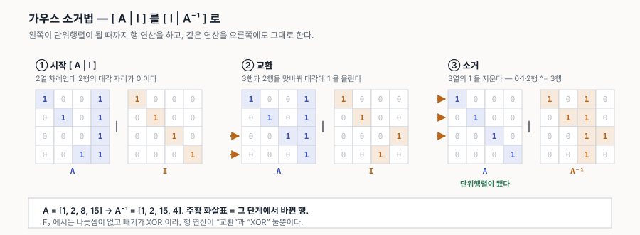

# 14. 가우스 소거법 — F₂ 에서 역행렬 구하기

[13-transpose-vs-inverse.md](13-transpose-vs-inverse.md) 에서 `A⁻¹` 은 "가우스 소거법으로 구한다"고만 적었다. 이 문서가 그 절차다. Triton 의 `invertAndCompose` 가 실제로 하는 계산이기도 하다([11-linearlayout-history.md](11-linearlayout-history.md) §3).

표기는 12 문서를 따른다 — 스칼라 *소문자 이탤릭*, 벡터 **소문자 볼드**, 행렬 **대문자 볼드**.

> **한 줄로.** `[ A | I ]` 를 나란히 놓고 **왼쪽이 단위행렬이 될 때까지** 행 연산을 한다. 그때 오른쪽에 남는 것이 `A⁻¹` 이다.

---

## 1. 왜 그렇게 되는가

행 연산 하나하나가 **어떤 행렬을 왼쪽에 곱하는 것**과 같다. 그 행렬들을 **E**₁, **E**₂, …, **E**ₖ 라 하자.

| | |
|---|---|
| 왼쪽이 **I** 가 됐다는 것 | **E**ₖ … **E**₂ **E**₁ **A** = **I** |
| 양변에 **A**⁻¹ 을 곱하면 | **E**ₖ … **E**₂ **E**₁ = **A**⁻¹ |

그런데 같은 연산을 오른쪽 **I** 에도 했으니, 오른쪽은 `Ek … E2 E1 I` = `Ek … E2 E1` 가 되어 있다. **그것이 곧 `A⁻¹`** 이다.

역행렬 공식을 따로 외울 필요가 없다는 것이 이 방법의 값이다 — **같은 연산을 두 곳에 하면 답이 따라 나온다.**

---

## 2. 허용된 행 연산

일반적인 체에서는 셋이다.

| | |
|---|---|
| ① 두 행을 **교환** | |
| ② 한 행에 **0 아닌 스칼라를 곱한다** | |
| ③ 한 행에 **다른 행의 스칼라 배를 더한다** | |

**F₂ 에서는 둘로 줄어든다.**

- ②가 사라진다 — 0 아닌 스칼라가 `1` 뿐이라 곱해 봐야 그대로다. **피벗을 1 로 만드는 나눗셈이 없다.**
- ③이 단순해진다 — 스칼라가 `1` 뿐이니 "다른 행을 그냥 더한다", 즉 **XOR** 이다. 그리고 `−x = x` 라 빼기와 더하기가 같아 부호도 없다.

남는 것은 **① 교환**과 **③ XOR**, 둘뿐이다.

12 문서 §8 의 "F₂ 라서 편한 것들"이 여기서 전부 쓰인다.

---

## 3. 절차

각 열 `col = 0, 1, 2, …` 에 대해:

| | |
|---|---|
| **① 피벗 찾기** | `col` 행 이하에서 그 열이 1 인 행을 찾는다. **없으면 가역이 아니다**(§5) |
| **② 교환** | 찾은 행을 `col` 행으로 올린다 |
| **③ 소거** | 그 열이 1 인 **다른 모든 행**에 `col` 행을 XOR 한다 |

3번에서 **위아래를 다 지우는** 것이 Gauss-Jordan 이다. 아래만 지우고 나중에 거꾸로 대입하는 것이 원래의 Gauss 인데, 역행렬을 구할 때는 전자가 편하다.

---

## 4. 손으로 따라가기

`A = [1, 2, 8, 15]` 로 해 보자. 기저 목록을 행렬로 펴면 **열 *c* 가 `A[c]` 의 이진수**다(12 문서 §7).



```
[ A | I ]
    1 0 0 1  |  1 0 0 0
    0 1 0 1  |  0 1 0 0
    0 0 0 1  |  0 0 1 0
    0 0 1 1  |  0 0 0 1
```

0열과 1열은 이미 대각이 1 이고 다른 행이 0 이라 할 일이 없다. 2열 차례인데 **2행의 대각 자리가 0** 이다.

**2열 · 교환** — 3행과 2행을 맞바꾼다.

```
    1 0 0 1  |  1 0 0 0
    0 1 0 1  |  0 1 0 0
    0 0 1 1  |  0 0 0 1
    0 0 0 1  |  0 0 1 0
```

**3열 · 소거** — 3열이 1 인 0·1·2행에 3행을 XOR 한다.

```
    1 0 0 0  |  1 0 1 0
    0 1 0 0  |  0 1 1 0
    0 0 1 0  |  0 0 1 1
    0 0 0 1  |  0 0 1 0
```

왼쪽이 단위행렬이 됐다. 오른쪽을 다시 기저 목록으로 읽으면 **`A⁻¹ = [1, 2, 15, 4]`** 이다.

검산은 합성으로 한다 — `A ∘ A⁻¹ = [1, 2, 4, 8]` 이면 단위다.

---

## 5. 피벗이 없을 때 = 가역이 아니다

어느 열에서 **1 인 행을 못 찾으면** 거기서 멈춘다. 그 열이 전부 0 이라는 뜻이고, 이는 **그 입력 비트가 출력에 아무 기여도 하지 않는다**는 말이다.

layout 으로 옮기면 **브로드캐스트**다. 그 비트를 켜든 끄든 같은 원소를 가리키니, 여러 lane 이 같은 값을 들게 된다. 되돌릴 수 없는 것이 당연하다 — "원소 5 는 누가 들고 있나"에 답이 여럿이다.

```python
BCAST = [1, 2, 0, 8, 16]      # 기저값 0 = 그 비트가 아무 데도 안 간다
inverse(BCAST)                # -> None
```

Triton 은 이때 역행렬을 포기하지 않고 **`invertAndCompose`** 로 넘어간다. 역행렬을 따로 만들지 않고 `AX = B` 의 해를 구하되, 해가 여럿이면 **최소 노름 해**를 골라 데이터 이동을 최소화한다(11 문서 §3).

---

## 6. F₂ 라서 빠르다

| 실수에서 | F₂ 에서 |
|---|---|
| 피벗으로 나눈다 | **나눗셈 없음** |
| 행의 *c* 배를 뺀다 | **XOR 한 번** |
| 피벗 선택에 수치 안정성 고려 | **아무 1 이나 잡으면 된다** — 오차가 없다 |
| 행 하나가 배열 | **행 하나가 정수** |

마지막 줄이 크다. `n × n` 행렬을 **정수 `n` 개**로 담을 수 있고, 행 연산 한 번이 **정수 XOR 한 번**이다. `n` 이 10~15 인 실제 layout 에서는 사실상 공짜다.

비용은 `O(n³)` 비트 연산인데, 정수 단위로는 `O(n²)` 번의 XOR 이다. `n = 15` 면 225 번. 컴파일 타임에 한 번 도는 계산으로는 무시할 만하다.

---

## 7. 코드

```python
def inverse(bases, n):
    """열 벡터 목록으로 주어진 정사각 F2 행렬의 역행렬. 가역이 아니면 None."""
    a = list(bases)                    # 원본
    b = [1 << j for j in range(n)]     # 단위행렬
    for col in range(n):
        piv = next((k for k in range(col, n) if a[k] >> col & 1), None)
        if piv is None:
            return None                # 피벗 없음 -> 가역이 아니다
        a[col], a[piv] = a[piv], a[col]
        b[col], b[piv] = b[piv], b[col]
        for k in range(n):
            if k != col and (a[k] >> col & 1):
                a[k] ^= a[col]         # 빼기가 아니라 XOR
                b[k] ^= b[col]
    return b
```

전체 판은 [`examples/f2_playground.py`](examples/f2_playground.py) 에 있다 — 역행렬, 합성, `B⁻¹ ∘ A`, 비가역 확인까지 돈다. GPU 없이 실행된다.

---

## 8. 곁가지 — 이름

**카를 프리드리히 가우스**의 이름이 붙었지만, 같은 절차가 중국 『구장산술』(기원전 2세기경)에 이미 나온다. 가우스는 19세기에 최소제곱법을 다루며 체계화했고, **빌헬름 요르단**이 측량 계산용으로 정리한 형태가 Gauss-Jordan 이다.

| | 하는 일 |
|---|---|
| **Gauss** | 아래쪽만 지워 상삼각으로 만든 뒤 거꾸로 대입 |
| **Gauss-Jordan** | 위아래를 다 지워 단위행렬로 — **역행렬 구할 때 쓰는 쪽** |

§3~§4 에서 한 것이 Gauss-Jordan 이다.
