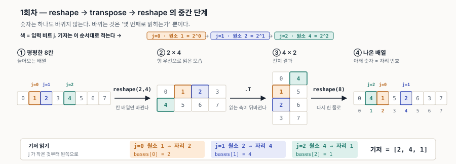
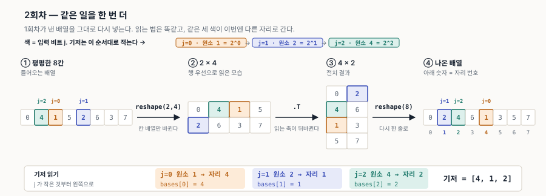
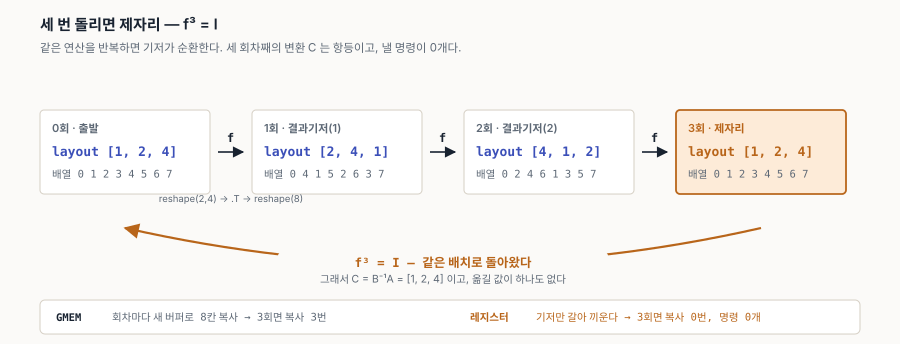

# 15. (심화) 한 예제를 끝까지 — `reshape → transpose → reshape` 를 두 번

> **한 줄로.** 같은 연산을 세 번 반복하면 **기저가 제자리로 돌아온다**. GMEM 이면 복사를 세 번 한 것이고, 레지스터면 **아무것도 하지 않은 것**이다.

이 문서는 11~14 문서에서 조각으로 나온 것들을 **하나의 예제로 이어 붙인 심화편**이다. 개념 설명은 하지 않고 그쪽을 가리킨다.

| 먼저 읽을 것 | |
|---|---|
| [12-f2-primer.md](12-f2-primer.md) | 기저, F₂, `A x = y` |
| [13-transpose-vs-inverse.md](13-transpose-vs-inverse.md) §2 | `A` · `B` · `C = B⁻¹A` 가 각각 무엇인가 |
| [11-linearlayout-history.md](11-linearlayout-history.md) §1 | 이 연산 조합이 왜 PR #3794 에 등장하는가 |

전부 [`examples/reshape_chain_twice.py`](examples/reshape_chain_twice.py) 로 재현된다.

---

## 1. 예제

```python
def step(a):
    return a.reshape(2, 4).T.reshape(8).copy()
```

`arange(8)` 에 이것을 세 번 먹인다.

```
       numpy 배열              layout 기저
0회  [0 1 2 3 4 5 6 7]        [1, 2, 4]
1회  [0 4 1 5 2 6 3 7]        [2, 4, 1]     결과기저(1)
2회  [0 2 4 6 1 3 5 7]        [4, 1, 2]     결과기저(2)
3회  [0 1 2 3 4 5 6 7]        [1, 2, 4]     제자리
```

**두 칸을 섞지 말 것.** 왼쪽은 배열이 실제로 들고 있는 값이고, 오른쪽이 **layout** 이다. 둘은 서로 역이며 §3 에서 자세히 본다.

이 세션의 다른 문서에 흩어져 나온 `[2, 4, 1]` 과 `[4, 1, 2]` 가 사실 같은 사슬의 1회차와 2회차다.

---

## 2. 1회차의 중간 단계



네 단계를 지나는 동안 **숫자는 하나도 바뀌지 않는다.** 바뀌는 것은 "몇 번째로 읽히는가"뿐이다.

**원소 1·2·4 만 색으로 따라가면 기저가 그림에서 바로 읽힌다.** 처음에 lane *L* 은 원소 *L* 을 들고 있으므로, 그 셋의 **최종 자리**가 곧 기저다.

셋을 고른 이유와 **적는 순서**가 색에 실려 있다 — 색은 **입력 비트 `j`** 다.

| 색 | `j` | 원소 | 왜 이것인가 | 최종 자리가 되는 칸 |
|---|---|---|---|---|
| 주황 | 0 | 1 = 2⁰ | lane 번호의 **1의 자리**만 켜진 lane | `bases[0]` |
| 파랑 | 1 | 2 = 2¹ | **2의 자리**만 켜진 lane | `bases[1]` |
| 청록 | 2 | 4 = 2² | **4의 자리**만 켜진 lane | `bases[2]` |

**기저는 `j` 가 작은 것부터 왼쪽으로 적는다.** 그림에서는 각 색칸 위의 `j=0/1/2` 꼬리표와 아래 띠의 왼쪽→오른쪽 순서가 그 순서다. 색이 최종 배열에서 뒤섞여 있어도 **적는 순서는 `j` 가 정한다** — 뒤섞인 순서대로 적으면 틀린다.

| 단계 | 하는 일 |
|---|---|
| ① → ② | `reshape(2,4)` — 8칸을 2행 4열로 **본다**. 순서 그대로 |
| ② → ③ | `.T` — 읽는 축을 맞바꾼다. **여기서만 순서가 바뀐다** |
| ③ → ④ | `reshape(8)` — 다시 한 줄로 **본다** |

순서를 실제로 바꾸는 것은 가운데 하나뿐이고, 양옆 `reshape` 는 **보는 방식**이다. 그래서 이 조합이 "겉보기에 세 연산인데 실제로는 하나"인 예로 계속 인용된다.

---

## 3. 방향 ① — 대응표에서 기저를 뽑는다

### 먼저 — 표가 두 개다

같은 1회차를 두 가지 표로 적을 수 있고, **둘은 서로 역이다.**

| 표 | 왼쪽 | 오른쪽 | 8칸 | 기저 |
|---|---|---|---|---|
| numpy 배열 | 새 자리 | 거기 들어온 **옛 원소** | `[0, 4, 1, 5, 2, 6, 3, 7]` | `[4, 1, 2]` |
| **layout** | **lane** | 그 lane 이 든 값의 **새 인덱스** | `[0, 2, 4, 6, 1, 3, 5, 7]` | **`[2, 4, 1]`** |

**layout 은 아래쪽이다.** LinearLayout 의 정의가 *하드웨어 좌표 → 텐서 인덱스* 이기 때문이다([13-transpose-vs-inverse.md](13-transpose-vs-inverse.md) §2). 레지스터에서는 값이 lane 에 눌러앉아 있고 **이름표(인덱스)만 갈리므로**, 물을 수 있는 것은 "lane *L* 이 든 값의 새 인덱스는?" 뿐이다 — 그것이 아래쪽 표다. [12-f2-primer.md](12-f2-primer.md) §11 이 `[2, 4, 1]` 이라고 적은 것도 이쪽이다.

위쪽 배열은 **GMEM 이 실제로 만드는 버퍼**라 눈에 먼저 들어오지만, 그것은 layout 의 역행렬 `A⁻¹` 이다.

### 뽑는 법

어느 쪽이든 읽는 법은 같다 — **비트가 하나만 켜진 자리 세 줄**이면 된다. layout 표에 적용하면:

```
lane 1 = 001   →  새 인덱스 2        bases[0] = 2
lane 2 = 010   →  새 인덱스 4        bases[1] = 4
lane 4 = 100   →  새 인덱스 1        bases[2] = 1
                                     결과기저(1) = [2, 4, 1]
```

나머지 다섯 줄은 이 셋의 XOR 로 따라온다 — 선형사상은 기저에서의 값만 정하면 끝이기 때문이다([12-f2-primer.md](12-f2-primer.md) §7).

> **이 방향은 사람이 하는 일회성 작업이다.** 새 명령이 나오면 PTX 규정을 한 번 읽어 기저로 옮겨 두고, 그다음부터는 기계가 기저만 쓴다.

### 그리고 이 예제에는 함정이 하나 더 있다

```
f    = [2, 4, 1]
f⁻¹  = [4, 1, 2]
f²   = [4, 1, 2]       f³ = I 이므로 f⁻¹ = f²
```

**1회차를 거꾸로 읽은 결과가 2회차 layout 과 똑같다.** 그래서 `[4, 1, 2]` 가 1회차의 답처럼 보인다. 우연이 아니라 사슬이 3-사이클이라서 생기는 일이고, `reshape(4,4)`(주기 2)에서는 `f⁻¹ = f` 가 되어 두 방향이 아예 같아진다 — 더 헷갈린다.

**구분하는 법은 하나다. 표의 왼쪽이 자리인지 lane 인지 먼저 정하고 시작할 것.**

---

## 4. 방향 ② — 기저에서 대응표를 만든다

거꾸로 가면 **켜진 비트의 기저값을 XOR** 한다.

`[2, 4, 1]` 에서 layout 표 `[0, 2, 4, 6, 1, 3, 5, 7]` 을 되살려 본다.

```
lane 3 = 011  →  bases[0] ^ bases[1] = 2 ^ 4 = 6       ✓ 표의 3번째가 6
lane 5 = 101  →  bases[0] ^ bases[2] = 2 ^ 1 = 3       ✓
lane 7 = 111  →  2 ^ 4 ^ 1 = 7                          ✓
```

여덟 줄이 전부 이 한 규칙에서 나온다. 스크립트가 두 방향이 서로 역임을 8칸 전부에 대해 확인한다.

**실무에서 쓰는 방향은 이쪽이다.** 기저가 원천이고 대응표는 파생이며, 대응표는 애초에 만들지 않는다 — 필요한 자리만 그때그때 이 식으로 계산한다.

---

## 5. 2회차 — 같은 일을 한 번 더

입력이 `[0 4 1 5 2 6 3 7]` 로 바뀌었을 뿐 절차는 똑같다. 색도 그대로 원소 1·2·4 를 따라간다.



이번에는 셋이 **다른 자리로** 간다. 읽는 순서(`j`)는 그대로다.

| 색 | `j` | 원소 | 1회차 | 2회차 |
|---|---|---|---|---|
| 주황 | 0 | 1 | 자리 **2** | 자리 **4** |
| 파랑 | 1 | 2 | 자리 **4** | 자리 **1** |
| 청록 | 2 | 4 | 자리 **1** | 자리 **2** |
| | | | **`[2, 4, 1]`** | **`[4, 1, 2]`** |

색 셋이 `2 → 4 → 1 → 2` 로 **한 칸씩 자리를 넘겨받는 것**이 보인다. 그래서 세 번째에 제자리다(§7).

### `A'x` 인가 `A'Ax` 인가

`A = [2, 4, 1]` 를 1회차, `A' = [4, 1, 2]` 를 2회차 기저라 하자. 2회차의 자리를 구할 때는 **`A'x` 하나면 된다.**

```
A' 는 이미 A 를 먹은 값이다 —   A ∘ A = [4, 1, 2] = A'
```

곱하지 않고 겹쳐 적으면 **두 번 적용한 꼴이 되어 틀린다.** 확인:

```
 x  |  A x  | A(A x) |  A' x
 3  |   6   |   5    |   5        A(Ax) == A'x  (8칸 전부 일치)
```

일반화하면 이렇다.

| 가진 것 | 2회차 자리 |
|---|---|
| **누적 기저** `A'` (§1 의 layout 열) | `A' x` — **행렬-벡터 곱 한 번** |
| 한 회차짜리 연산 `f` 만 | `f(f(x))` 또는 미리 `f²` 를 만들어 한 번 |

**컴파일러는 항상 앞쪽을 쓴다.** 합성은 컴파일 타임에 한 번 해 두고(§7), 코드 생성 때는 `A'x` 한 번만 낸다 — `C = B⁻¹A` 를 미리 곱해 두는 것과 정확히 같은 이유다([13-transpose-vs-inverse.md](13-transpose-vs-inverse.md) §2).

> **1회차와 2회차의 배열·layout 이 서로 맞바뀐 꼴인 것에 주의할 것.** 1회차 배열이 `[0 4 1 5 2 6 3 7]`, layout 이 `[0 2 4 6 1 3 5 7]` 인데 2회차는 정확히 그 반대다. `f³ = I` 라 `f² = f⁻¹` 이기 때문이다(§3).

---

## 6. 3회차 — 제자리



세 번째에 `[1, 2, 4]` 로 **돌아온다.** 8칸짜리 배열을 세 번 전치하면 원래대로라는 것인데, 기저로 보면 이유가 한 줄로 나온다 — 다음 절이다.

---

## 7. 회차는 기저의 합성이다

한 회차가 하는 일 자체가 기저 하나다. 그것을 `f` 라 하면:

```
f   = [2, 4, 1]
f²  = [4, 1, 2]
f³  = [1, 2, 4] = I
```

`f` 를 비트 자리로 읽으면 왜 3 인지 보인다.

```
비트 0  →  비트 1
비트 1  →  비트 2
비트 2  →  비트 0        비트 세 자리를 한 칸씩 돌린다
```

**세 자리를 한 칸씩 돌리는 일은 세 번 하면 제자리다.** 그러니 주기는 배열 크기가 아니라 **비트 자리 수와 회전량**이 정한다.

```
b = log2(원소 수)          비트 자리 수
r = log2(행 수)            한 회차가 돌리는 칸 수
주기 = b / gcd(r, b)
```

| shape | `b` | `r` | 주기 |
|---|---|---|---|
| `(2, 4)` · 8원소 | 3 | 1 | **3** |
| `(2, 8)` · 16원소 | 4 | 1 | **4** |
| `(4, 4)` · 16원소 | 4 | 2 | **2** |
| `(8, 8)` · 64원소 | 6 | 3 | **2** |

`(4,4)` 가 **두 번 만에** 제자리인 것에 주의할 것 — 원소 수가 늘었다고 주기가 늘지 않는다. 스크립트로 11가지 조합을 돌려 이 식과 실측이 전부 일치하는 것을 확인했다.

그리고 이 합성이 `결과기저 = f ∘ 이전기저` 로, [13-transpose-vs-inverse.md](13-transpose-vs-inverse.md) §2 의 `C = B⁻¹ ∘ A` 와 **완전히 같은 행렬곱**이다. 다른 것은 곱하는 상대뿐이다.

---

## 8. GMEM 이면 복사 3번, 레지스터면 0번


| | 한 회차가 실제로 하는 일 | 3회차까지 |
|---|---|---|
| **GMEM** | `.T` 뒤의 `reshape` 가 연속이 아니므로 **새 버퍼로 8칸을 옮긴다** | 복사 **3번** |
| **레지스터** | 값은 그 lane 에 그대로 있고 **기저 목록만 갈아 끼운다** | 복사 **0번** |

레지스터에는 "연속" 이라는 요구가 없다. 주소가 아니라 **레지스터 번호 + lane 번호**로 값을 짚고, 그 번호는 명령어 안의 즉치값이라 자유롭게 고를 수 있다([10-memory-model.md](10-memory-model.md) §2.3). 그래서 "다시 늘어놓는다"는 일이 아예 존재하지 않는다.

**그리고 3회차에서는 기저가 항등이므로 낼 명령조차 0개다.** 소스에 `step()` 이 세 번 적혀 있어도 나가는 코드는 비어 있다.

---

## 9. 이것이 `C = B⁻¹A` 와 만나는 곳

`A` 는 값이 지금 놓인 배치(= 결과기저), `B` 는 소비자가 요구하는 배치다. **둘 다 §3 의 layout 규약으로 적는다.**

| 상황 | `A` | `B` | `C = B⁻¹A` | 나가는 것 |
|---|---|---|---|---|
| 3회 돌린 값을 원래 배치로 쓴다 | `[1, 2, 4]` | `[1, 2, 4]` | **`[1, 2, 4]` = I** | **없음** |
| 1회 돌린 값을 원래 배치로 쓴다 | `[2, 4, 1]` | `[1, 2, 4]` | `[2, 4, 1]` | lane 비트 회전 → `shfl` |
| 1회 값을 2회 배치로 쓴다 | `[2, 4, 1]` | `[4, 1, 2]` | `[4, 1, 2]` | lane 비트 회전 → `shfl` |

두 번째 줄에서 `C = A` 인 것은 **`B` 가 항등이라서**다. 이 특수 케이스가 "결과기저를 그대로 쓰면 되는 것 아닌가" 하는 인상을 준다 — `B` 가 항등이 아닌 세 번째 줄에서 갈라진다. 실제 GPU 에서 `B` 는 PTX 가 정한 fragment 배치라 거의 항상 항등이 아니다.

> **첫째 줄이 Triton 이 실제로 하는 일이다.** 소스에는 연산이 세 개 적혀 있고, 컴파일러는 그것을 합성해 항등을 얻고, 명령을 내지 않는다. 사람이 "이 셋은 상쇄된다"를 알아볼 필요가 없다 — 행렬곱이 알려 준다.

### `C ≠ I` 일 때 — 어느 축이 남느냐가 비용을 정한다

위 표는 lane 축 하나뿐인 장난감이라 갈래가 둘밖에 안 나온다. 실제로는 입력 축이 **`(block, warp, lane, register)`** 넷이고, `C` 에서 **항등이 아닌 채로 남는 축**이 비용을 정한다.

Triton 은 `B⁻¹A` 를 그대로 보지 않고, 이미 항등인 축을 느린 쪽부터 잘라 낸다.

```cpp
// lib/Dialect/TritonGPU/IR/LinearLayoutConversions.cpp
// We get the smallest submap of srcTy^{-1} * dstTy that is not the identity
// under the common dimensions. If a transformation is the identity on block,
// it does not need distributed shared memory. If it is also the identity on
// warp, it can transfer via warp shuffles, and if it is the identity on lane,
// it only needs to reorder registers.
auto conversion = dstLayout.invertAndCompose(srcLayout);
for (auto dim : commonDims) {
  auto quotient = conversion.quotient(dim);
  if (!quotient) break;
  conversion = *quotient;
}
```

축을 `register` 2비트 · `lane` 2비트 · `warp` 2비트로 두고 (= 기저 6개, 값 `1·2·4·8·16·32`) 사례를 늘어놓으면 이렇다.

| 상황 | `A` (지금 놓인 배치) | `B` (요구되는 배치) | `C = B⁻¹A` | 남는 축 | 나가는 것 |
|---|---|---|---|---|---|
| 두 배치가 같다 | `[1, 2, 4, 8, 16, 32]` | `[1, 2, 4, 8, 16, 32]` | `[1, 2, 4, 8, 16, 32]` | — | **없음** — `replaceOp(op, src)` |
| 레지스터 두 칸만 뒤바뀜 | `[1, 2, 4, 8, 16, 32]` | `[2, 1, 4, 8, 16, 32]` | `[2, 1, 4, 8, 16, 32]` | `register` | **SSA 재배열** — 공짜 |
| lane 두 비트가 뒤바뀜 | `[1, 2, 4, 8, 16, 32]` | `[1, 2, 8, 4, 16, 32]` | `[1, 2, 8, 4, 16, 32]` | `lane` | `shfl` |
| 레지스터 비트 ↔ lane 비트 | `[1, 2, 4, 8, 16, 32]` | `[4, 2, 1, 8, 16, 32]` | `[4, 2, 1, 8, 16, 32]` | `register`, `lane` | `shfl` |
| lane 비트 ↔ warp 비트 | `[1, 2, 4, 8, 16, 32]` | `[1, 2, 16, 8, 4, 32]` | `[1, 2, 16, 8, 4, 32]` | `lane`, `warp` | **SMEM 왕복** + 배리어 |

`A` 가 항등이라 표에서 `C = B` 로 보이지만, 그건 이 예가 그렇게 골라져서다 — `A` 가 항등이 아니면 `C` 는 둘 중 어느 것도 아니다.

#### 읽는 법 — `[1, 2, 4, 8, 16, 32]` 이 기준자다

이 여섯 개가 **항등 기저**다. 기저값 `2ʲ` 가 `j` 번째 자리에 있는 것. 그리고 **자리도 값도 축으로 묶여 있다.**

```
자리 j  :    0        1     |    2        3     |    4        5
축      : register register |   lane     lane   |   warp     warp
기저값  :    1        2     |    4        8     |   16       32
```

**자리 = 출발 축, 값 = 도착 축.** 그래서 판정이 한 줄로 끝난다.

> **자리 `j` 에 놓인 기저값이 `j` 와 같은 칸 출신인가?**

| `C` | 어긋난 자리 | 걸친 칸 | 나가는 것 |
|---|---|---|---|
| `[1, 2, 4, 8, 16, 32]` | 없음 | — | 없음 |
| `[2, 1, 4, 8, 16, 32]` | 자리0←`2`(reg) · 자리1←`1`(reg) | `register` | SSA 재배열 |
| `[1, 2, 8, 4, 16, 32]` | 자리2←`8`(lane) · 자리3←`4`(lane) | `lane` | `shfl` |
| `[4, 2, 1, 8, 16, 32]` | 자리0←`4`(**lane**) · 자리2←`1`(**reg**) | `register`·`lane` | `shfl` |
| `[1, 2, 16, 8, 4, 32]` | 자리2←`16`(**warp**) · 자리4←`4`(**lane**) | `lane`·`warp` | **SMEM 왕복** |

셋째 줄과 다섯째 줄의 차이는 **기저값이 `8` 이냐 `16` 이냐 하나뿐**이다. `8` 은 `lane` 칸의 마지막 값이고 `16` 은 `warp` 칸의 첫 값이다 — **그 한 칸이 워프 경계**다.

#### 거리가 아니라 경계다

"많이 옮길수록 비싸다"가 아니다. 워프 하나를 32 lane(5비트)으로 두고 재어 보면 뒤집힌다.

| | 최대 이동거리 | 워프 넘는 값 | 나가는 것 |
|---|---|---|---|
| `lane` 비트 전부 뒤집기 | **21** | 0개 | `shfl` |
| `lane` 비트 하나 ↔ `warp` 비트 | **16** | 32개 | **SMEM 왕복** |

**더 멀리 옮기는 쪽이 싸다.** 기준은 크기가 아니라 경계다.

```
값 하나
 └─ 스레드(lane) 의 레지스터        이름만 바꾼다
     └─ 워프 = lane 32개            shfl 이 닿는 끝
         └─ CTA                     st.shared + barrier + ld.shared
             └─ 클러스터             DSMEM (sm_90+)
                 └─ grid            global
```

결정적인 것은 워프 경계다. **다른 워프의 레지스터를 읽는 명령이 ISA 에 없다** — 레지스터 번호는 명령어 안의 즉치값이고 워프와 레지스터 파일의 연결은 블록 수명 동안 고정이다([10-memory-model.md](10-memory-model.md) §2.3). 그래서 `shfl` 은 워프에서 딱 끊긴다.

칸의 **폭**은 이렇게 정해진다.

| 축 | 비트 수 | 정하는 것 |
|---|---|---|
| `register` | `log₂(스레드당 원소 수)` | 타일 크기 ÷ 스레드 수 (컴파일러) |
| **`lane`** | **항상 5** | **하드웨어 — 워프 = 32 lane** |
| `warp` | `log₂(워프 수)` | 런치 설정 (`num_warps`) |
| `block` | `log₂(CTA 수)` | 그리드 |

`lane` 만 하드웨어가 못 박는다. 나머지는 사람이 고르므로, **`num_warps` 를 바꾸면 같은 커널의 같은 변환이 `shfl` 에서 SMEM 왕복으로 넘어갈 수 있다.** LinearLayout 의 입력 축이 `(block, warp, lane, register)` 넷인 이유가 이 네 경계다.

**둘째 줄이 "`C ≠ I` 인데 비용 0"인 경우다.** `C` 는 분명히 항등이 아닌데 나가는 것은 SSA 값의 재배열뿐이다.

```cpp
// lib/Conversion/TritonGPUToLLVM/ConvertLayoutOpToLLVM.cpp — transferWithinThread
for (int i = 0; i < outVals.size(); i++) {
  auto srcIdx = conversion.apply({{kRegister, i}}).begin()->second;
  outVals[i] = inVals[srcIdx];      // 명령이 아니라 값 순서만 바꾼다
}
```

### 실제 커널에서의 사례

| 상황 | `A` | `B` | `C` 의 성격 | 나가는 것 |
|---|---|---|---|---|
| `mma.sync.m16n8k16` f16 의 누산기를 다음 GEMM 의 A 로 | 누산기 배치 | `dot_operand` A 배치 | **항등** — 둘이 같다(10 문서 §0.6) | 없음 |
| 같은 것을 fp8 `m16n8k32` 에서 | 누산기: lane 비트가 `열[2:1]` | A: `열[3:2]` | 레지스터·lane 비트가 어긋남 | `shfl` |
| coalesced 로드 결과를 MMA A 로 | `blocked` | `dot_operand` | lane·register 가 모두 다름 | `ldmatrix` 또는 SMEM 왕복 |
| 에필로그에서 워프 경계를 넘는 전치 | MMA 누산기 | 출력 `blocked` | `warp` 축이 어긋남 | **SMEM 왕복** + 배리어 |

맨 윗줄이 "표기는 다른데(`MmaEncodingAttr` vs `DotOperandEncodingAttr`) layout 은 같다"는 경우다. LinearLayout 이 없으면 **사람이 PTX 그림 두 장을 눈으로 대조해야** 알 수 있고, 못 알아보면 맨 아랫줄로 떨어진다. PR #3794 가 든 이유가 이것이다([11-linearlayout-history.md](11-linearlayout-history.md) §1).

---

## 10. 직접 해 보기

```
python3 docs/examples/reshape_chain_twice.py
```

여덟 절로 나뉘어 있다 — 세 회차 추적, 두 방향이 서로 역임을 확인, 배열 기저와 layout 기저가 서로 역임을 확인, 회차가 기저 합성임을 확인, 복사 횟수 대비, 주기 공식 검증(11가지 조합), `C = B⁻¹A` 에서 남는 축별 비용 등급, 거리가 아니라 경계임을 이동거리로 확인. GPU 없이 실행된다.

`reshape(4,4)` 로 바꿔 **주기가 4 가 아니라 2 가 되는 것**을 보는 것이 이 예제를 가장 잘 써먹는 방법이다.
