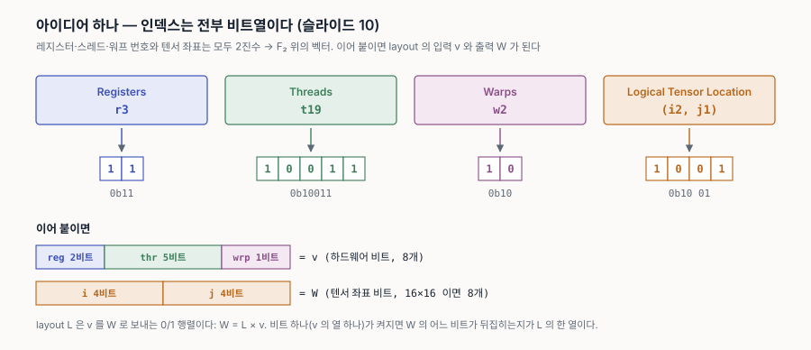
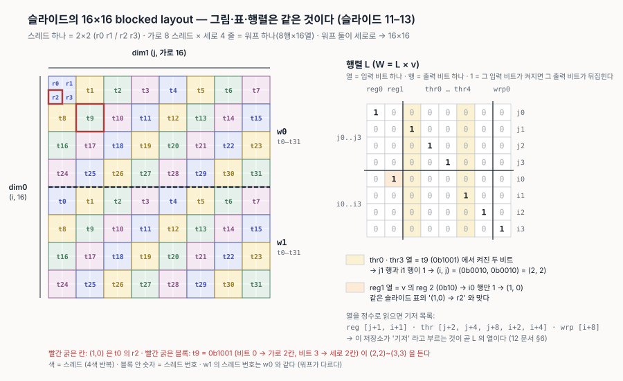
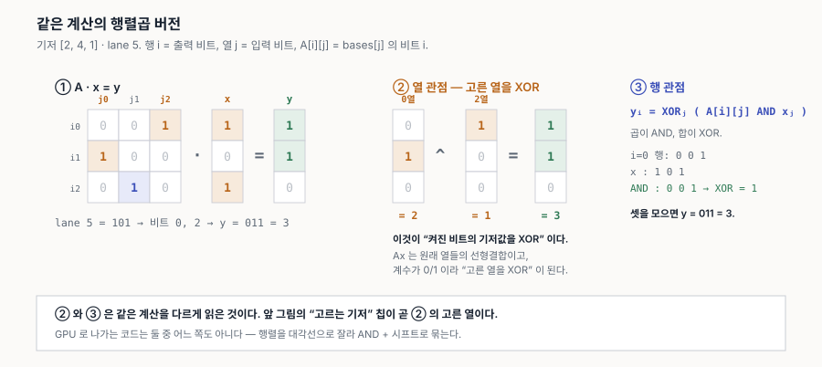
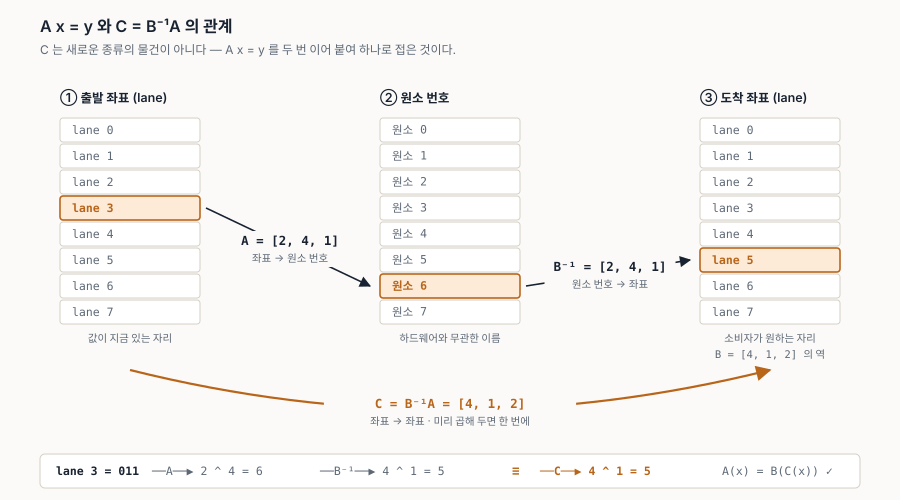
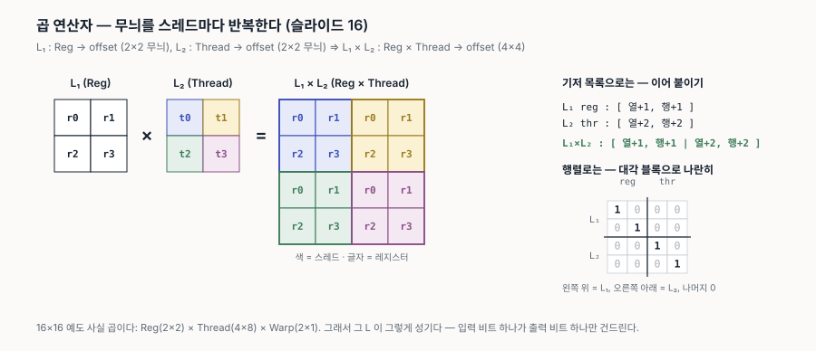
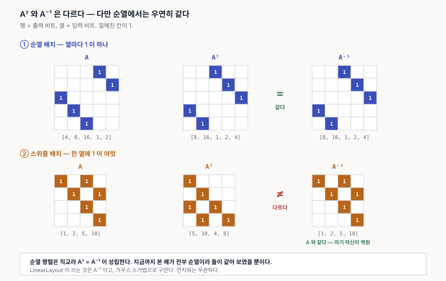
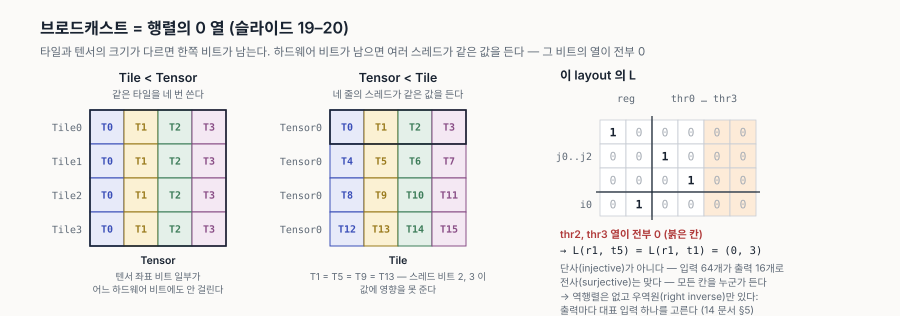
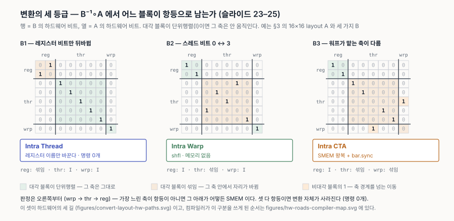
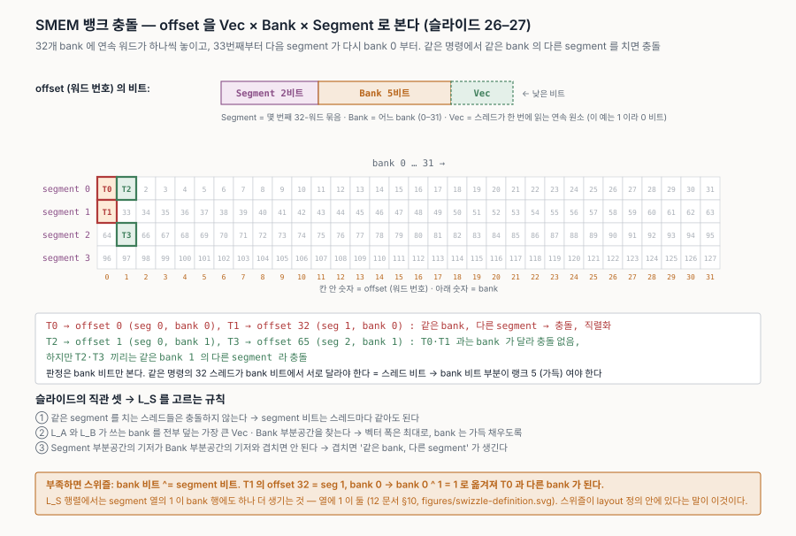
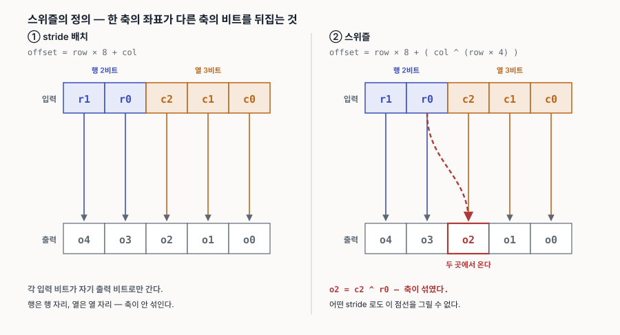

# 16. LinearLayout 발표 슬라이드 다시 읽기 — 처음 배우는 사람 순서로

원본은 *Linear Layouts: Robust Code Generation of Efficient Tensor Computation Using F₂* 의 **ASPLOS'26 발표 슬라이드 41장** ([`sources/linear-layouts/`](sources/linear-layouts/SOURCES.md), Keren Zhou · Mario Lezcano · Adam Goucher 외). 슬라이드는 이미 아는 사람에게 20분 안에 말하는 순서라, 처음 보는 사람이 읽으면 "왜 이게 문제인지"와 "그래서 뭐가 달라졌는지"가 가운데의 수식에 가려진다. 이 문서는 같은 내용을 **문제 → 아이디어 하나 → 정의 → 연산 셋 → 그걸로 무엇을 만드나 → 얼마나 좋아졌나** 순서로 다시 놓고, 수식이 나올 때마다 슬라이드의 예제 숫자를 손으로 따라간다.

세 가지를 미리 밝힌다.

- **이건 슬라이드 재구성이고 논문 정독이 아니다.** 논문([arXiv 2505.23819](https://arxiv.org/abs/2505.23819)) 본문 대조는 계획 B0 로 남아 있다. 슬라이드 36장이 *"Figure 4 and Figure 5 have been fixed in the Arxiv version"* 이라고 하니 논문은 **arXiv 판**을 볼 것.
- **수학은 12 → 13 → 14 문서가 이미 다뤘다.** 여기서는 그 결과를 쓰기만 하고, 처음 나오는 곳마다 링크를 건다.
- **슬라이드의 표기 방향이 이 저장소와 다른 곳이 있다.** §10 에 표로 모았다. 인용할 때 먼저 볼 것.

> 슬라이드의 모든 예제 숫자는 [`examples/linear_layouts_talk_example.py`](examples/linear_layouts_talk_example.py) 로 재현했다 (GPU 불필요). 표·행렬·브로드캐스트·곱·변환 등급이 전부 거기서 나온다.

---

## 0. 한 줄 요약과 읽는 순서

> **레지스터 번호·스레드 번호·워프 번호는 전부 비트열이다. 비트열을 F₂ 위의 벡터로 보면 "누가 어느 원소를 갖는가"(layout)는 행렬 하나 `L` 이 되고, 배치 사이의 변환은 `L_B⁻¹ ∘ L_A` 라는 행렬 계산 하나로 통일된다.**

| 절 | 슬라이드 | 묻는 것 |
|---|---|---|
| §1 | 4–8 | layout 이 무엇이고 왜 골칫거리였나 |
| §2 | 10 | 아이디어 하나 — 인덱스는 비트다 |
| §3 | 11–13 | 정의 `W = L × v` 를 16×16 예로 읽기 |
| §4 | 14 | F₂ 산술 — 필요한 만큼만 |
| §5 | 15–17 | 연산 셋 — 합성 · 곱 · 우역원 |
| §6 | 19–28 | 코드 생성 — 브로드캐스트, 변환 3등급, SMEM 경유, 뱅크 충돌 |
| §7 | 29 | 다른 쓰임 — MXFP, `ldmatrix`, 벡터화 |
| §8 | 31–34 | 실험 — 통과율과 속도 |
| §9 | 39–40 | CuTe 와 비교, 한계 |
| §10 | — | 이 저장소 규약과 어긋나는 표기 |
| §11 | 36–38 | 더 읽을 것 |

표기는 12 문서와 같다. 스칼라 *소문자 이탤릭*, 벡터 **소문자 볼드**, 행렬 **대문자 볼드**. 슬라이드 원문을 인용할 때만 슬라이드 기호(`W`, `L`, `v`)를 그대로 쓴다.

---

## 1. 문제 — layout 은 무엇이고 왜 골칫거리였나 (슬라이드 4–8)

### 타일 언어에서 사용자는 배치를 안 정한다

Triton 같은 타일 기반 언어에서 사용자는 텐서를 **타일**로 자르는 것만 적는다. 슬라이드 5장의 `vecAdd` 커널이 그 예다 — `tl.arange` 로 인덱스를 만들고 `tl.load` / `tl.store` 를 부를 뿐, "이 타일의 (3, 5) 원소를 어느 스레드의 몇 번째 레지스터가 들고 있는가"는 어디에도 없다. 그걸 정하는 것이 **layout** 이고, 정하는 주체는 컴파일러다. Gluon 에서는 사용자가 직접 정하지만(슬라이드 7장), 그래도 **접근 코드와 변환 코드를 만드는 것은 컴파일러**다.

### layout = 하드웨어 좌표 ↔ 텐서 좌표의 대응

슬라이드 4장은 layout 을 *"mapping logical tensor (i, j) to hardware resource"* 라고 적는다. 하드웨어 자원이란 슬라이드 6장의 세 인덱스다.

| 기호 | 뜻 |
|---|---|
| *t* | Thread Index — 워프 안 스레드 번호 (이 저장소의 `lane`) |
| *w* | Warp Index — CTA 안 워프 번호 |
| *r* | Register Index — 스레드 안 레지스터 번호 |

슬라이드 6장 그림에는 이름 있는 layout 이 여럿 나온다. **Distributed** 쪽에 Blocked · MMA · Sliced · MMAInput(Idx=0/1), **Memory** 쪽에 Unswizzled · Swizzled. Blocked 는 원소를 스레드에 균등하게 나눈 것, MMA 는 Tensor Core 명령이 요구하는 조각 모양, Sliced 는 한 축을 줄인 것, MMAInput 은 MMA 의 피연산자 모양, Swizzled 는 SMEM 뱅크 충돌을 피하려고 주소를 XOR 로 섞은 것이다. 지금은 이름만 알면 된다 — **이름이 여럿이라는 것 자체가 문제**였다.

### 이름마다 코드가 있으면 쌍마다 코드가 생긴다

슬라이드 8장이 문제를 한 그림으로 보인다. 옛 Triton layout 노드 여덟 개 — Blocked · MMA · Dot · Sliced · WGMMA · FMA · Tensor Memory · Shared Memory — 사이에 선이 전부 이어져 있다. layout 사이 변환을 **쌍마다 손으로** 짰기 때문이다.

여덟 이름이 각각 무엇인지는 Triton HEAD 의 `TritonGPUAttrDefs.td` (NVIDIA 전용은 `TritonNvidiaGPUAttrDefs.td`) 정의를 기준으로 적는다. 앞의 여섯은 **Distributed** (레지스터에 나눠 든 것), 뒤의 둘은 **Memory** (SMEM / TMEM 에 놓인 것) 다.

| 슬라이드의 이름 | Triton 속성 | 무엇인가 | 어디서 나오나 |
|---|---|---|---|
| **Blocked** | `#ttg.blocked` | 워프마다 텐서의 **연속된 조각**을 맡고, 그 안을 `sizePerThread · threadsPerWarp · warpsPerCTA · order` 로 균등하게 나눈 것. 정의문: *"typically the kind of data layout used to promote memory coalescing in LoadInst and StoreInst"* | `tl.load` / `tl.store` 의 기본. 10 문서 §0.6 이 `order` = coalescing, `sizePerThread` = 벡터화 폭이라고 한 그것 |
| **MMA** | `#ttg.nvidia_mma` (`versionMajor` 1·2) | Tensor Core 명령 **`mma.sync` 의 출력(누산기)이 놓이는 모양**. `versionMajor` 1 = Volta `mma.884`, 2 = Turing/Ampere `m16n8k*`. 정의문: *"tensors that have been produced by tensor cores"* | `tt.dot` 의 결과. 10 문서 §0.6 의 누산기 비트 배정표가 이것 |
| **Dot** | `#ttg.dot_op` (`opIdx` 0/1, `parent`, `kWidth`) | `tt.dot` 의 **피연산자 A·B** 가 놓여야 하는 모양. `parent` 가 결과의 MMA layout 이고, `kWidth` 는 한 스레드가 K 방향으로 연속으로 드는 원소 수. 정의문: *"operands a and b must be of DotOperandEncodingAttr layout, if the dot is MMA v1 or v2"* | `tt.dot` 직전. 10 문서 §0.6 의 A/B 조각. 누산기 → 다음 dot 의 A 로 넘길 때 MMA → Dot 변환이 생긴다 |
| **Sliced** | `#ttg.slice` (`dim`, `parent`) | 부모 layout 에서 **축 하나를 짜낸(squeeze)** 것. 정의문: *"useful for constructing the inverse layout of an expand_dims operation"* | `tl.sum(axis=…)` 같은 reduce 의 결과, `expand_dims` 의 입력 |
| **WGMMA** | `#ttg.nvidia_mma` 의 `versionMajor` 3 (`isHopper()`) | Hopper `wgmma` 의 누산기 모양. 워프 하나가 아니라 **워프그룹(4 워프)** 이 발행하므로 워프 축의 배정이 다르고, 피연산자는 보통 레지스터가 아니라 SMEM(`nvmma_shared`)에서 직접 읽는다. 정의문: *"For MMA v3, the operands are almost always in a regular shared encoding"* | sm_90 `tt.dot`. sm_120 에는 없다 |
| **FMA** | 별도 속성 없음 — `tt.dot` 결과가 **`#ttg.blocked`** 일 때의 경로 | Tensor Core 를 안 쓰고 **스칼라 `fma` 명령**으로 dot 을 계산하는 fallback. 결과 layout 이 `blocked` 면 `convertFMADot` 으로 내려간다 (`DotOpToLLVM.cpp`) | Tensor Core 가 못 다루는 자료형·모양, 또는 아주 작은 dot |
| **Tensor Memory** | `#ttng.tensor_memory_encoding` (`blockM · blockN · colStride · twoCTAs`) | Blackwell sm_100 의 **TMEM** 에 놓인 누산기 모양. `tcgen05.mma` 의 출력이 레지스터가 아니라 TMEM 에 쌓이고, `tcgen05.ld` 로 레지스터에 가져온다. `colStride` 1 이면 빽빽하게, `twoCTAs` 는 `cta_group::2` 용 | sm_100 `tt.dot` (MMA v5). sm_120 에는 TMEM 자체가 없다. 11 문서 §5 가 이 layout 을 LinearLayout 이 어떻게 흡수했는지 다룬다 |
| **Shared Memory** | `#ttg.swizzled_shared`, `#ttg.nvmma_shared` (그 외 `padded_shared` 등) | SMEM 에 놓인 타일의 모양. `swizzled_shared` 는 `vec · perPhase · maxPhase` 로 **행마다 열을 XOR** 해 뱅크 충돌을 피한 것, `nvmma_shared` 는 `wgmma` / `tcgen05` 가 직접 읽는 **PTX 규정 타일 배치**(`swizzlingByteWidth` 32/64/128 B). 입력 축이 `offset` 하나다 | `tl.load` → SMEM 스테이징, `ldmatrix`, TMA 목적지, 그리고 §6.4 의 변환용 scratch |

이름이 여덟인 이유가 보인다. **명령이 요구하는 모양마다 이름을 하나씩 붙였기 때문**이다 — `mma.sync` 의 누산기, 그 피연산자, `wgmma` 의 누산기, `tcgen05` 의 누산기, 그것들을 먹이는 SMEM 타일 …. 새 명령이 나오면 이름이 하나 늘고, 그 이름과 기존 이름 사이의 변환이 N−1 개 늘었다. LinearLayout 은 이 이름들을 없애지 않고(11 문서 §7) **그 아래를 하나로** 만들었다. 슬라이드의 세 단어가 그 대가다.

| | 뜻 |
|---|---|
| **Fragile** | 쌍마다 따로 짠 코드는 서로 검증되지 않는다. 슬라이드: *"~12% of Triton bugs are layout bugs"* |
| **Inefficient** | 신경 쓴 쌍만 빠르고 나머지는 가장 일반적인 경로로 떨어진다 |
| **Fixed** | 새 layout 하나를 더하려면 *"O(N) conversions"* 을 새로 짜야 한다 |

"O(N)" 은 이 저장소가 11 문서에서 커밋으로 확인한 것과 같은 얘기다 — N 개일 때 새 layout 하나 = 함수 N−1 개 추가. **12% 라는 수치는 슬라이드에만 있고 저장소 이력에서는 확인하지 않았다** (11 문서 §8-4 의 이슈 목록은 다른 방법으로 셌다).

---

## 2. 아이디어 하나 — 인덱스는 비트다 (슬라이드 10)

슬라이드 10장은 그림 넷과 화살표 넷뿐이다.

```
r3  -> 0b11        t19 -> 0b10011       w2 -> 0b10       (i2, j1) -> (0b10, 0b01)
```



레지스터 번호, 스레드 번호, 워프 번호, 그리고 텐서의 행·열 번호 — **전부 2진수**다. 그리고 GPU 에서 이 번호들은 언제나 2의 거듭제곱 개수로 온다 (워프 32 스레드, 타일 16×16 …). 그러면 번호 하나는 **비트열 하나**이고, 비트열은 F₂ 위의 **벡터**다 (12 문서 §5).

이게 왜 아이디어인가. 지금까지 layout 을 적던 방식은 "stride 얼마, 몇 개씩" 같은 **정수 산술**이었다. 정수 산술로는 스위즐(XOR)이 따로 놀고, 두 layout 을 합치거나 뒤집는 일반 공식이 없다. 비트를 벡터로 보면 layout 은 **선형사상**이 되고, 선형사상에는 행렬·합성·역행렬이라는 **닫힌 연산**이 있다. 그 셋이 §5 다.

---

## 3. 정의 — `W = L × v` 를 16×16 예로 읽기 (슬라이드 11–13)

슬라이드 11–13장은 같은 예 하나를 표 → 그림 → 행렬로 세 번 보인다. 예는 이렇다.

- 텐서 16×16 (`dim0` = *i* 세로, `dim1` = *j* 가로).
- 스레드 하나가 2×2 원소를 든다 — 레지스터 `r0 r1 / r2 r3`.
- 스레드 8개가 가로로, 4줄이 세로로 → 워프 하나가 8행 × 16열.
- 워프 둘(`w0`, `w1`)이 세로로 → 16×16.



### 표로 보면

슬라이드 11장의 표를 스크립트가 다시 만든 것이다 (왼쪽이 텐서 좌표, 오른쪽이 하드웨어 좌표).

```
Location            Register     Thread        Warp
(0, 0) / (00, 00)   r0 / 0b00    t0 / 0b0000   w0 / 0b00
(0, 1) / (00, 01)   r1 / 0b01    t0 / 0b0000   w0 / 0b00
(0, 2) / (00, 10)   r0 / 0b00    t1 / 0b0001   w0 / 0b00
(1, 0) / (01, 00)   r2 / 0b10    t0 / 0b0000   w0 / 0b00
(2, 2) / (10, 10)   r0 / 0b00    t9 / 0b1001   w0 / 0b00
(3, 3) / (11, 11)   r3 / 0b11    t9 / 0b1001   w0 / 0b00
```

`(2, 2)` 를 `t9 = 0b1001` 이 드는 이유를 비트로 읽어 보자. `t` 의 비트 0 이 켜지면 가로로 2칸(스레드 한 칸이 2열), 비트 3 이 켜지면 세로로 2칸(스레드 한 줄이 2행). `0b1001` 은 비트 0 과 3 → `(2, 2)`. **비트마다 "켜지면 어디로 가는가"가 정해져 있고, 여러 비트가 켜지면 그 이동을 전부 합친다.** 이것이 선형이라는 뜻이다.

### 행렬로 보면

슬라이드 12–13장의 식이 이것이다.

```
W = L x v
```

| 기호 | 슬라이드의 이름 | 무엇인가 |
|---|---|---|
| `v` | Hardware bits | 입력 — `(register, thread, warp)` 비트를 이어 붙인 벡터 |
| `L` | The layout matrix | 0/1 행렬. **열** = 입력 비트 하나, **행** = 출력 비트 하나 |
| `W` | Logical tensor coordinates | 출력 — `(dim0, dim1)` 비트를 이어 붙인 벡터 |

스크립트가 만든 `L` 은 이렇다 (행 = `j0 j1 j2 j3 | i0 i1 i2 i3`, 열 = `reg0 reg1 | thr0 … thr4 | wrp0`).

```
j0   1 0 | 0 0 0 0 0 | 0
j1   0 0 | 1 0 0 0 0 | 0
j2   0 0 | 0 1 0 0 0 | 0
j3   0 0 | 0 0 1 0 0 | 0
i0   0 1 | 0 0 0 0 0 | 0
i1   0 0 | 0 0 0 1 0 | 0
i2   0 0 | 0 0 0 0 1 | 0
i3   0 0 | 0 0 0 0 0 | 1
```

읽는 법은 **열 하나 = 입력 비트 하나가 켜졌을 때 출력의 어느 비트가 뒤집히는가**다. `reg0` 열은 `j0` 행에만 1 → 레지스터 비트 0 은 가로로 1칸. `thr3` 열은 `i1` 행에만 1 → 스레드 비트 3 은 세로로 2칸. 이 행렬의 열들을 정수로 읽으면 이 저장소가 "기저 목록"이라고 부르는 것이 된다 (12 문서 §6).


슬라이드 13장은 `v = (2, 0, 0)` — 레지스터 2, 스레드 0, 워프 0 — 을 넣어 본다. 레지스터 2 는 `0b10`, 비트 1 만 켜짐 → `reg1` 열 → `i0` 행 → **`(i, j) = (1, 0)`**. 표에서 `(1, 0)` 이 `r2` 인 것과 맞는다.

> 슬라이드 13장은 이 결과를 `W = (0, 1)` 로 적었다. 같은 슬라이드 11장의 표는 `(1, 0) → r2` 다. 좌표 순서 표기의 차이로 보이며, 스크립트는 `(1, 0)` 을 낸다. 어느 쪽이 슬라이드 의도인지는 논문에서 확인할 것.

마지막으로 슬라이드 13장 아래 줄:

> *L : Reg × Thr × Wrp → F₂ⁿ × F₂ᵐ is a linear map between labeled vector spaces over F₂*

**labeled** 가 중요하다. 입력 비트는 그냥 8개가 아니라 "레지스터 2개, 스레드 5개, 워프 1개"로 이름이 붙어 있다. 이 이름이 §6 의 변환 등급을 정한다 — 어느 이름의 비트가 움직였는지에 따라 비용이 갈리기 때문이다.

---

## 4. F₂ 산술 — 필요한 만큼만 (슬라이드 14)

슬라이드 14장은 세 줄이다.

| | 식 | 비트 연산 |
|---|---|---|
| 원소 | `{0, 1}` | |
| 덧셈 | `a ⊕ b = (a + b) mod 2` | `XOR` |
| 곱셈 | `a · b = (a × b) mod 2` | `AND` |

행렬 곱 `L × v` 는 그래서 "각 행에서 `v` 와 AND 한 뒤 전부 XOR" 이고, 같은 것을 열로 읽으면 "`v` 에서 켜진 비트의 열들을 XOR" 이다 (아래 그림).

 뒤 계산은 `t9` 예제에서 이미 했다 — 비트 0 의 이동과 비트 3 의 이동을 XOR 한 것이 `(2, 2)` 다.

여기서 흔히 걸리는 것 하나. `mod 2` 덧셈은 **자리올림이 없다.** 그래서 `stride` 가 2의 거듭제곱일 때만 정수 산술과 F₂ 산술이 같은 답을 낸다 (12 문서 §9, 11 문서 §1 의 stride 절). 슬라이드 40장의 *"restriction to power-of-two shapes"* 가 바로 이 조건이다.

더 필요하면 [12 문서](12-f2-primer.md) §2–§8.

---

## 5. 연산 셋 — 합성 · 곱 · 우역원 (슬라이드 15–17)

layout 이 행렬이 됐으니, 행렬에 할 수 있는 일을 layout 에 한다. 슬라이드는 셋을 든다.

### 합성 (∘) — 두 대응을 이어 붙인다

> `L₁ : U → V`, `L₂ : V → W` 이면 `L₂ ∘ L₁ : U → W`

슬라이드 15장의 예: `L₁ : Reg → Memory Offset`, `L₂ : Memory Offset → Logical Coordinate` 이면 `L₂ ∘ L₁ : Reg → Logical Coordinate`. 가운데 공간(`Memory Offset`)이 같으면 이어 붙일 수 있고, 결과는 행렬 곱이다. **§6 의 변환 공식 `L_B⁻¹ ∘ L_A` 가 이것의 한 사례**다 .



### 곱 (×) — 무늬를 반복한다

> `L₁ : U₁ → V₁`, `L₂ : U₂ → V₂` 이면 `L₁ × L₂ : U₁ × U₂ → V₁ × V₂`

슬라이드 16장의 예: `L₁ : Reg → offset` 이 2×2 무늬 `r0 r1 / r2 r3`, `L₂ : Thread → offset` 이 2×2 무늬 `t0 t1 / t2 t3` 이면 곱은 4×4 다.

```
r0 r1 r0 r1
r2 r3 r2 r3
r0 r1 r0 r1
r2 r3 r2 r3
```



슬라이드의 말로는 *"repeating the register/offsets mapping across multiple threads"*. 스레드 `t0` 이 왼쪽 위 2×2, `t1` 이 오른쪽 위 …. 행렬로는 두 행렬을 **대각 블록으로 나란히 놓는 것**이고, 기저 목록으로는 **두 목록을 이어 붙이는 것**이다. §3 의 16×16 layout 도 사실 `Reg(2×2) × Thread(4×8) × Warp(2×1)` 이라는 곱이다 — 그래서 `L` 이 그렇게 성기다.

### 우역원 — 거꾸로 묻기

> *A surjective linear layout `L : U → V` over F₂ has a right inverse `L′ : V → U`*

"거꾸로"가 필요한 이유는 §6 에서 "원소 `(i, j)` 는 **누가** 들고 있나"를 물어야 하기 때문이다. `L` 은 "누가 → 무엇을" 방향이니 그 역이 필요하다.

슬라이드 17장이 두 단어를 정의한다.

| | 뜻 | layout 에서 |
|---|---|---|
| **Surjective** (전사) | `V` 의 모든 원소가 최소 한 번은 맞는다 | 텐서의 모든 칸을 누군가 든다 — 항상 성립해야 한다 |
| **Injective** (단사) | `U` 의 서로 다른 원소는 서로 다른 곳에 간다 | 두 스레드가 같은 칸을 들지 않는다 — **브로드캐스트에서 깨진다** |

둘 다 성립하면 보통의 역행렬이고, 전사만 성립하면 **우역원**(`L ∘ L′ = I` 인 `L′`)만 있다. 슬라이드는 이것을 *"the solution obtained by Gaussian elimination of `MX = I_m`"* 이라고 적는다 — 가우스 소거법으로 `[L | I]` 를 `[I | L′]` 로 만드는 절차가 [14 문서](14-gaussian-elimination.md) 다. 피벗이 없는 열이 곧 브로드캐스트다 (14 문서 §5).

![F₂ 에서 역행렬 구하기 — [A|I] → [I|A⁻¹]](figures/gaussian-elimination.svg)

> `Aᵀ` 와 `A⁻¹` 을 섞지 말 것. 이 예들은 거의 전부 순열 행렬이라 둘이 같아 보이지만, 스위즐에서 갈라진다 ([13 문서](13-transpose-vs-inverse.md)).
>
> 

---

## 6. 코드 생성 — 이 셋으로 무엇을 만드나 (슬라이드 19–28)

### 6.1 브로드캐스트 = 0 열 (슬라이드 19–20)

슬라이드 19장은 두 경우를 나란히 놓는다.

| | 뜻 | layout 에서 |
|---|---|---|
| **Tile < Tensor** | 타일이 텐서보다 작아 같은 타일을 여러 번 쓴다 | 텐서 좌표 비트 일부가 어떤 하드웨어 비트에도 안 걸린다 |
| **Tensor < Tile** | 타일이 텐서보다 커서 여러 스레드가 같은 원소를 든다 | **하드웨어 비트 일부가 어떤 텐서 좌표에도 안 걸린다 → `L` 의 그 열이 전부 0** |

슬라이드 20장의 행렬에서 `Thread` 열 넷 중 뒤의 둘이 0 이다. 그러면 스레드 비트 2·3 은 켜져도 출력이 안 바뀌니, `t1`, `t5`, `t9`, `t13` 이 같은 값을 든다 — *"The same values are broadcasted every four threads"*, `L × (r₁, t₅) = L × (r₁, t₁)`. 스크립트가 확인한다. 이 `L` 은 단사가 아니지만 전사라 §5 의 우역원은 있다 — 대표 스레드 하나를 고르는 것이 우역원이다.



옛 체계에서는 브로드캐스트를 layout 마다 따로 처리해야 했다. 여기서는 **행렬의 0 열**이라는 한 가지 사실이고, 판정도 소거법의 피벗 유무 하나다.

### 6.2 변환 = `L_B⁻¹ ∘ L_A` (슬라이드 21–22)

> *Given distributed layouts `L_A` and `L_B`, we can convert … from `L_A` to `L_B` by `L_B⁻¹ ∘ L_A`*

읽는 순서는 오른쪽부터다. `L_A` 로 "지금 이 `(reg, thr, wrp)_A` 가 든 원소가 무엇인가"를 구하고, `L_B⁻¹` 로 "그 원소를 `B` 에서는 누가 들어야 하나"를 구한다. 결과는 `(reg, thr, wrp)_A → (reg, thr, wrp)_B`, 즉 **하드웨어 좌표 → 하드웨어 좌표**다. 이 저장소가 `C = B⁻¹A` 라고 적어 온 것과 같은 식이다 (CLAUDE.md 규약, 13 문서 §2).

슬라이드 22장은 이 변환이 **어디에 생기는지**를 말한다. 컴파일러는 먼저 **anchor** — 휴리스틱으로 잘 정해진 layout (보통 `load`/`store`/`dot`) — 를 정하고, 그 layout 을 **앞으로(uses)** 그리고 **뒤로(defs)** 전파한다. 두 anchor 가 만나 충돌하면 한쪽을 다시 만들어(rematerialize) 풀고, 그래도 안 되면 그 자리에 `convert_layout` 이 남는다. 11 문서 §1 의 `reshape + transpose + reshape` 예에서 `convert_layout` 이 마지막 `reshape` 앞에 남은 것이 정확히 이 과정이다.

### 6.3 변환의 세 등급 (슬라이드 23–25)

핵심은 **`L_B⁻¹ ∘ L_A` 를 계산한 뒤 어느 블록이 항등으로 남는가**다. 입력 비트에 이름(`Reg`, `Thr`, `Wrp`)이 붙어 있어서 이 판정이 가능하다 — §3 의 "labeled" 가 여기서 쓰인다.

| 등급 | 조건 (슬라이드) | 하드웨어 수단 | 추가 메모리 |
|---|---|---|---|
| **Intra Thread** | `(L_B⁻¹ ∘ L_A)^Thr` 와 `^Wrp` 가 항등 | 레지스터 이름 바꾸기 — *"register permutation"* | 없음 |
| **Intra Warp** | `^Wrp` 만 항등 | `shfl` — *"Each shuffle is a bijective mapping across threads"* | 없음 |
| **Intra CTA** | 둘 다 항등이 아님 | SMEM 경유 — *"The most general layout conversion mechanism"* | 필요 |

스크립트 D 절이 §3 의 16×16 layout `A` 에 대해 세 `B` 를 만들어 판정한다.

| `B` | `A` 와 다른 곳 | 판정 |
|---|---|---|
| `B1` | 레지스터 비트 둘의 역할만 맞바꿈 | intra-thread |
| `B2` | 스레드 비트 0 과 3 의 역할을 맞바꿈 | intra-warp |
| `B3` | 워프가 세로 대신 가로를 맡고, 스레드 비트 하나가 그 자리를 채움 | intra-CTA |



이 셋이 11 문서가 그린 하드웨어의 세 길이다. 같은 lane 안의 재배열은 명령 0개, 워프 안은 `shfl`, 워프 사이는 SMEM.


그 문서가 커밋 이력으로 확인한 대로, 슬라이드가 말하는 이 구분은 LinearLayout 도입 뒤에 **순서대로** 열렸다 — 2024-06 에 intra-thread, 2025-01 에 intra-warp 가 일반 경로가 됐다.


### 6.4 SMEM 경유는 어떻게 만드나 (슬라이드 25)

Intra CTA 에서는 SMEM 을 거친다. 슬라이드는 그 코드를 layout 셋으로 만든다.

```
L_S  : Coordinate -> Memory Offset            (새로 만든 SMEM layout)
L_AS = L_S o L_A     : (reg, thr, wrp)_A -> Memory Offset      (store 주소)
L_BS = L_B^-1 o L_S^-1 : Memory Offset -> (reg, thr, wrp)_B    (load 주소)
```

`L_AS` 로 저장하고 `L_BS` 로 읽으면 끝이다. 옛 체계에서 쌍마다 손으로 짜던 것이 **합성 두 번**으로 줄었다. 여기서 `L_S` 를 어떻게 고르느냐가 다음 절이다.

> 슬라이드의 `L_S` 는 **coordinate → offset** 방향이다. 이 저장소가 `sharedLayout` 이라고 부르는 것은 **offset → 텐서 인덱스** 방향, 즉 `L_S⁻¹` 이다. 11 문서의 `invertAndComposeLocal(sharedLayout, regLayout)` = `sharedLayout⁻¹ ∘ regLayout` 이 슬라이드의 `L_AS = L_S ∘ L_A` 와 같은 것이다. §10 표 참조.
>
> 

### 6.5 뱅크 충돌 — `L_S` 를 고르는 기준 (슬라이드 26–28)

SMEM 은 32개 **bank** 로 나뉘고, 연속한 32개 워드가 bank 0–31 에 하나씩 놓인 뒤 다음 32개가 다시 bank 0 부터 시작한다. 슬라이드는 이 "다음 32개"를 **segment** 라고 부른다. 같은 명령에서 두 스레드가 **같은 bank 의 다른 segment** 를 건드리면 충돌이 나서 직렬화된다 (10 문서 §2.6).

슬라이드 27장은 offset 을 세 조각으로 본다.

```
Memory Offset = Vec x Bank x Segment
```

| 조각 | 뜻 |
|---|---|
| `Vec` | 한 스레드가 한 번에 읽는 연속 워드 (벡터 폭) |
| `Bank` | 그 안에서 어느 bank 인가 |
| `Segment` | 몇 번째 32-워드 묶음인가 |

그리고 직관 셋을 준다.

1. 같은 segment 를 건드리는 스레드들은 충돌하지 않는다.
2. `L_A` 와 `L_B` 가 쓰는 bank 를 전부 덮는 **가장 큰 `Vec` · `Bank` 부분공간**을 찾을 수 있다.
3. `Segment` 부분공간의 기저가 `Bank` 부분공간의 기저와 **겹치지 않아야** 한다 — 겹치면 같은 bank 의 다른 segment 를 치게 된다.



말로 풀면 이렇다. 저장할 때 32개 스레드가 한 명령에서 건드리는 offset 들이 bank 비트에서 **서로 다르도록** `L_S` 를 짜라. offset 도 비트열이고 `L_S` 도 행렬이니, "bank 비트를 맡는 열들이 스레드 비트로부터 가득 채워지는가"라는 **랭크 조건**으로 검사할 수 있다. 부족하면 행 비트를 열 비트에 XOR 해 넣는 것 — 그게 **스위즐**이다 (12 문서 §10).

 슬라이드 28장의 예제 그림은 논문 Figure 5 를 그대로 옮긴 것이라 여기서는 다루지 않는다 — arXiv 판 Figure 5 를 볼 것.

이 절의 요점은 하나다. **스위즐이 layout 정의 안에 들어 있다.** 옛 체계와 CuTe 에서는 스위즐이 별도 단계였는데(§9), F₂ 행렬에서는 "열에 1 이 둘 이상"일 뿐이라 같은 연산으로 다룬다.

---

## 7. 다른 쓰임 (슬라이드 29)

변환만이 아니다. 슬라이드 29장이 넷을 든다.

| 쓰임 | 어떻게 |
|---|---|
| **MXFP 소프트웨어 에뮬레이션** | scale 오퍼랜드의 배치 변환을 LinearLayout 으로 |
| **`ldmatrix` / `stmatrix`** | layout 의 **division** 연산 — 명령이 요구하는 8×8 조각으로 layout 을 나눌 수 있는지 판정 |
| **연속 원소 수** | *"Largest `u` such that `L_reg⁻¹(i) = i` for any `i ≤ u`"* — 레지스터 비트가 텐서 인덱스의 하위 비트와 항등인 길이 = 벡터화 폭 |
| **일반화된 벡터화** | 레지스터 값을 치환해 연속 원소 수를 늘린다 |

셋째 줄은 10 문서 §0.6 이 "Triton `blocked` 의 `sizePerThread` 가 곧 벡터화 폭"이라고 한 것의 일반형이다. `blocked` 가 아니어도, 어떤 layout 이든 `L_reg⁻¹` 이 항등인 하위 비트 수를 세면 된다.

MXFP 가 "다른 쓰임"에 있다는 것도 적어 둔다. 11 문서가 커밋 이력으로 확인한 대로 MX scale 은 LinearLayout 의 **동기가 아니라 나중에 온 사례**고, 슬라이드의 배치도 같다.

---

## 8. 실험 — 얼마나 좋아졌나 (슬라이드 31–34)

전부 **슬라이드의 수치**다. 이 저장소의 장비(RTX 5090 · RTX PRO 6000)에서 측정한 것이 아니고, 비교 대상은 *legacy Triton* 대 *Triton-Linear* 다.

**장비** (슬라이드 31장): NVIDIA RTX 4090 (24 GB GDDR6X, consumer), NVIDIA GH200 (80 GB HBM2e), AMD MI250 (64 GB HBM2).

**Case 1 — 혼합 정밀도 통과율** (슬라이드 32장). 두 자료형을 섞은 `dot` 의 테스트 통과 수 / 전체 수. 휴리스틱 변환 대신 LinearLayout 자동 생성을 쓴 결과다.

| 자료형 | Triton | Triton-Linear | 자료형 | Triton | Triton-Linear |
|---|---|---|---|---|---|
| i16/f16 | 32/64 | **64/64** | i16/f32 | 32/32 | 32/32 |
| i16/f64 | 32/32 | 32/32 | i16/f8 | 36/96 | **96/96** |
| i32/f16 | 32/32 | 32/32 | i32/f64 | 16/32 | **32/32** |
| i32/f8 | 18/48 | **48/48** | i64/f16 | 32/32 | 32/32 |
| i64/f32 | 16/32 | **32/32** | i64/f8 | 18/48 | **48/48** |
| i8/f16 | 36/96 | **96/96** | i8/f32 | 18/48 | **48/48** |
| i8/f64 | 18/48 | **48/48** | i8/f8 | 30/144 | **144/144** |

Triton-Linear 는 전부 통과다. 옛 체계에서 실패했던 것은 대개 **8-bit 가 끼는 조합**이다 — §1 의 "Fragile" 이 숫자로 보인다.

**Case 2 — 변환·gather 속도** (슬라이드 33장). 워프 셔플로 SMEM 을 거치지 않게 된 효과. 막대그래프에서 읽은 대략치라 `(계산값 · 그래프 판독)` 이다.

| 벤치 | 속도 향상 범위 |
|---|---|
| Warp Shuffle (64~512 × i8/i16/i32) | 약 1.0× ~ 3.9× (512×i32 에서 최대) |
| Convert Layout ([512, 2~64] × f8/f16) | 약 1.5× ~ 14× ([512, 32] 에서 최대) |

**실제 벤치마크** (슬라이드 34장). TritonBench 21개 벤치마크, 265개 케이스.

| 장비 | 최대 향상 |
|---|---|
| GH200 | 1.40× |
| RTX 4090 | 1.37× |
| MI250 | 1.03× |

산점도를 보면 대부분의 점이 1.0× 근처고 큰 이득은 `flex_attention`, `fp8_gemm`, `gemm`, `int4_gemm`, `template_attention` 몇 곳에 몰려 있다. **LinearLayout 의 요점은 평균 속도가 아니라 "쌍마다 짠 코드 없이 같은 성능"** 이라는 것 — 11 문서 §8-2 가 같은 결론을 커밋 수로 냈다.

---

## 9. CuTe 와 비교, 그리고 한계 (슬라이드 39–40)

슬라이드 39장의 표를 그대로 옮긴다.

| 관점 | Linear Layouts | CuTe |
|---|---|---|
| 목표 | 컴파일러 프레임워크에 통합 | 사람이 적는 layout 기술 |
| 수학 모델 | F₂ 위의 선형대수 | 범주론 |
| layout 변환 | 자동 생성 | 일반 메커니즘 없음 |
| 스위즐 | layout 정의에 내재 | 별도 단계 |
| 차원 의미 | 이름 있음 (`Reg`, `Thr`, `Wrp`) | 이름 없음 |

마지막 두 줄이 이 문서에서 본 것과 직결된다. 스위즐이 내재된 것은 §6.5, 이름 있는 차원이 변환 등급을 가능하게 한 것은 §6.3 이다.

**한계** (슬라이드 40장): *"restriction to power-of-two shapes"*. §4 에서 본 자리올림 조건이다. 슬라이드의 완화책은 "더 큰 텐서로 정의하고 경계 밖을 마스크한다". GMEM 의 런타임 stride 가 이 체계 밖에 있는 이유도 같다 (11 문서 §1 그림 [`rf-smem-coordinate-systems.svg`](figures/rf-smem-coordinate-systems.svg) 맨 아래).

---

## 10. 이 저장소 규약과 어긋나거나 보태는 곳

인용할 때 방향을 먼저 맞출 것. CLAUDE.md 의 "한 번 뒤집히면 전부 뒤집힌다"가 여기 그대로 적용된다.

| 항목 | 슬라이드 | 이 저장소 | 비고 |
|---|---|---|---|
| layout 의 방향 | 4장: *"mapping logical tensor (i, j) to hardware resource"* (말) / 12장: `W = L × v`, `v` = 하드웨어 비트 (식) | 하드웨어 좌표 → 텐서 인덱스 | **식은 같은 방향**, 4장의 말만 반대로 읽힌다 |
| `L_S` 의 방향 | Coordinate → Memory Offset | `sharedLayout` = offset → 텐서 인덱스 (`L_S⁻¹`) | §6.4. `L_S ∘ L_A` = `sharedLayout⁻¹ ∘ regLayout` |
| 변환 공식 | `L_B⁻¹ ∘ L_A` | `C = B⁻¹A` (`A.invertAndCompose(B)`) | 같다 |
| `W = (0, 1)` 예 | 13장 | 스크립트·같은 슬라이드 표는 `(1, 0)` | 좌표 순서 표기 차이로 보임. 논문에서 확인 |
| 12% 버그 통계 | 8장 | 확인 안 함 | 11 문서 §8-4 는 이슈를 다른 방법으로 셌다 |
| 옛 layout 노드 | Blocked · MMA · Dot · Sliced · WGMMA · FMA · Tensor Memory · Shared Memory | 11 문서 §7 의 `TritonGPUAttrDefs.td` 목록 | Tensor Memory 는 Blackwell 이후 추가된 것이라 "legacy" 에 넣은 것이 시점상 흥미롭다 — 논문에서 확인 |
| MXFP 의 위치 | "Other Use Cases" | 동기가 아니라 나중 사례 (11 문서) | 일치 |
| 변환 3등급 | Intra Thread / Warp / CTA | register / lane / warp·block 남는 축 | 같다. 11 문서 그림이 시점을 보탠다 — 슬라이드는 셋이 언제 열렸는지 말하지 않는다 |
| 성능 | 최대 1.40× (GH200) 등 | 미측정, "요점은 N² → 1" | 슬라이드 수치를 우리 장비 수치처럼 쓰지 말 것 |

---

## 11. 더 읽을 것

슬라이드 36–38장의 목록이다. URL 은 [`sources/linear-layouts/SOURCES.md`](sources/linear-layouts/SOURCES.md) 에 있다.

- 논문 arXiv 판 (Figure 4·5 가 고쳐진 판).
- Lei 의 블로그 두 편 — linear layout 개념, Triton bespoke layouts.
- Justin Lebar 의 블로그.
- Thaihoa 의 Layout Visualizer — Blocked / MMA A·B·C / Shared Memory 128B Swizzle 을 그려 준다. §3 의 표를 눈으로 확인하기 좋다.
- 코드 — `TritonGPUAttrDefs.td` (이름 있는 layout 정의), `LinearLayout.h` (연산), `linear_layout.cc` (Python 인터페이스).

이 저장소 안에서는 [12](12-f2-primer.md) → [13](13-transpose-vs-inverse.md) → [14](14-gaussian-elimination.md) 가 §4–§5 의 수학이고, [11](11-linearlayout-history.md) 이 §1·§6 의 "그래서 실제로 어떻게 바뀌었나"를 커밋으로 보인다. [15](15-reshape-chain-walkthrough.md) 는 §3 의 읽기를 한 예제로 끝까지 연습하는 곳이다.
